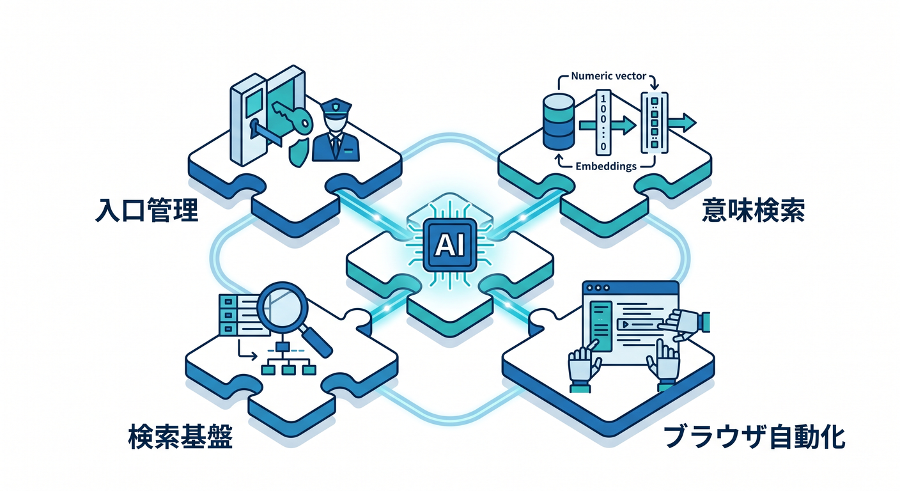
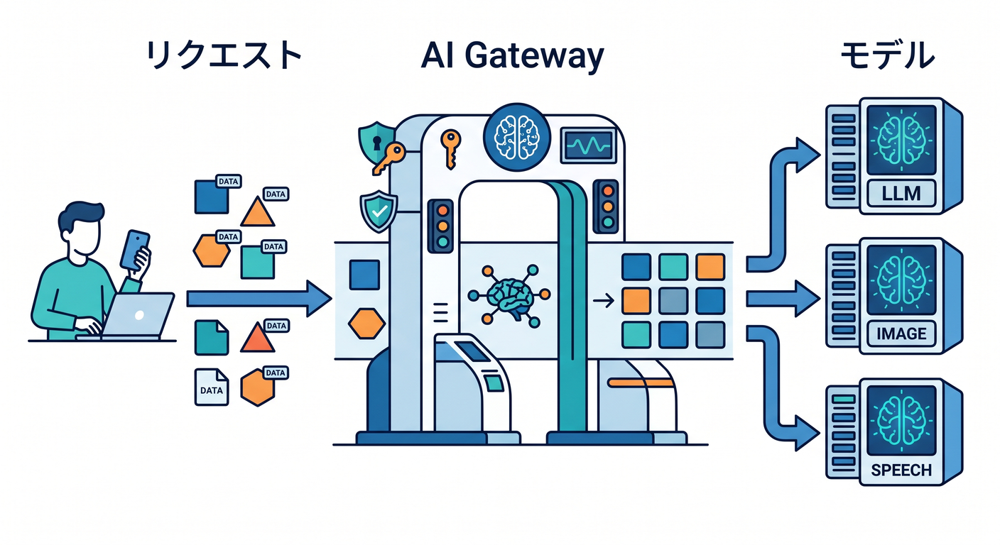
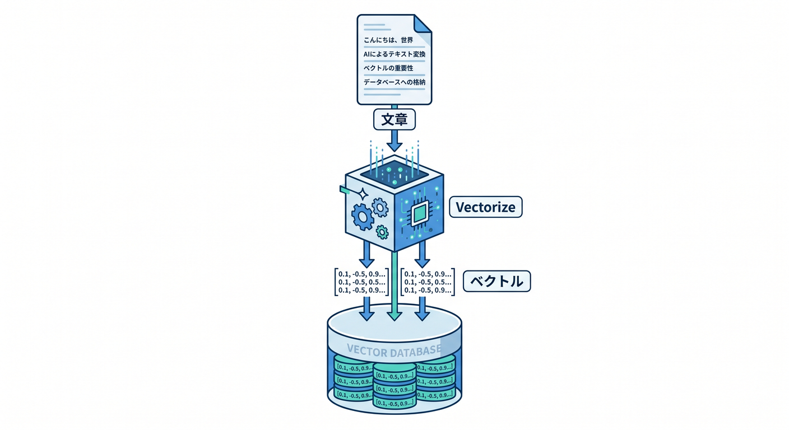
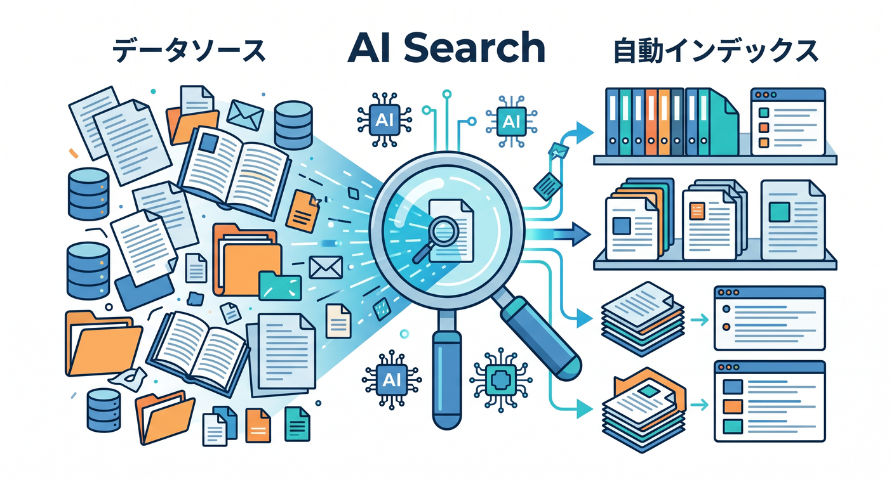

# Cloudflare AI Gateway・Vectorize・AI Search・Browser Run 15章アウトライン 🧠✨

確認日: 2026-04-24  
主な確認先: Cloudflare AI Gateway Overview / Caching / Rate limiting / Retry and fallback / Vectorize Overview / Vectorize with Workers AI / AI Search Overview / Workers binding / Browser Run Overview / Browser Rendering examples 公式ドキュメント

## 第1章　AI機能を“実用”へ進めよう 🧠

Workers AIでAIを呼べるようになったら、次は実用化の準備です。  
AI Gatewayで観測と制御を入れ、Vectorizeで意味検索を作り、AI Searchで検索基盤を楽に扱います。  
Browser Runは、動的ページの取得やスクリーンショット、PDF生成などに使える発展機能です。  
この章では、AIアプリを遊びから運用できる形へ進める全体像をつかみます 😊  
この章のゴールは、4つのAI関連機能の役割を説明できることです ✅

## 第2章　AI GatewayでAIの入口を管理しよう 🌉

AI Gatewayは、AIアプリのリクエストを観測・制御する入口です。  
公式では、analytics、logging、caching、rate limiting、request retries、model fallbackなどを扱えると案内されています。  
Workers AIやOpenAI、Anthropic、Googleなど複数providerと組み合わせられます。  
まずはAIリクエストをGateway経由にして、見える状態へ近づけます。  
この章のゴールは、AI Gatewayが何を守り、何を見せてくれるか理解することです。

## 第3章　AI Gatewayのログ・Analytics・コストを見よう 📈

AIアプリでは、どのモデルをどれだけ使ったか、どこで失敗したかが重要です。  
AI Gatewayでは、request数、tokens、cost、latency、errorなどを観測できます。  
ログにはrequestIdやuserId、model名を残し、prompt全文や個人情報は出しすぎません。  
運用では、急な利用増加やエラー増加を早めに見つけます 🔎  
この章のゴールは、AI利用状況を見える化する基本を理解することです。

## 第4章　Caching・Rate limiting・Retry・Fallbackを学ぼう 🛡️

AI Gatewayの実用機能として、Caching、Rate limiting、Retry、Fallbackがあります。  
同じpromptの再利用でコストを下げ、rate limitで使いすぎを抑えます。  
一時的な失敗はretryし、特定モデルが失敗したら別モデルへfallbackする設計もあります。  
ただし、個人情報を含むpromptのcacheには注意します 🔐  
この章のゴールは、AI Gatewayの制御機能を使い分けられることです。

## 第5章　Vectorizeとベクトル検索の基本 🧭

Vectorizeは、Cloudflareのベクトルデータベースです。  
Workers AIなどで作ったembeddingsを保存し、意味が近いデータを検索できます。  
公式では、semantic search、recommendations、anomaly detection、LLMへのcontextやmemoryに使えると案内されています。  
まずは「文章をembeddingにしてVectorizeへ保存し、近い文章を探す」流れを学びます。  
この章のゴールは、Vectorizeの役割を説明できることです。

## 第6章　Vectorize indexを作ってbindingしよう ⚙️

Vectorizeを使うにはindexを作成し、Workerへbindingします。  
WranglerコマンドやDashboardでindexを用意し、`wrangler.jsonc` に `vectorize` bindingを書きます。  
TypeScriptでは `VectorizeIndex` をEnv型へ追加します。  
dimensionやmetricは、使うembeddingモデルに合わせて決めます 🧪  
この章のゴールは、WorkerからVectorize indexへアクセスできることです。

## 第7章　Workers AIでembeddingを作ってVectorizeへ保存しよう 🧩

Workers AIで文章をembeddingへ変換し、Vectorizeへinsertします。  
vector id、values、metadataをセットで保存します。  
metadataにはtitle、source、r2Key、userIdなど検索後に使う情報を入れます。  
個人情報や長文本文をmetadataへ詰め込みすぎないようにします 🔐  
この章のゴールは、AIで作ったembeddingをVectorizeへ保存できることです。

## 第8章　Vectorizeでqueryして意味検索しよう 🔎

ユーザーの質問もembeddingに変換し、Vectorizeへqueryします。  
近いベクトルが返ってきたら、metadataやD1/R2の元データを使って回答に活かします。  
スコア、topK、metadata filteringの考え方も学びます。  
「完全一致ではなく意味が近いものを探す」感覚をつかみます。  
この章のゴールは、意味検索APIを作れることです。

## 第9章　RAGの流れを理解しよう 📚

RAGは、AIが回答する前に関連文書を検索してcontextとして渡す考え方です。  
Vectorizeで関連文書を探し、Workers AIや外部LLMへcontext付きpromptを渡します。  
D1にはメタデータ、R2には原文やPDF、Vectorizeにはembeddingを置く構成が自然です。  
検索結果をそのまま信じず、出典や引用元を表示する設計も大切です 🧭  
この章のゴールは、RAGの全体像を説明できることです。

## 第10章　AI Searchでmanaged searchを知ろう 🔍

AI Searchは、データを接続して自然言語検索できるCloudflareのmanaged search serviceです。  
公式では、Webサイトや非構造データを接続し、自動で継続更新されるindexを作れると案内されています。  
Vectorize、AI Gateway、R2、Browser Run、Workers AIと統合されます。  
自前RAGとAI Searchの違いを整理します。  
この章のゴールは、AI Searchが何を楽にしてくれるか理解することです。

## 第11章　AI SearchをWorkerから呼び出そう 🌐

AI Searchは、WorkerからbindingやAPIで検索できます。  
ユーザーの自然文質問を受け、AI Search instanceへ問い合わせ、結果をReactへ返します。  
検索対象、権限、公開してよいデータかを必ず確認します。  
社内文書や学習メモ検索では、ユーザーごとのアクセス制御も考えます 🔐  
この章のゴールは、AI Searchをアプリの検索APIとして使う流れを理解することです。

## 第12章　Browser Runで動的ページを扱おう 🖥️

Browser Renderingは現在Browser Runとして案内され、Workersからheadless browserを扱えます。  
スクリーンショット、PDF生成、動的ページの取得、ブラウザ自動化が候補です。  
JavaScriptで描画されるページを取得したい場合、通常のfetchだけでは足りないことがあります。  
利用時はrobots、利用規約、アクセス頻度、コストに注意します 🧯  
この章のゴールは、Browser Runが必要になる場面を理解することです。

## 第13章　Browser RunとAI Searchの関係を見よう 🧷

AI SearchがWebサイトをデータソースにする場合、動的ページの取得にBrowser Run系の機能が関係します。  
取得したページをindex化し、自然言語検索へつなげます。  
ただし、すべてのWebページを勝手に大量取得するのではなく、自分のサイトや許可されたデータから始めます。  
R2に取得結果を保存し、D1でクロール状態を管理する設計もあります。  
この章のゴールは、Web取得からAI検索までの流れを説明できることです。

## 第14章　AI機能の安全・権限・運用をまとめよう 🔐

実用AIアプリでは、安全性と運用がとても重要です。  
AI Gatewayで観測し、Rate Limitingや認証で入口を守り、VectorizeやAI Searchでは権限のあるデータだけ検索します。  
Browser Runはアクセス先のルールを守り、ログには個人情報やsecretを出しすぎません。  
Copilotにも安全レビューを依頼し、公式ドキュメントと照らして確認します ✅  
この章のゴールは、AI機能を安全に運用する視点を持つことです。

## 第15章　AIドキュメント検索アプリを完成させよう 🏁

最後は、React + Workers + AI Gateway + Vectorize / AI Search + R2で小さなAIドキュメント検索アプリを作ります。  
自分の学習メモやMarkdownをR2/D1へ保存し、embeddingをVectorizeへ入れ、質問に近い文書を検索します。  
発展としてAI Searchでmanaged search化し、Browser Runで自分のサイトを取り込む流れも見ます。  
ログ、Rate Limiting、アクセス制御、コスト、Copilotレビューまで確認します。  
この章のゴールは、Cloudflare上で実用寄りAI検索の全体像を作れることです。

---

## 参照URL

- https://developers.cloudflare.com/ai-gateway/
- https://developers.cloudflare.com/ai-gateway/features/caching/
- https://developers.cloudflare.com/ai-gateway/features/rate-limiting/
- https://developers.cloudflare.com/ai-gateway/features/dynamic-routing/
- https://developers.cloudflare.com/ai-gateway/observability/analytics/
- https://developers.cloudflare.com/vectorize/
- https://developers.cloudflare.com/vectorize/get-started/vectorize-workers-ai/
- https://developers.cloudflare.com/vectorize/best-practices/insert-vectors/
- https://developers.cloudflare.com/vectorize/best-practices/query-vectors/
- https://developers.cloudflare.com/vectorize/reference/metadata-filtering/
- https://developers.cloudflare.com/ai-search/
- https://developers.cloudflare.com/ai-search/usage/workers-binding/
- https://developers.cloudflare.com/browser-run/
- https://developers.cloudflare.com/browser-rendering/get-started/screenshots/
- https://developers.cloudflare.com/workers-ai/
