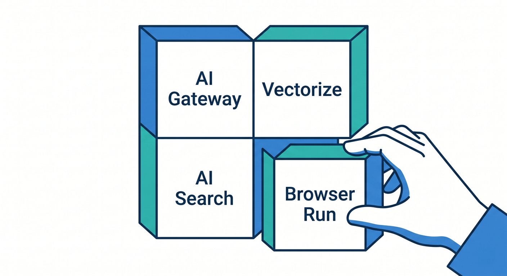
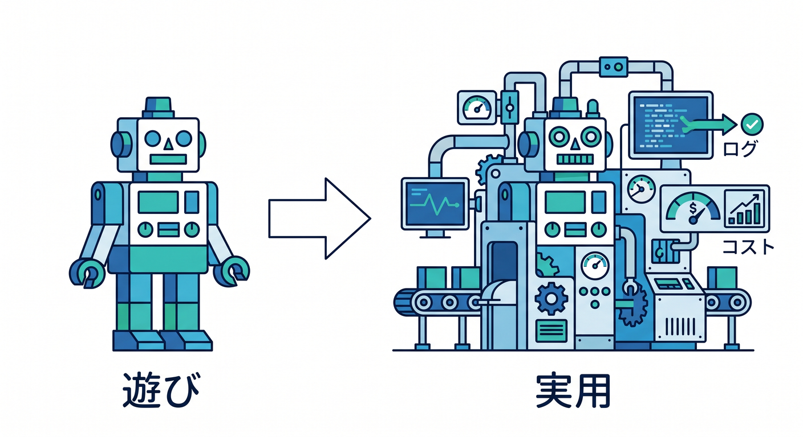
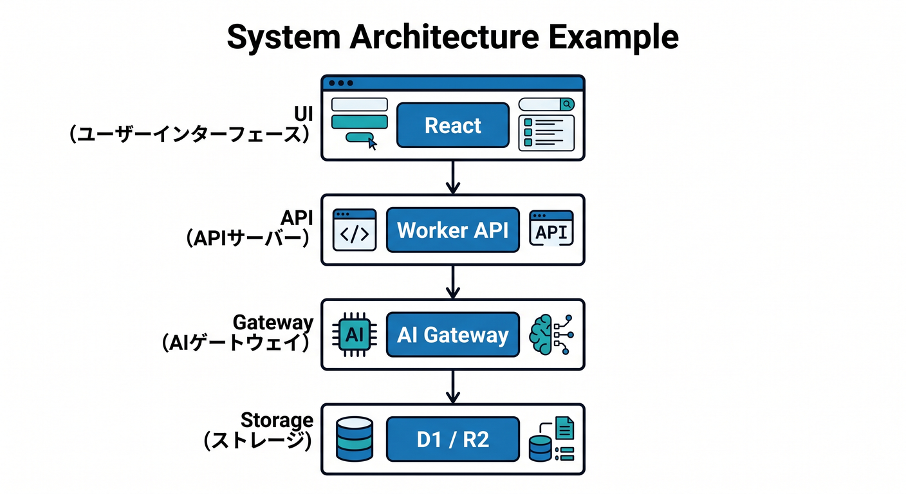
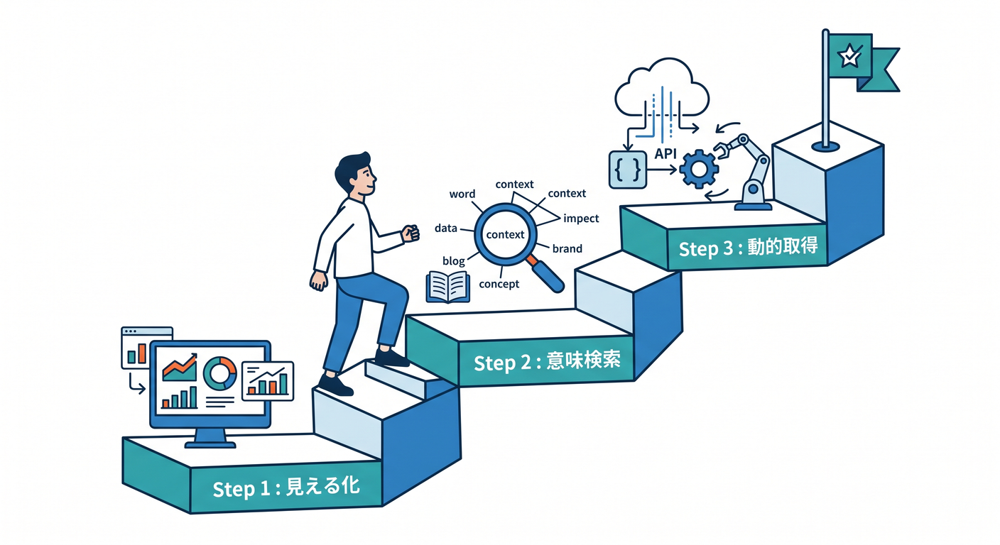
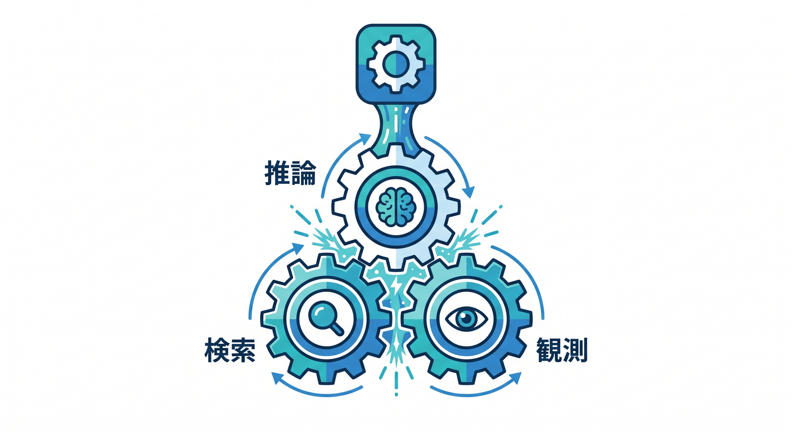

# 第01章：AI機能を“実用”へ進めよう 🧠

Workers AIでAIを呼べるようになったら、次は実用化です。  
ただAIが返事するだけでなく、ログ、検索、保存、権限、コストまで考えます 😊

---

## 1. 4つの役割 🧩



この章では、4つの機能を見ます。

- AI Gateway
- Vectorize
- AI Search
- Browser Run

AI GatewayはAIの入口管理。  
Vectorizeは意味検索のためのベクトルDB。  
AI Searchは検索基盤をmanagedに扱うサービス。  
Browser Runはブラウザを使った取得や自動化です。

---

## 2. 遊びと実用の違い 🧭



AIの試作では、promptを送って返事が来れば楽しいです。  
でも実用では、次が必要になります。

```text
誰が使ったか
どれだけ使ったか
どのデータを検索したか
失敗時にどうするか
秘密情報を守れているか
```

この視点が入ると、AIアプリらしくなります。

---

## 3. 全体構成の例 🏗️



AIドキュメント検索アプリなら、こうなります。

```text
React
  ↓
Worker API
  ↓
AI Gateway / Workers AI
  ↓
Vectorize / AI Search
  ↓
D1 / R2
```

AIだけでなく、検索と保存がセットになります。

---

## 4. この章の進め方 📚



まずAI Gatewayで入口を見える化します。  
次にVectorizeで意味検索を作り、AI Searchでmanaged searchを知ります。  
最後にBrowser Runで動的ページ取得の発想を学びます。

---

## 5. 章末チェック ✅



- AI Gatewayの役割を言える
- Vectorizeの役割を言える
- AI Searchの役割を言える
- Browser Runの役割を言える
- AIアプリには運用と安全性が必要だと分かる

この章で覚える一言はこれです。  
**実用AIアプリは、推論・検索・保存・観測を組み合わせて作ります 🧠**
