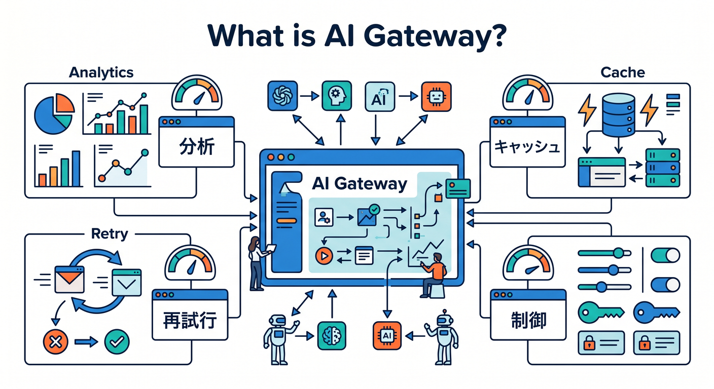
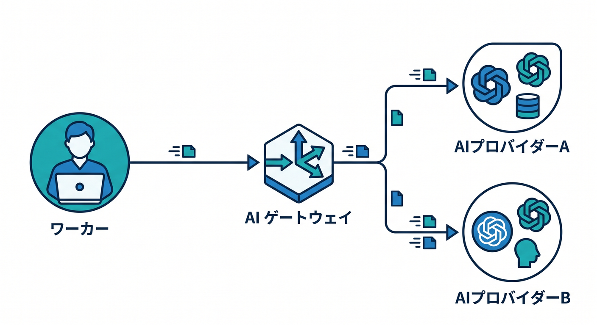
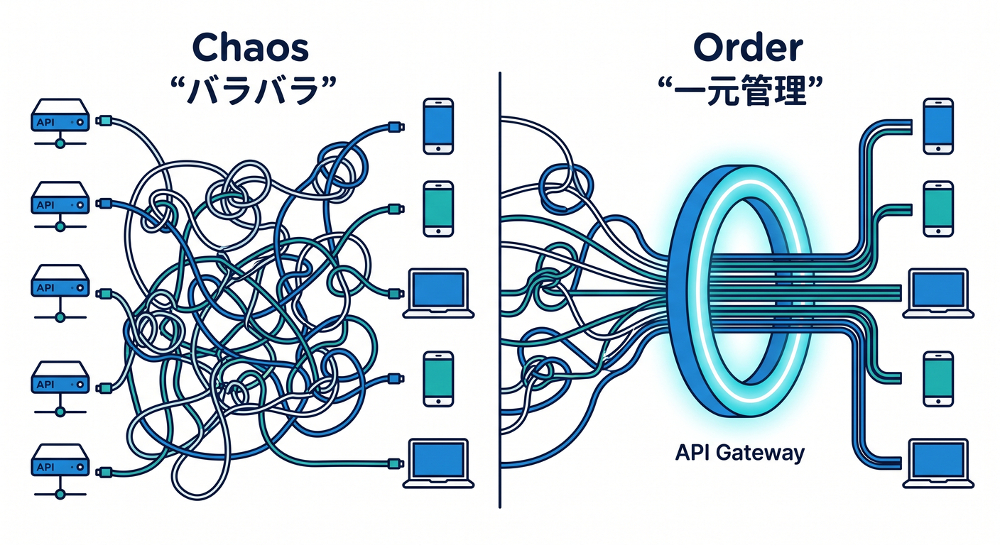
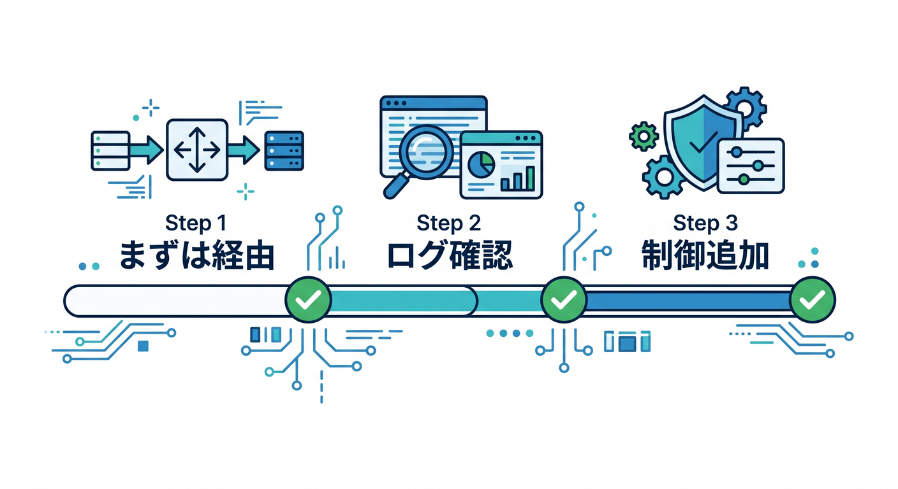
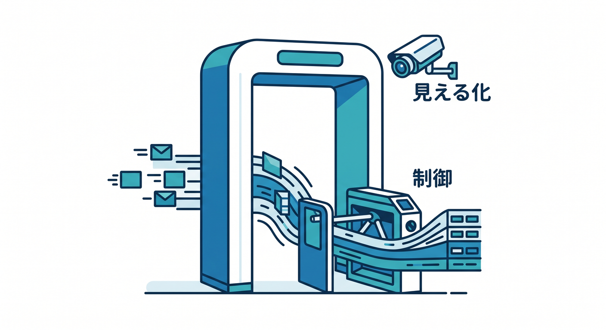

# 第02章：AI GatewayでAIの入口を管理しよう 🌉

AI Gatewayは、AIリクエストの入口を管理するサービスです。  
AIを使うアプリでは、何が起きているか見えることがとても大切です。

---

## 1. AI Gatewayでできること 👀



公式ドキュメントでは、AI GatewayはAIアプリのvisibilityとcontrolを得るためのサービスとして案内されています。  
主な機能は次の通りです。

- Analytics
- Logging
- Caching
- Rate limiting
- Request retries
- Model fallback

AIをただ呼ぶだけでなく、観測し、制御できます。

---

## 2. どんなproviderと使う？ 🤖



AI Gatewayは、Workers AIや外部AI providerと組み合わせられます。

```text
Worker
  ↓
AI Gateway
  ↓
Workers AI / OpenAI / Anthropic / Google / other providers
```

複数providerを使うときも、入口をまとめやすくなります。

---

## 3. なぜ入口をまとめるの？ 🧭



AI APIを直接あちこちから呼ぶと、調査が難しくなります。

```text
どのモデルで失敗した？
どれくらいコストがかかった？
どのユーザーが大量に使った？
同じ質問を何度も投げていない？
```

AI Gatewayを通すと、こうした情報を追いやすくなります。

---

## 4. 最初の使い方 🌱



最初は、既存のWorkers AI呼び出しをAI Gateway経由にするところから始めます。  
いきなり全機能を使う必要はありません。

```text
第1段階: Gateway経由にする
第2段階: logsとanalyticsを見る
第3段階: cacheやrate limitingを検討する
```

---

## 5. 章末チェック ✅



- AI GatewayはAIの入口管理だと分かる
- AnalyticsやLoggingを使えると分かる
- Caching、Rate limiting、Retry、Fallbackの存在を知っている
- 複数providerの入口にできる
- 最初はGateway経由にするだけでも価値がある

この章で覚える一言はこれです。  
**AI Gatewayは、AIリクエストを見える化し、制御するための入口です 🌉**
