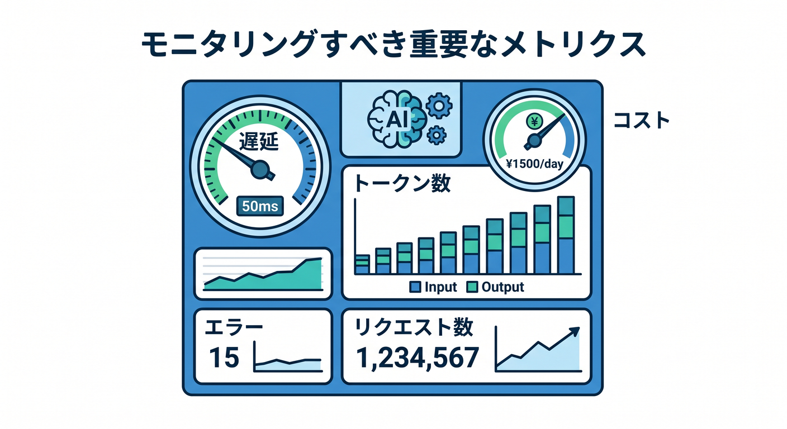
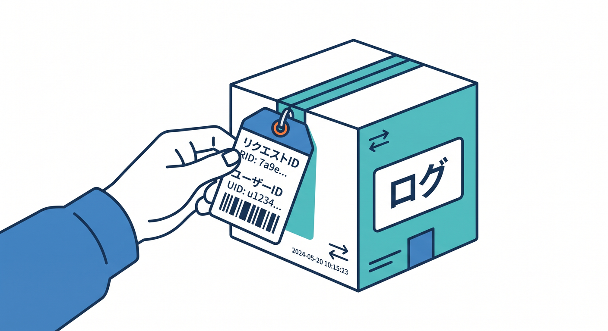
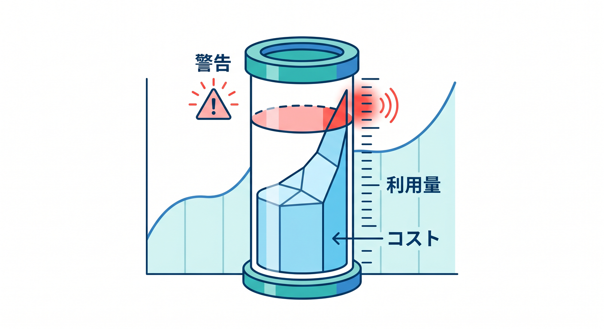
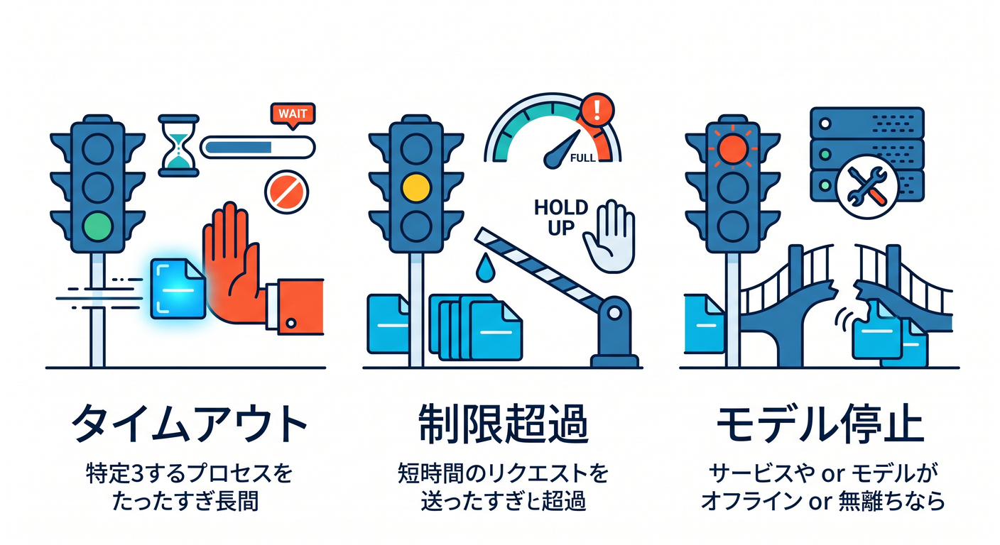

# 第03章：AI Gatewayのログ・Analytics・コストを見よう 📈

AIアプリでは、どれだけ使われたかを見ることが大切です。  
AI Gatewayは、AIリクエストのログやAnalyticsを見る助けになります。

---

## 1. 見たい数字 📊



AI Gatewayでは、次のような情報を見ます。

- request数
- token数
- cost
- latency
- error
- provider
- model

「動いたか」だけでなく、「どれくらい使われたか」を見ます。

---

## 2. ログに入れるID 🪪



Worker側でも追跡用IDを入れます。

```ts
console.log("ai request", {
  requestId,
  userId,
  model,
  promptLength,
});
```

prompt全文ではなく、長さやIDを残します。

---

## 3. コストを見る 💰



AIは使うほどコストが増える可能性があります。  
AI GatewayやWorkers AIのdashboardで利用量を確認します。

```text
昨日より急に増えていないか
特定ユーザーだけ多くないか
同じpromptが繰り返されていないか
```

小さなアプリでも、使いすぎ対策が大切です。

---

## 4. エラーを見る 🧯



AI providerは失敗することがあります。

- 429 rate limit
- 5xx
- timeout
- invalid request
- model unavailable

GatewayのログとWorkerのログを合わせて見ます。

---

## 5. 章末チェック ✅


- AI Gatewayで見る数字が分かる
- requestIdやuserIdで追跡できる
- costやtokenを見る理由が分かる
- AI providerのエラー種類を知っている
- prompt全文をログへ出しすぎない

この章で覚える一言はこれです。  
**AI GatewayのAnalyticsは、AIアプリの使われ方と失敗を知るための窓です 📈**
