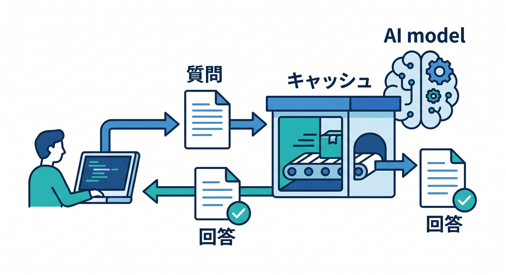
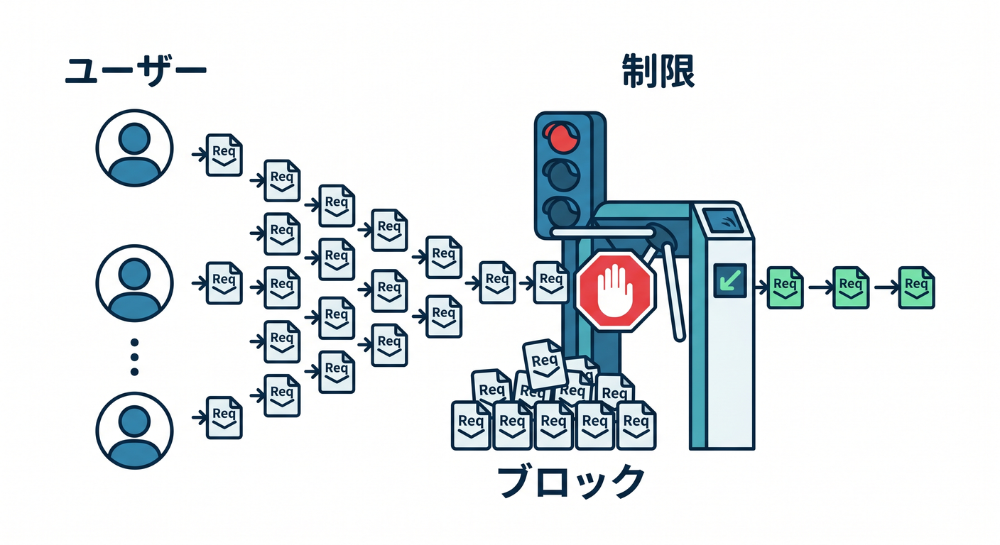
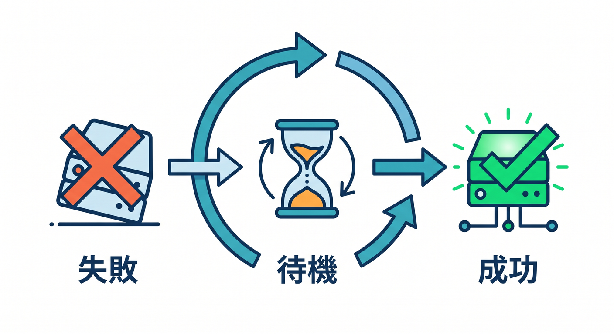
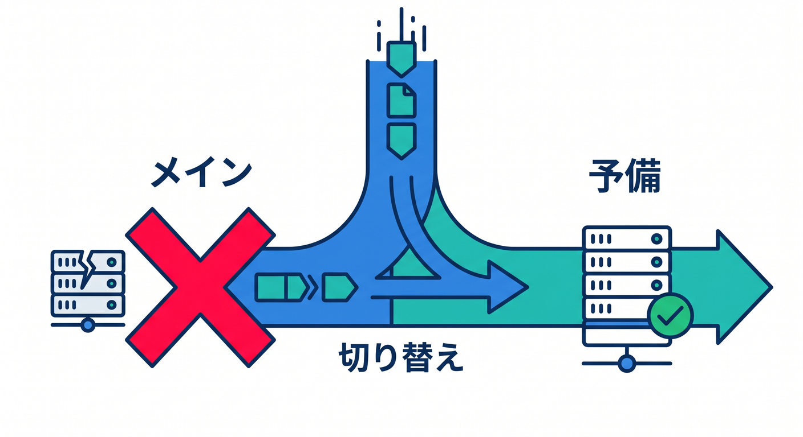
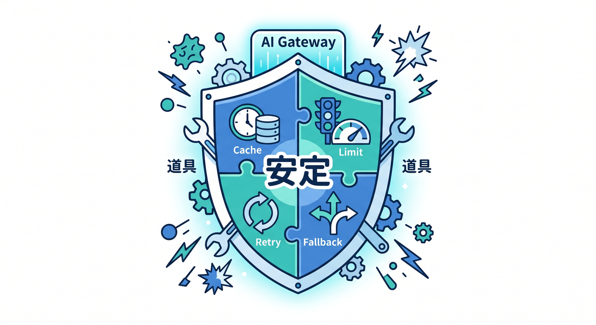

# 第04章：Caching・Rate limiting・Retry・Fallbackを学ぼう 🛡️

AI Gatewayには、AIアプリを安定させるための機能があります。  
ここではCaching、Rate limiting、Retry、Fallbackを整理します。

---

## 1. Caching ⚡



同じリクエストに同じ回答を返せる場面では、cacheが役立ちます。

```text
同じ質問
  ↓
前回の回答を再利用
```

コスト削減や高速化につながります。  
ただし、個人情報を含むpromptやユーザーごとに違う回答はcacheに注意します。

---

## 2. Rate limiting 🚦



Rate limitingは、使いすぎを抑える機能です。

```text
1分に何回まで
1ユーザーに何回まで
特定routeだけ制限
```

AI APIはコストがかかるので、入口を守ることが大切です。

---

## 3. Retry 🔁



一時的な失敗は、retryで成功することがあります。

```text
AI providerが一時的に5xx
  ↓
少し待って再試行
```

ただし、入力不正のような失敗はretryしても直りません。

---

## 4. Fallback 🪂



Fallbackは、あるモデルやproviderが失敗したときに別の候補へ切り替える考え方です。

```text
model Aが失敗
  ↓
model Bで試す
```

品質、コスト、速度の違いも考えます。

---

## 5. 章末チェック ✅



- Cachingで高速化やコスト削減ができると分かる
- Rate limitingで使いすぎを防げる
- Retryは一時的な失敗向けだと分かる
- Fallbackで別モデルへ切り替えられる
- 個人情報を含むpromptのcacheに注意できる

この章で覚える一言はこれです。  
**AI Gatewayの制御機能は、AIアプリを安定して運用するための道具です 🛡️**
