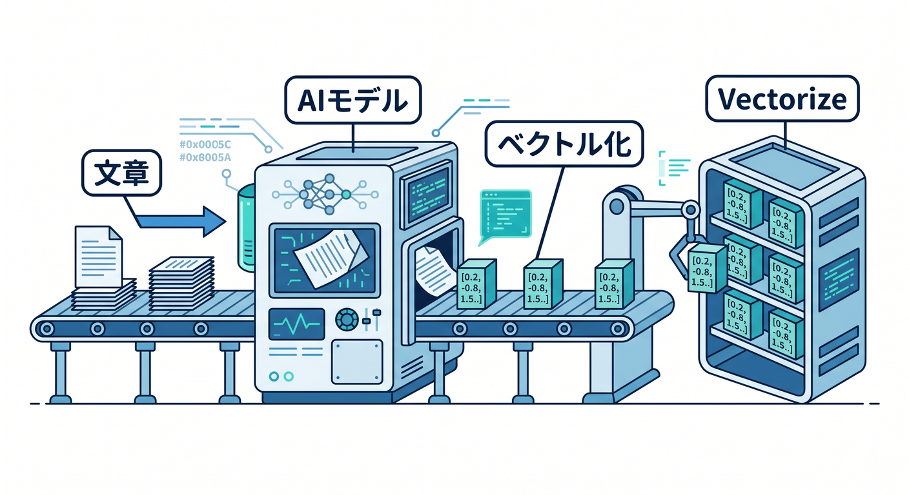
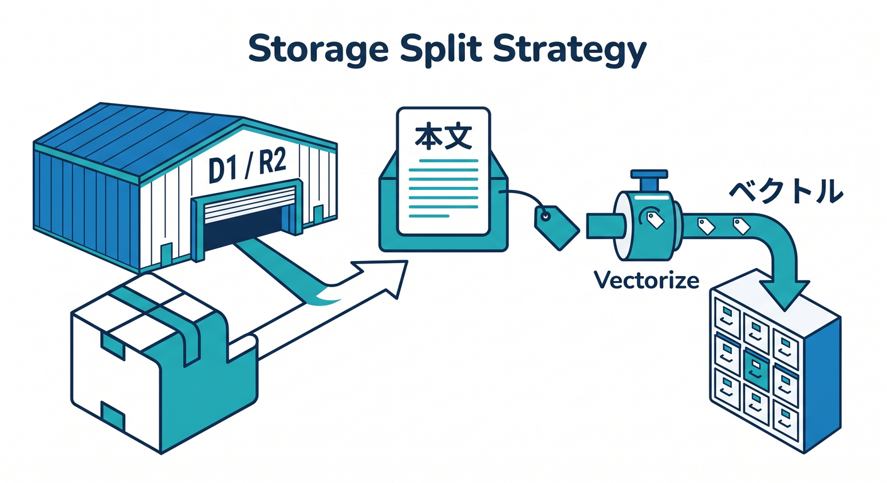

# 第05章：Vectorizeとベクトル検索の基本 🧭

Vectorizeは、Cloudflareのベクトルデータベースです。  
意味が近い文章やデータを探すAI検索の土台になります。

---

## 1. ベクトル検索とは 🔎


普通の検索は、キーワード一致が中心です。

```text
検索: Workers
  ↓
"Workers" を含む文章
```

ベクトル検索では、意味の近さを使います。

```text
検索: サーバーなしでAPIを動かしたい
  ↓
Cloudflare Workersの記事
```

言葉が完全一致しなくても探せるのが魅力です。

---

## 2. Embeddingを保存する 🧩



文章をAIでembeddingに変換し、Vectorizeへ保存します。

```text
文章
  ↓ Workers AI
embedding
  ↓
Vectorize
```

あとでユーザー質問もembeddingにして、近いものを探します。

---

## 3. 何に使える？ 📚


Vectorizeは、いろいろなAIアプリに使えます。

- FAQ検索
- 学習メモ検索
- 類似記事検索
- おすすめ
- 異常検知
- LLMへのcontextやmemory

公式でも、semantic searchやrecommendationsなどの用途が案内されています。

---

## 4. 保存先の分担 🗺️



Vectorizeにはembedding、本文やファイルは別に置くことが多いです。

```text
本文 → D1 / R2
embedding → Vectorize
メタデータ → D1 / Vectorize metadata
```

大きな本文を全部Vectorizeへ詰め込む場所ではありません。

---

## 5. 章末チェック ✅


- VectorizeはベクトルDBだと分かる
- キーワード検索と意味検索の違いが分かる
- embeddingを保存してqueryすると分かる
- FAQ検索やRAGに使える
- 本文とembeddingの保存先を分けられる

この章で覚える一言はこれです。  
**Vectorizeは、文章やデータの“意味の近さ”で探すためのデータベースです 🧭**
