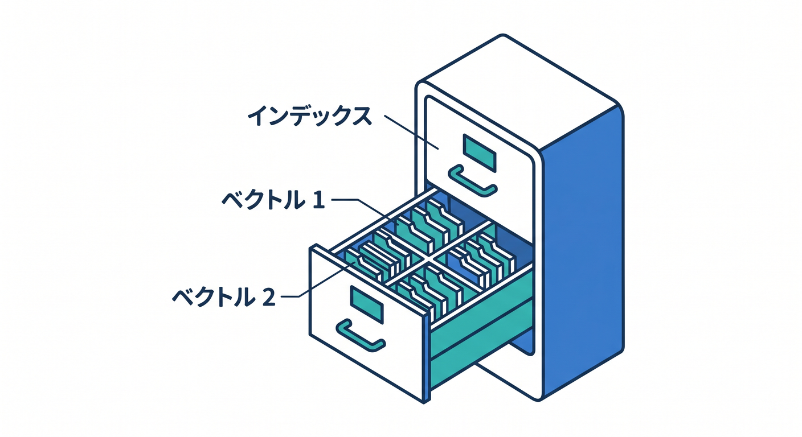
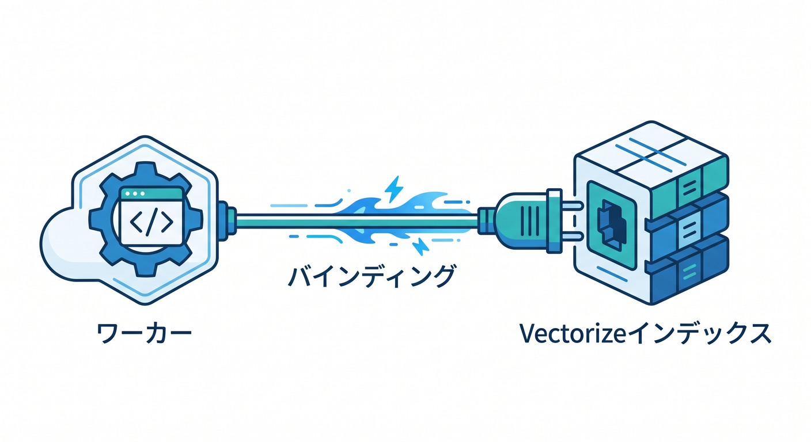
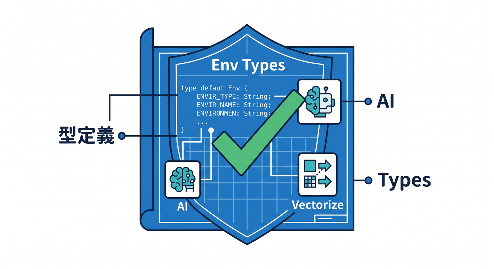
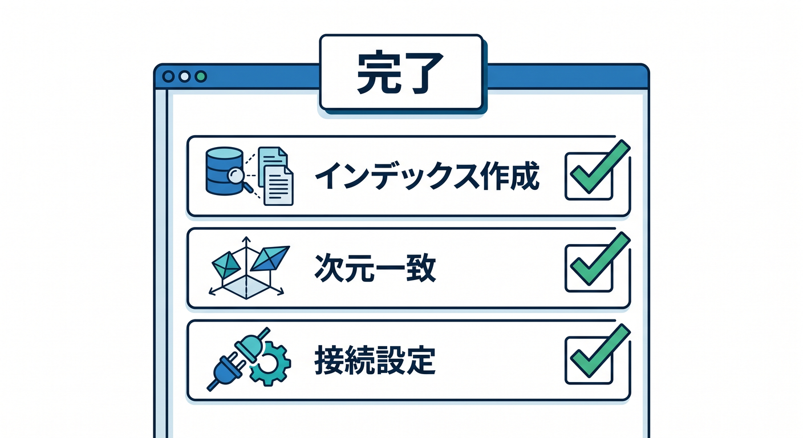

# 第06章：Vectorize indexを作ってbindingしよう ⚙️

VectorizeをWorkerから使うには、indexを作ってbindingします。  
R2やD1と同じように、Workerから使う名前を設定します。

---

## 1. indexとは 🧱



Vectorize indexは、ベクトルを入れる場所です。

```text
study-notes-index
  ├─ vector 1
  ├─ vector 2
  └─ vector 3
```

用途ごとに分けると管理しやすいです。

---

## 2. dimensionを合わせる 🧪


index作成時には、dimensionを指定します。  
これはembeddingの数値リストの長さです。

```text
embedding modelのdimension
  =
Vectorize indexのdimension
```

使うモデルのドキュメントを確認して合わせます。

---

## 3. wrangler.jsoncにbindingを書く 🔌



Workerから使うためにbindingを書きます。

```jsonc
{
  "vectorize": [
    {
      "binding": "VECTORIZE",
      "index_name": "study-notes-index"
    }
  ]
}
```

Workerでは `env.VECTORIZE` として使います。

---

## 4. Env型を書く 🧩



TypeScriptではEnv型を用意します。

```ts
export interface Env {
  VECTORIZE: VectorizeIndex;
  AI: Ai;
}
```

Workers AIでembeddingを作り、Vectorizeへ保存する構成です。

---

## 5. 章末チェック ✅



- Vectorize indexの役割が分かる
- dimensionをembeddingモデルに合わせると分かる
- `vectorize` bindingを書ける
- Env型に `VectorizeIndex` を書ける
- Workers AIと組み合わせる準備ができる

この章で覚える一言はこれです。  
**Vectorizeは、index作成・dimension確認・binding設定の3点セットで始めます ⚙️**
