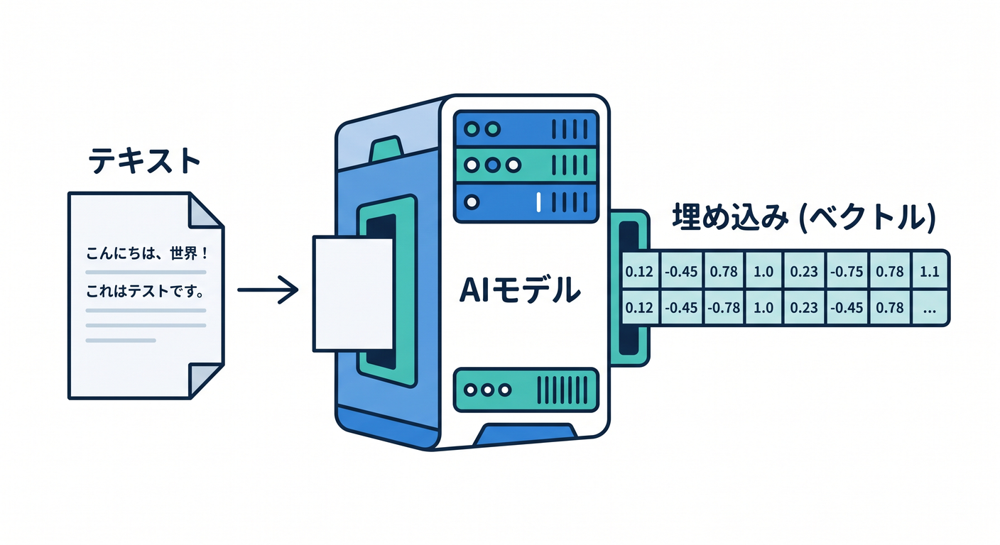
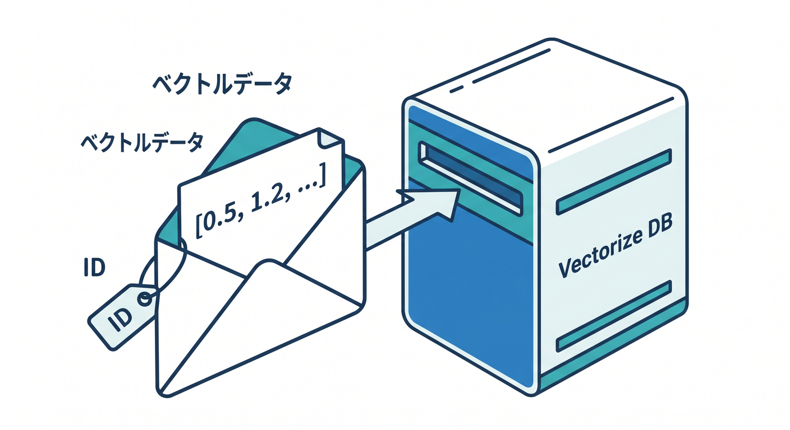
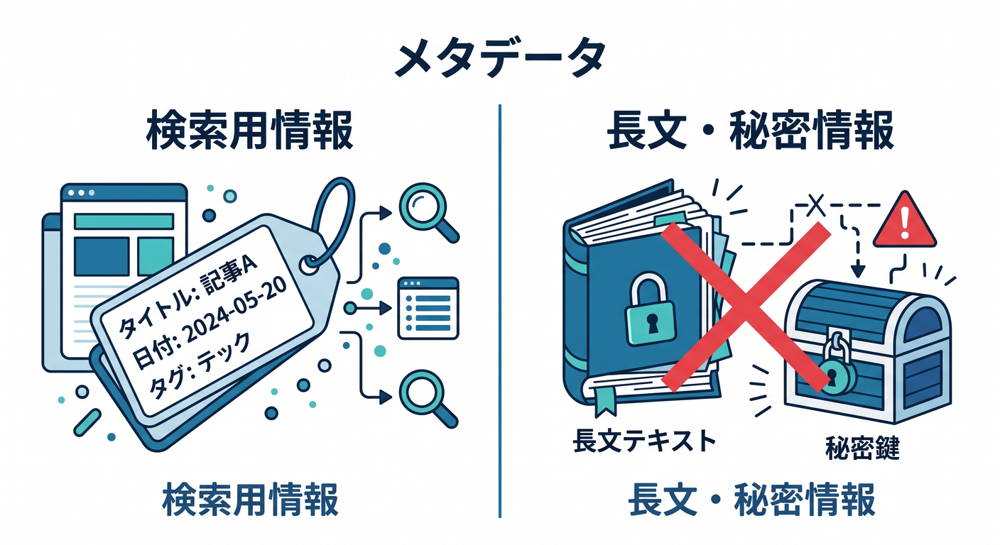
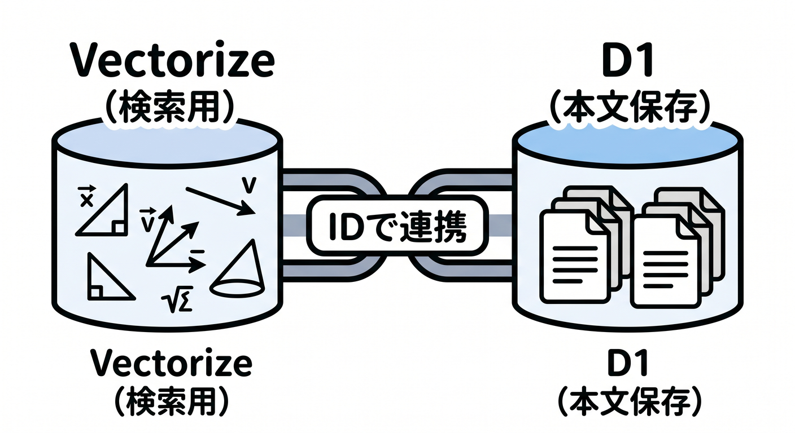
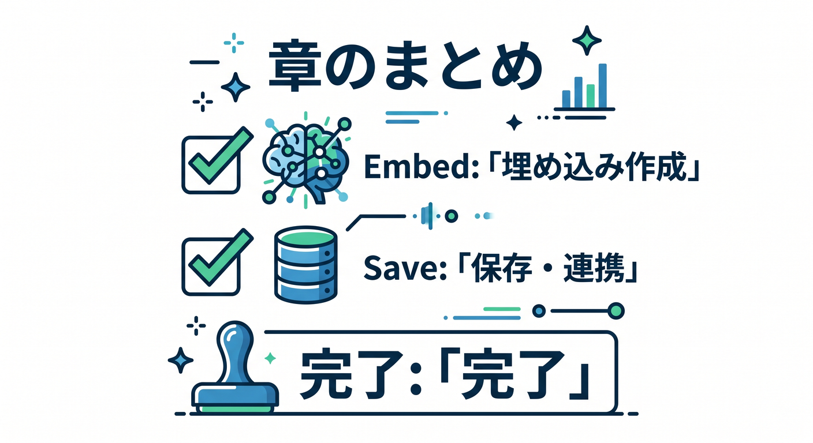

# 第07章：Workers AIでembeddingを作ってVectorizeへ保存しよう 🧩

Vectorizeへ入れるベクトルは、Workers AIで作れます。  
ここでは、学習メモをembeddingにして保存する流れを見ます。

---

## 1. 文章からembeddingを作る 🤖



Workers AIのembeddingモデルを使います。

```ts
const embedding = await env.AI.run("@cf/baai/bge-base-en-v1.5", {
  text: ["Cloudflare Workersを学ぶメモ"],
});
```

モデル名や入力形式は、Workers AIのModel Catalogで確認します。

---

## 2. Vectorizeへinsertする 📥



Vectorizeへ保存する例です。

```ts
await env.VECTORIZE.insert([
  {
    id: noteId,
    values: embedding.data[0],
    metadata: {
      title: "Workers学習メモ",
      source: "study-note",
    },
  },
]);
```

`id` は後でD1やR2の元データとつなぐために使います。

---

## 3. metadataを考える 🏷️



metadataには、検索後に使う情報を入れます。

- title
- source
- r2Key
- userId
- createdAt
- visibility

ただし、長文本文やsecretを入れすぎないようにします。

---

## 4. D1ともつなげる 🗄️



本文や詳しい情報はD1へ置きます。

```text
D1: noteId, title, body
Vectorize: noteId, embedding, metadata
```

検索でnoteIdを取り、D1から本文を読む構成です。

---

## 5. 章末チェック ✅



- Workers AIでembeddingを作れる
- Vectorizeへinsertできる
- vector idで元データとつなげると分かる
- metadataに入れる情報を選べる
- 本文はD1やR2へ置く設計が分かる

この章で覚える一言はこれです。  
**embeddingはVectorizeへ、本文はD1やR2へ置いてIDでつなげます 🧩**
