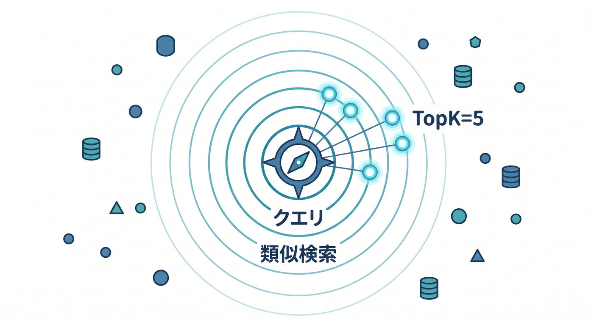
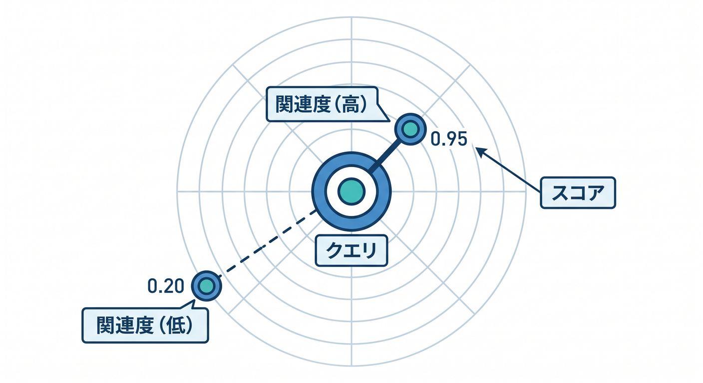
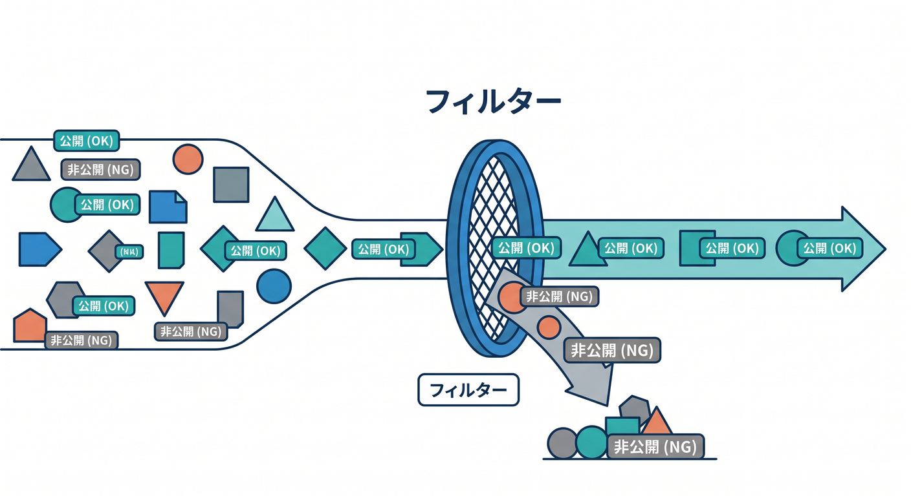
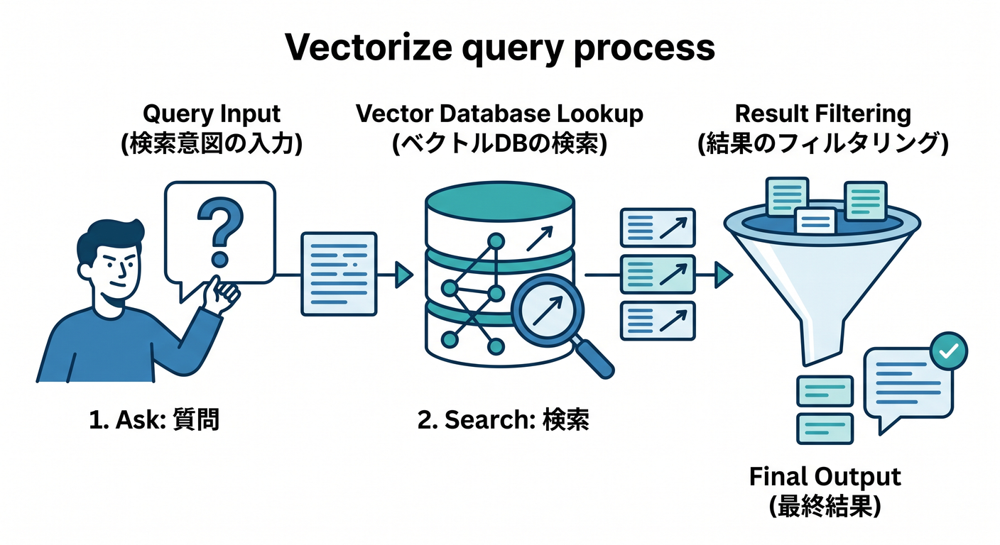

# 第08章：Vectorizeでqueryして意味検索しよう 🔎

Vectorizeへ保存したら、次は検索です。  
ユーザーの質問をembeddingにして、近いベクトルを探します。

---

## 1. 質問もembeddingにする 🧠


保存時と同じ考え方で、質問をembeddingにします。

```ts
const queryEmbedding = await env.AI.run("@cf/baai/bge-base-en-v1.5", {
  text: [question],
});
```

保存時とquery時で、基本的に同じembeddingモデルを使います。

---

## 2. Vectorizeへqueryする 📡



近いベクトルを探します。

```ts
const matches = await env.VECTORIZE.query(queryEmbedding.data[0], {
  topK: 5,
  returnMetadata: true,
});
```

`topK` は何件返すかです。

---

## 3. scoreを見る 📊



検索結果には、近さを示すscoreが含まれます。  
scoreが低すぎる場合は「見つかりませんでした」と返す設計もあります。

```text
scoreが高い → 関連が強い
scoreが低い → 関連が弱い
```

しきい値は実際のデータで調整します。

---

## 4. metadata filtering 🏷️



metadataで絞り込むこともできます。

```text
userIdが同じものだけ
visibilityがpublicのものだけ
categoryがdocsのものだけ
```

権限のないデータを検索結果に出さないことが重要です 🔐

---

## 5. 章末チェック ✅



- 質問もembeddingにすると分かる
- Vectorizeのqueryで近いデータを探せる
- topKの意味が分かる
- scoreを見て関連度を判断できる
- metadata filteringで権限やカテゴリを絞れる

この章で覚える一言はこれです。  
**Vectorize queryは、質問に意味が近いデータを探すための処理です 🔎**
