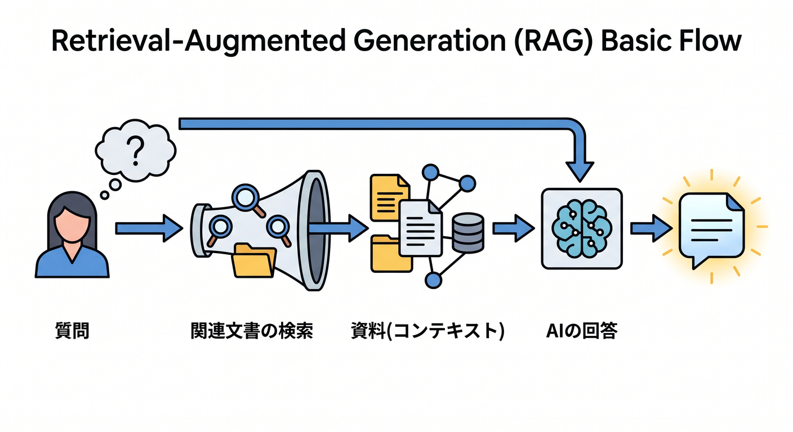
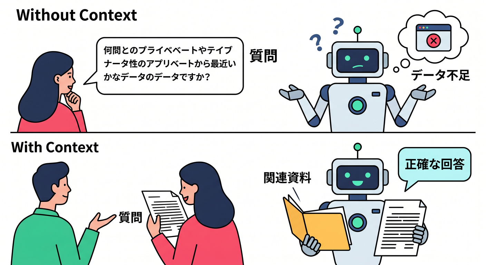
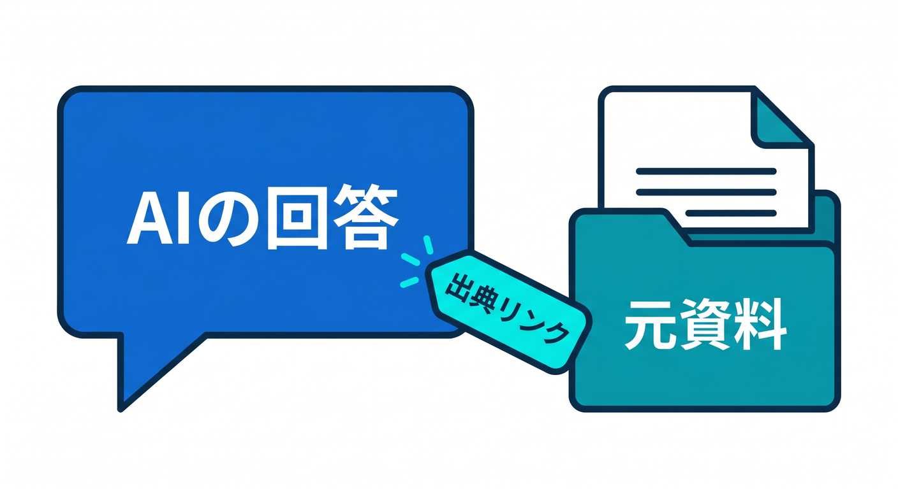
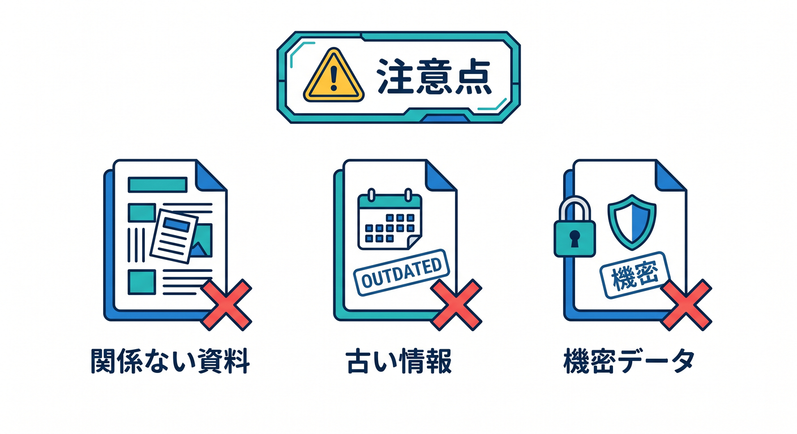
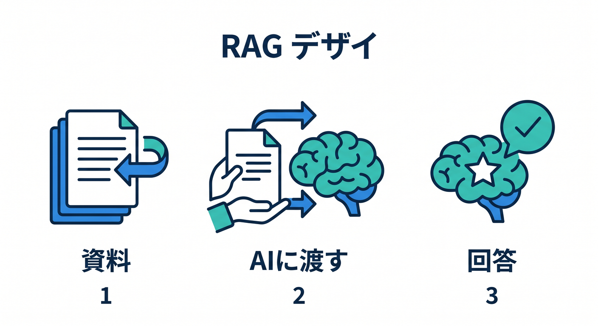

# 第09章：RAGの流れを理解しよう 📚

RAGは、AIが回答する前に関連文書を探して、contextとして渡す考え方です。  
「AIに記憶させる」のではなく、「必要な資料を渡して答えてもらう」イメージです。

---

## 1. RAGの流れ 🧭



基本の流れです。

```text
ユーザー質問
  ↓
質問をembedding
  ↓
Vectorizeで関連文書を検索
  ↓
D1/R2から本文を取得
  ↓
Workers AIへcontext付きprompt
  ↓
回答
```

検索と生成を組み合わせます。

---

## 2. なぜcontextが必要？ 🧠



AIは、あなたのアプリ固有の最新データを最初から知っているわけではありません。  
そこで、関連する資料を一緒に渡します。

```text
質問: この教材のKV章を要約して
context: KV章の本文
```

資料に基づいた回答に近づけます。

---

## 3. 出典を表示する 🏷️



検索結果のsourceやtitleを回答と一緒に出します。

```json
{
  "answer": "...",
  "sources": [
    { "title": "KV入門", "id": "note_123" }
  ]
}
```

ユーザーが元資料を確認できるようにします。

---

## 4. 注意点 🔐



RAGでも、AIが間違えることはあります。

- 関連文書の取り違え
- context不足
- 古い情報
- 権限のない文書の混入

検索対象と権限管理が大切です。

---

## 5. 章末チェック ✅



- RAGの基本の流れが分かる
- Vectorizeで関連文書を探す理由が分かる
- D1/R2から本文を取る構成が分かる
- 出典を表示する意味が分かる
- 権限のない文書を混ぜないと分かる

この章で覚える一言はこれです。  
**RAGは、検索した資料をAIに渡して回答させる設計です 📚**
