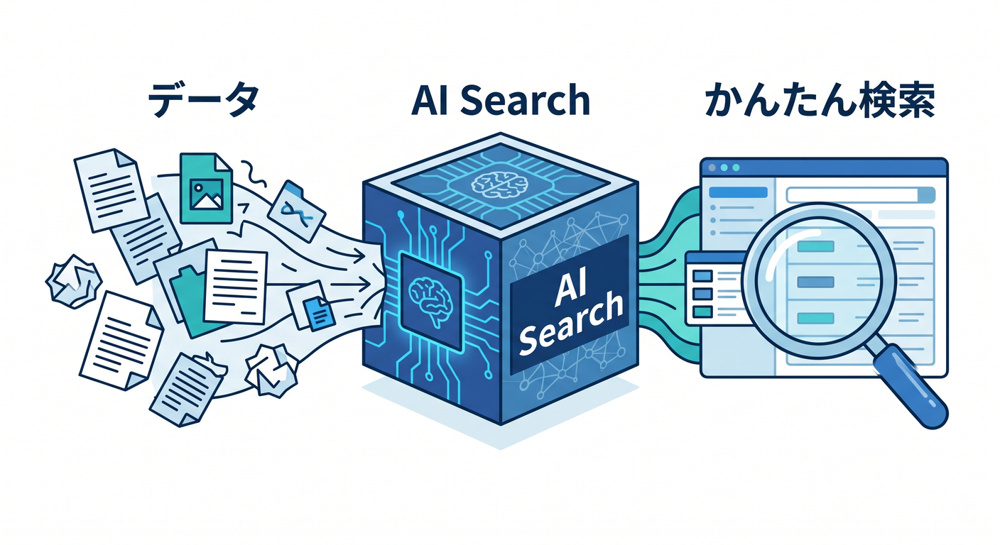
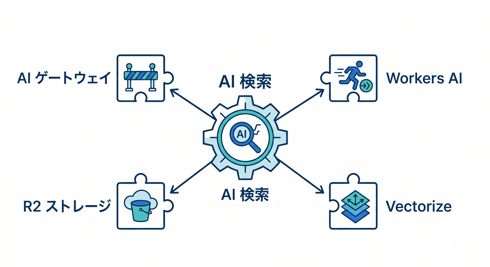
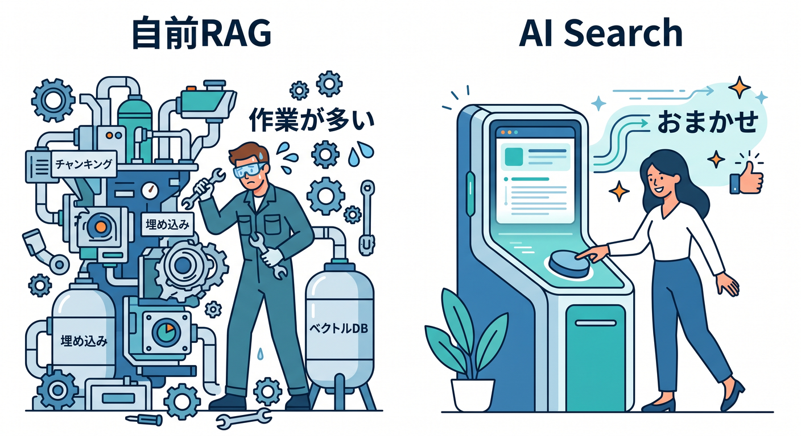
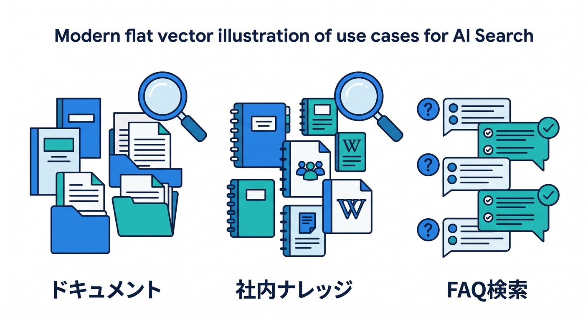
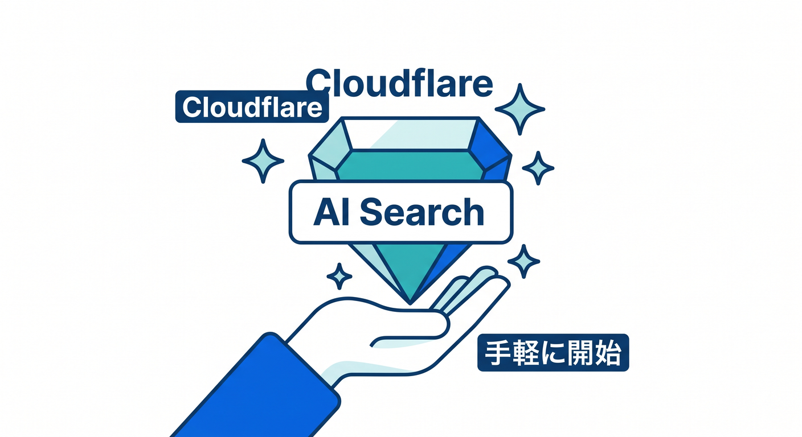

# 第10章：AI Searchでmanaged searchを知ろう 🔍

AI Searchは、Cloudflareのmanaged search serviceです。  
自分で全部のRAG基盤を組む前に、AI Searchで楽になる部分を知ります。

---

## 1. AI Searchとは 🌐



公式ドキュメントでは、AI SearchはWebサイトや非構造データを接続し、自然言語で検索できるmanaged search serviceとして案内されています。  
継続的に更新されるindexを作り、アプリやAI agentからqueryできます。

```text
データを接続
  ↓
index化
  ↓
自然言語検索
```

---

## 2. 統合されるCloudflare機能 🧩



AI Searchは、次のようなCloudflare機能と統合されます。

- Vectorize
- AI Gateway
- R2
- Browser Run
- Workers AI

自前で全部つなぐ手間を減らせる可能性があります。

---

## 3. 自前RAGとの違い 🧭



自前RAGは自由度が高いですが、作るものが多いです。

```text
自前RAG:
  chunk分割
  embedding生成
  Vectorize保存
  query
  context作成

AI Search:
  managed searchとして扱える部分が増える
```

要件に応じて選びます。

---

## 4. 使いどころ 📚



AI Searchは次のような用途に向きます。

- ドキュメント検索
- 社内ナレッジ検索
- サイト内自然言語検索
- AI agentの検索機能
- FAQ検索

最初は自分の学習メモや自分のサイトで試すのが安全です。

---

## 5. 章末チェック ✅



- AI Searchはmanaged search serviceだと分かる
- Webサイトや非構造データを扱えると分かる
- VectorizeやR2などと統合されると分かる
- 自前RAGとの違いを説明できる
- ドキュメント検索に使えると分かる

この章で覚える一言はこれです。  
**AI Searchは、自然言語検索の基盤をCloudflare側で扱いやすくするサービスです 🔍**
