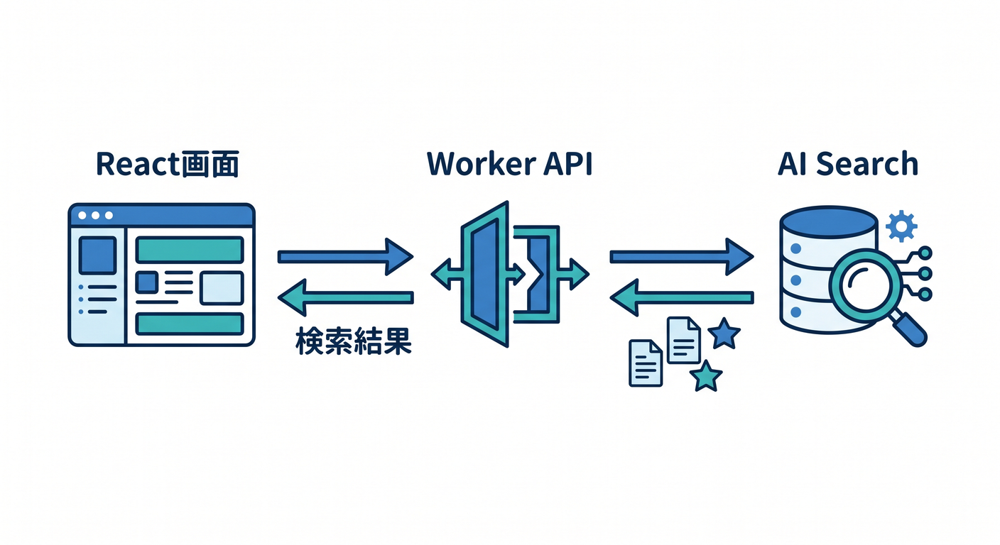
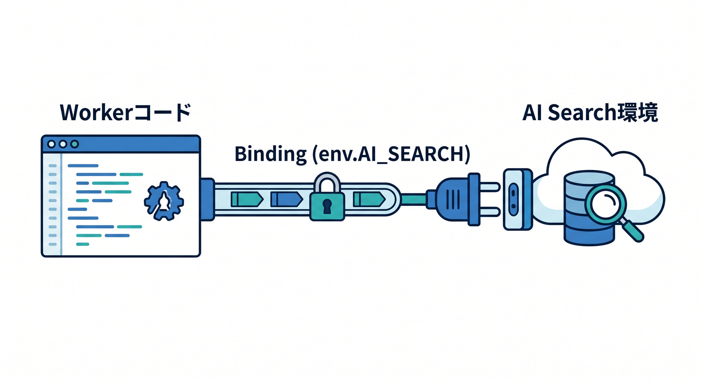
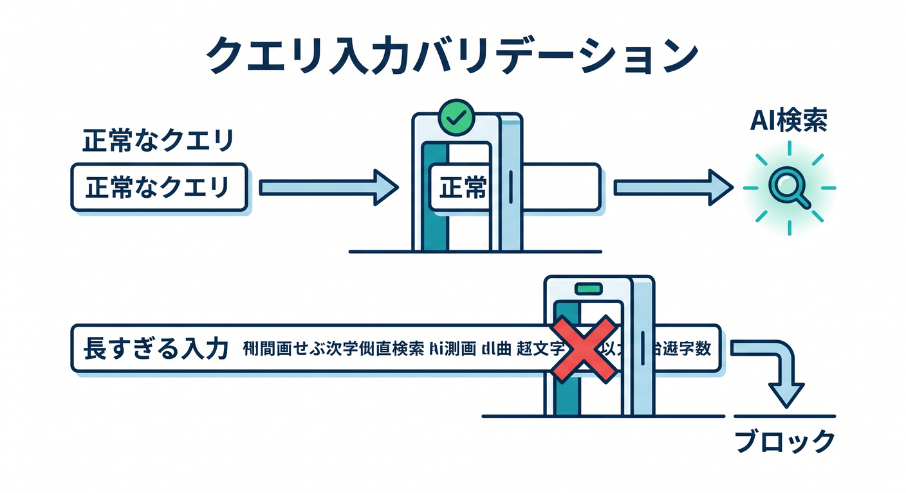
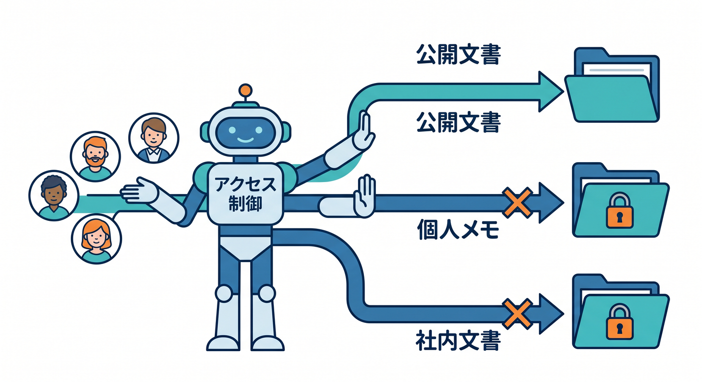
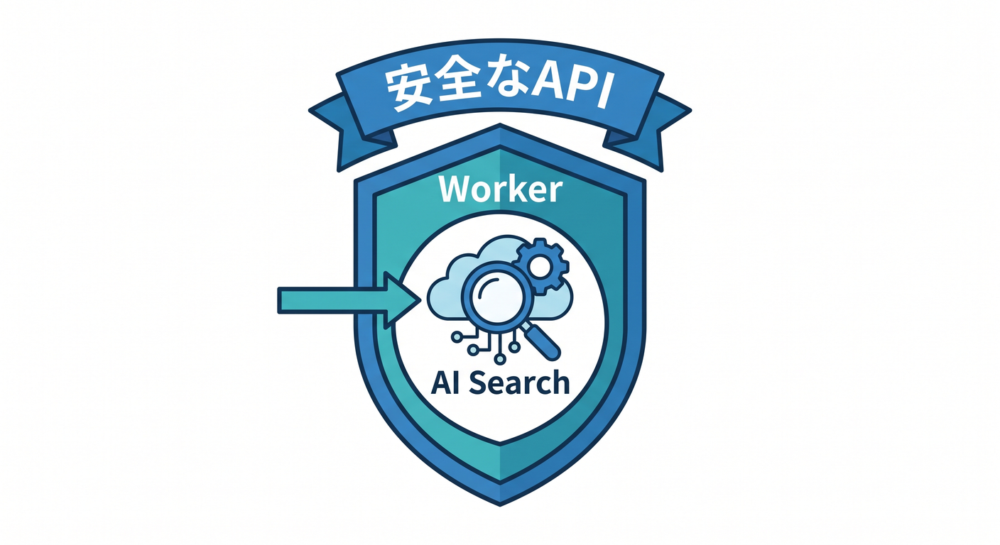

# 第11章：AI SearchをWorkerから呼び出そう 🌐

AI Searchは、Workerからアプリの検索APIとして使えます。  
React画面から質問を送り、WorkerがAI Searchへ問い合わせます。

---

## 1. 全体構成 🧭



構成はこうです。

```text
React
  ↓ POST /api/search
Worker
  ↓ AI Search
検索結果
  ↓
Reactへ表示
```

ユーザーはキーワードではなく、自然文で質問できます。

---

## 2. Worker bindingの考え方 🔌



公式ドキュメントでは、AI SearchをWorkers bindingから扱う方法が案内されています。  
bindingを使うと、Worker内でAI Search instanceへアクセスできます。

```ts
const result = await env.AI_SEARCH.search({
  query: "D1とKVの違いは？",
});
```

実際のメソッド名や型は、利用中の公式ドキュメントに合わせて確認します。

---

## 3. 入力チェック 🔐



検索queryにも制限を入れます。

```ts
if (!query || query.length > 500) {
  return Response.json({ error: "Invalid query" }, { status: 400 });
}
```

長すぎる入力や空文字を止めます。

---

## 4. 権限管理 🧯



検索は便利ですが、権限のない文書を見せてはいけません。

```text
公開文書 → 誰でも検索可
個人メモ → 本人だけ
社内文書 → 権限のあるユーザーだけ
```

AI Searchへ渡す前後で、アクセス制御を考えます。

---

## 5. 章末チェック ✅



- ReactからWorker経由でAI Searchを使う構成が分かる
- Workers bindingの存在を知っている
- queryの入力チェックが必要だと分かる
- 検索結果にも権限管理が必要だと分かる
- 自然言語検索APIの形をイメージできる

この章で覚える一言はこれです。  
**AI Searchは、Worker経由で安全にアプリの検索機能として使います 🌐**
