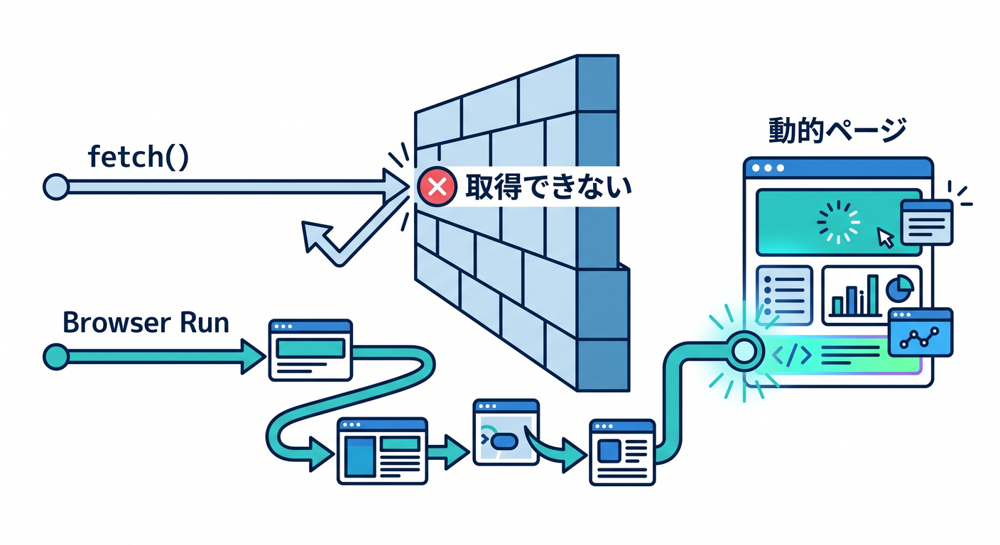
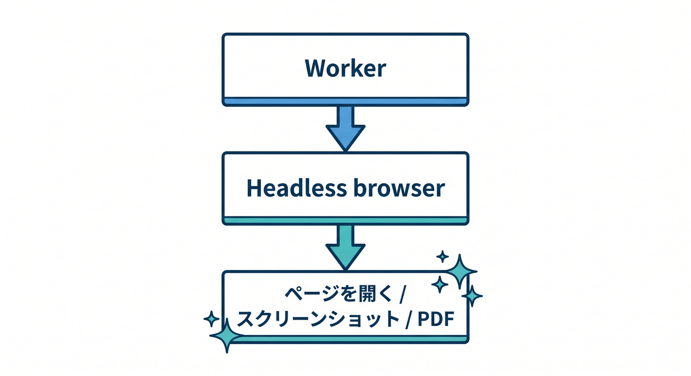
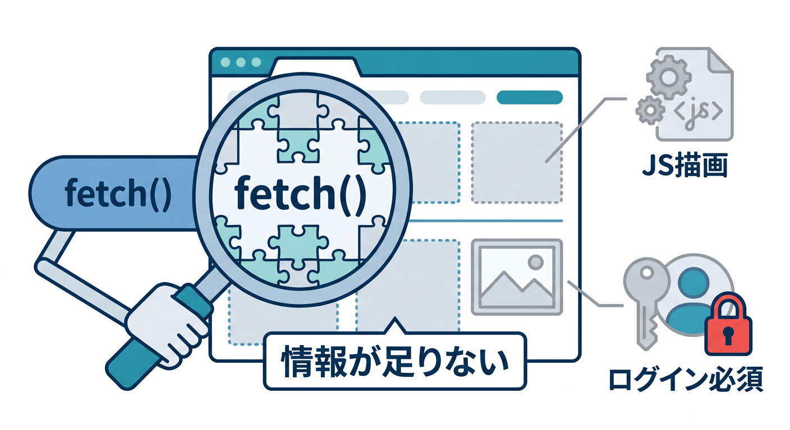
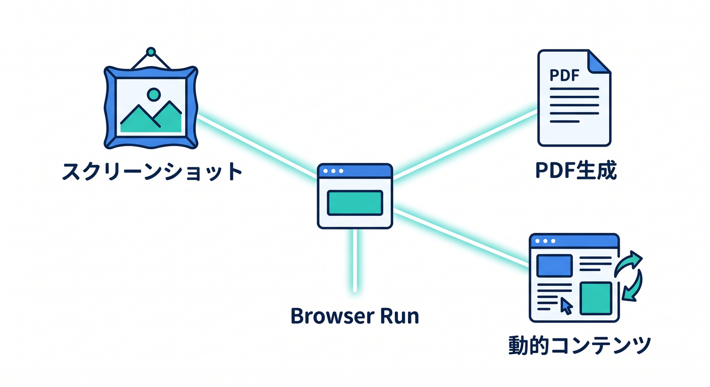
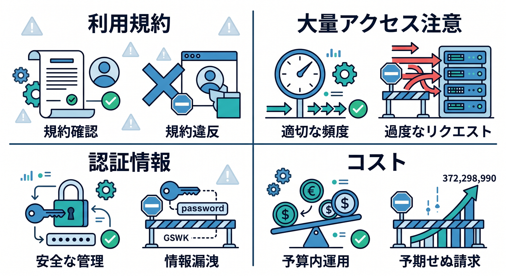

# 第12章：Browser Runで動的ページを扱おう 🖥️

通常の `fetch()` だけでは、JavaScriptで描画されるページをうまく取得できないことがあります。  

そのときに候補になるのがBrowser Runです。

---

## 1. Browser Runとは 🧭

Browser Renderingは現在Browser Runとして案内され、Workersからheadless browserを扱える機能です。  
スクリーンショット、PDF生成、動的ページ取得、ブラウザ自動化などに使えます。


```text
Worker
  ↓
Headless browser
  ↓
ページを開く / スクリーンショット / PDF
```

---

## 2. fetchだけでは足りない場面 🧩

次のようなページでは、fetchだけだと情報が足りないことがあります。


- JavaScriptで本文を描画するページ
- ログイン後に表示が変わるページ
- 画像やCanvasが必要なページ
- スクリーンショットを取りたいページ

ブラウザとして開く必要がある場合があります。

---

## 3. できること 📸

Browser Runでは、次のような処理が候補です。


- スクリーンショット
- PDF生成
- ページタイトル取得
- 動的コンテンツ取得
- UIの簡易確認

AI SearchやRAG用に、自分のサイトを取り込む発展にもつながります。

---

## 4. 注意点 🔐

便利ですが、使い方には注意します。


- robotsや利用規約を守る
- 自分のサイトや許可されたサイトから始める
- 大量アクセスしない
- 認証情報を安全に扱う
- コストとlimitsを確認する

勝手な大量取得は避けます。

---

## 5. 章末チェック ✅

- Browser Runの役割が分かる
- fetchだけでは足りない場面が分かる
- スクリーンショットやPDF生成に使えると分かる
- AI SearchやRAGのデータ取得とつながる
- robotsや利用規約に注意できる

この章で覚える一言はこれです。  
**Browser Runは、Workerからブラウザを使って動的ページを扱うための発展機能です 🖥️**
