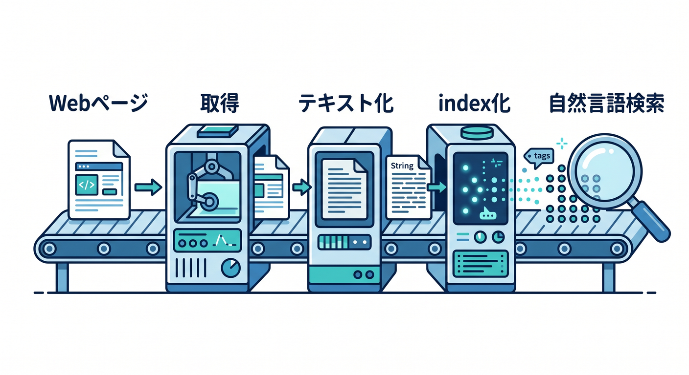
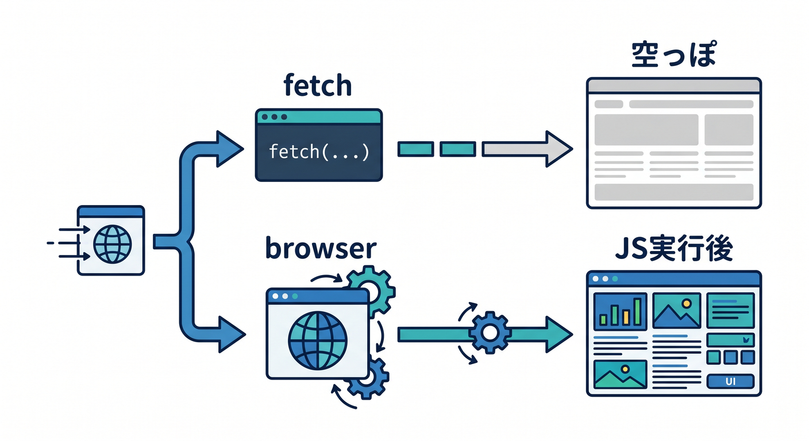
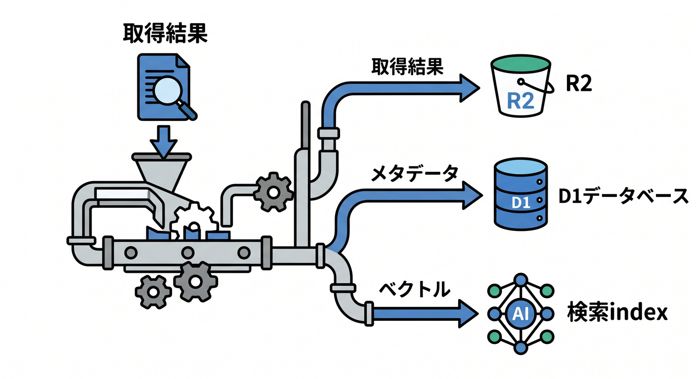
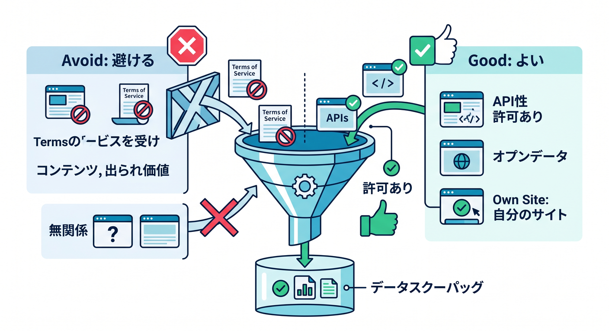
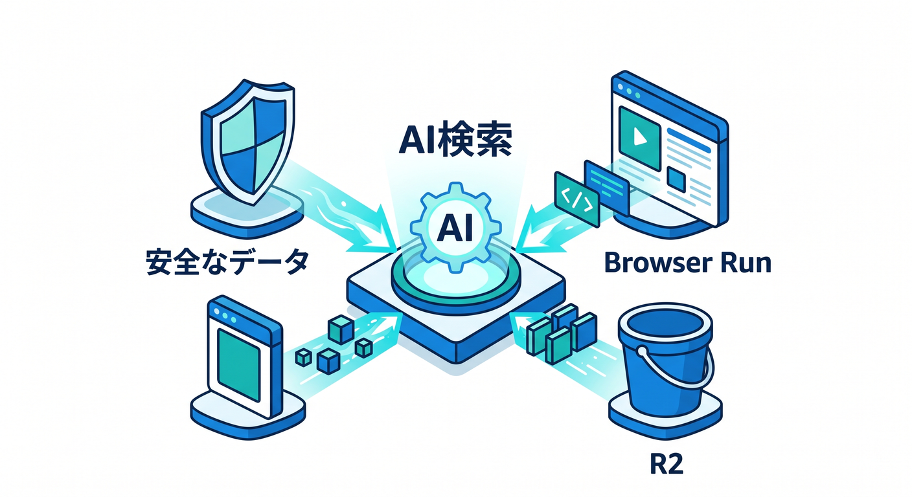

# 第13章：Browser RunとAI Searchの関係を見よう 🧷

AI SearchでWebサイトをデータソースにすると、ページ取得とindex化が関係します。  
動的ページでは、Browser Runのようなブラウザ実行が役立つ場面があります。

---

## 1. WebページからAI検索へ 🌐

流れはこうです。


```text
Webページ
  ↓ 取得
テキスト化
  ↓
index化
  ↓
自然言語検索
```

AI Searchは、この流れの多くをmanagedに扱える方向のサービスです。

---

## 2. 動的ページの問題 🧩

JavaScriptで本文が後から出るページでは、HTMLだけをfetchしても中身が足りないことがあります。


```text
fetch → 空っぽに近いHTML
browser → JavaScript実行後の内容
```

この差を理解しておくと、データ取得の失敗に気づきやすいです。

---

## 3. R2に保存する設計 🪣

取得したMarkdownやHTMLをR2へ保存する設計もあります。


```text
取得結果 → R2
メタデータ → D1
検索index → AI Search / Vectorize
```

あとで再indexや調査がしやすくなります。

---

## 4. 対象を絞る 🔐

最初は、自分のサイトや許可されたページだけを対象にします。


```text
よい: 自分のドキュメントサイト
よい: 公開許可された社内資料
避ける: 無関係なサイトの大量取得
```

検索基盤を作る前に、データ利用のルールを確認します。

---

## 5. 章末チェック ✅

- Webページ取得からAI検索までの流れが分かる
- 動的ページではfetchだけでは足りないことがある
- Browser Runが役立つ場面が分かる
- 取得結果をR2へ保存する設計が分かる
- 対象サイトを絞る必要があると分かる

この章で覚える一言はこれです。  

**AI検索は、検索する前に“正しく安全にデータを集める”ことが大切です 🧷**
