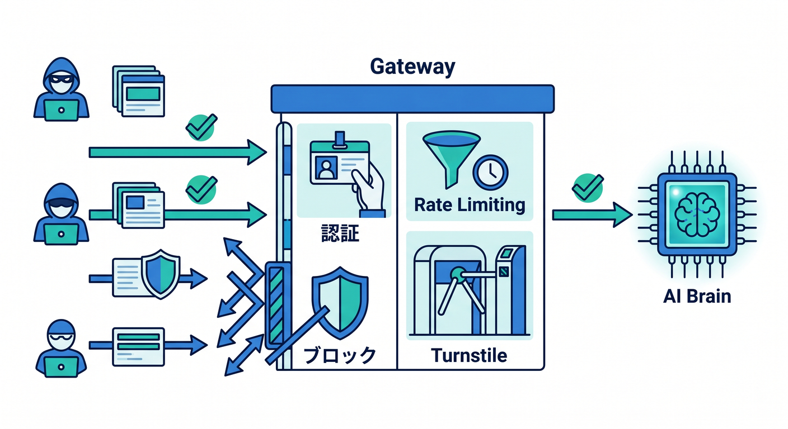
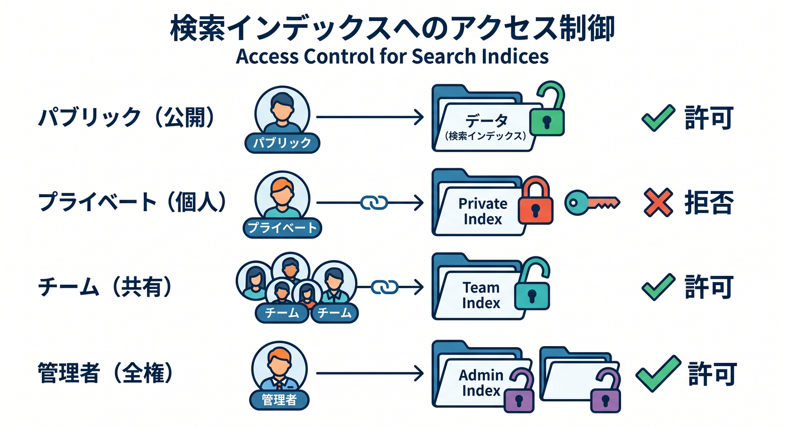
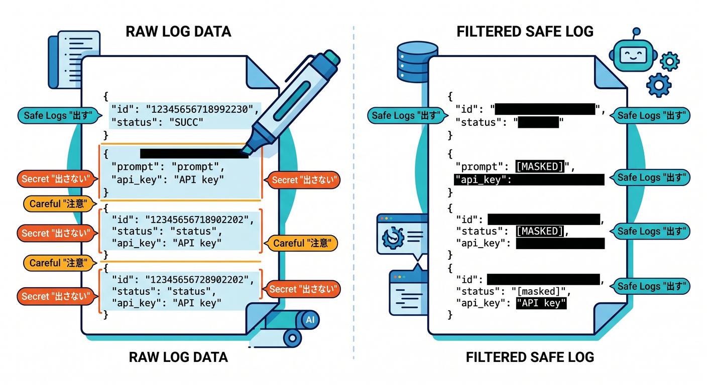
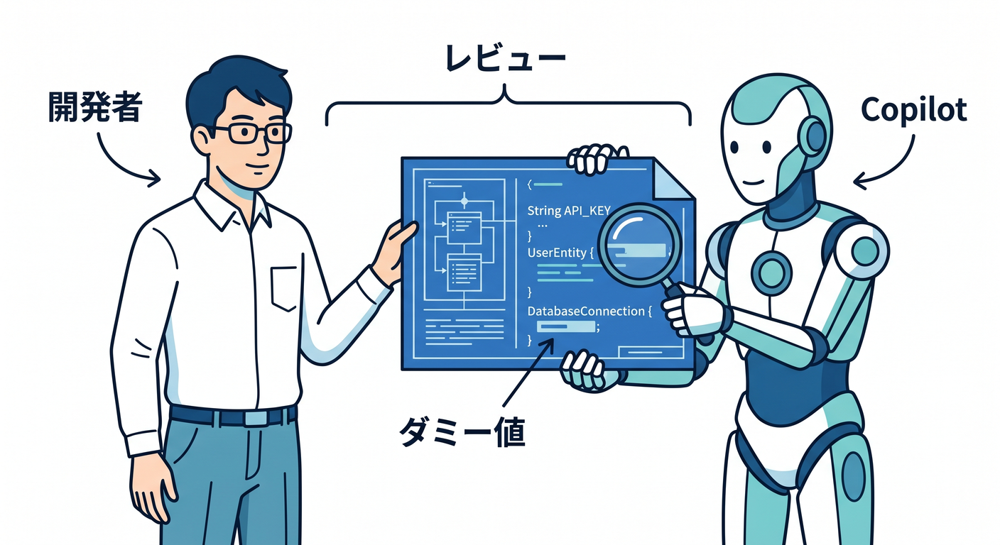

# 第14章：AI機能の安全・権限・運用をまとめよう 🔐

AI Gateway、Vectorize、AI Search、Browser Runを使うと、できることが一気に増えます。  
同時に、安全性と運用の責任も増えます。

---

## 1. 入口を守る 🚪

AI APIは、誰でも無制限に使える形にしないようにします。


- 認証
- Rate Limiting
- Turnstile
- 入力長制限
- 管理者機能のアクセス制御

AI GatewayやCloudflareのセキュリティ機能を組み合わせます。

---

## 2. 検索対象を守る 🔎

VectorizeやAI Searchでは、権限のないデータを返さないことが重要です。


```text
public → 誰でも検索可
private → 本人だけ
team → チームメンバーだけ
admin → 管理者だけ
```

metadata filteringやD1の権限チェックを組み合わせます。

---

## 3. ログを安全にする 📝

ログには、調査に必要な情報だけを残します。


```text
出す: requestId, jobId, model, status, durationMs
注意: prompt全文, 検索query全文, 個人情報
出さない: API key, token, Cookie
```

AI関連ログは個人情報が混ざりやすいので注意します。

---

## 4. Copilotレビュー例 🤖

実装後にレビューを頼めます。


```text
Cloudflare AI Gateway + Vectorize + AI Search + Browser Runを使ったAI検索APIです。
認証、Rate Limiting、権限チェック、metadata filtering、ログ、コスト、Browser Runの対象制限をレビューしてください。
```

実データやsecretは貼らず、ダミー値にします。

---

## 5. 章末チェック ✅

- AI APIの入口を守れる
- 検索対象の権限管理を考えられる
- ログに出す情報を選べる
- Browser Runの対象制限を考えられる
- Copilotへ安全レビューを依頼できる

この章で覚える一言はこれです。  

**実用AI機能は、便利さだけでなく権限・ログ・コストまで守って作ります 🔐**
