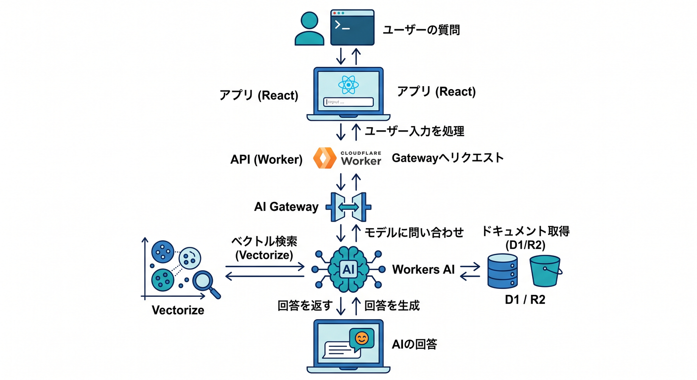
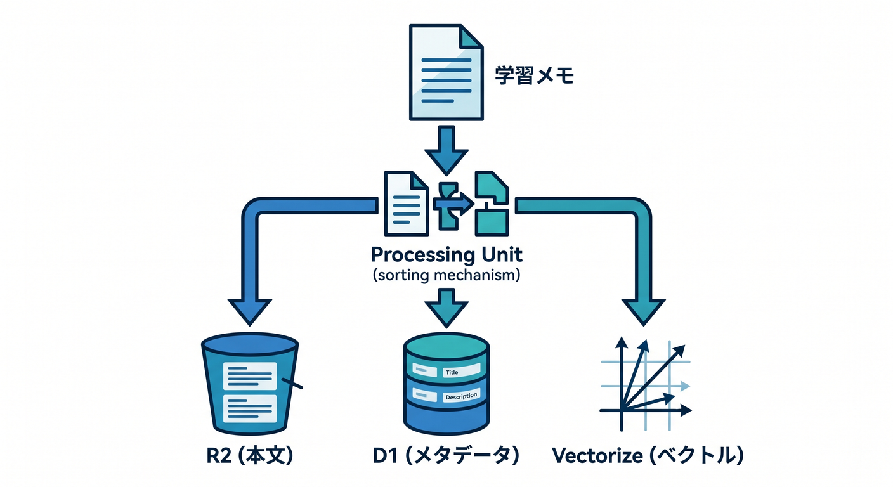
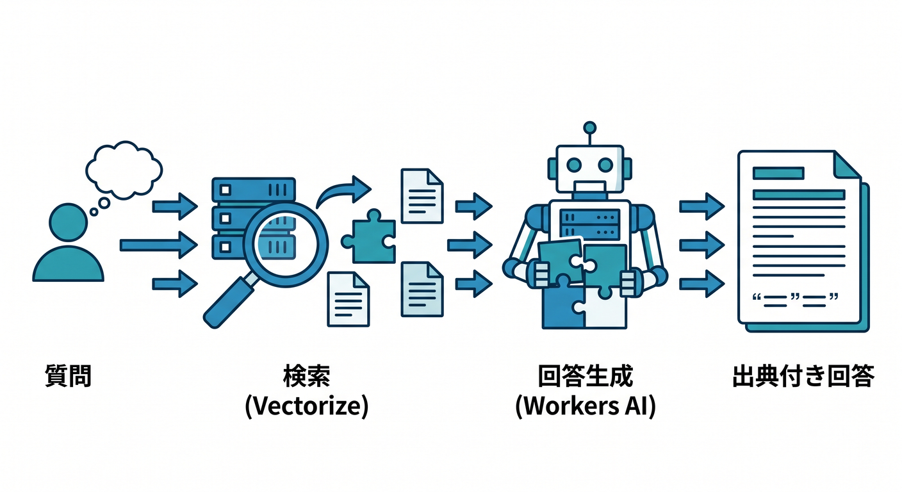
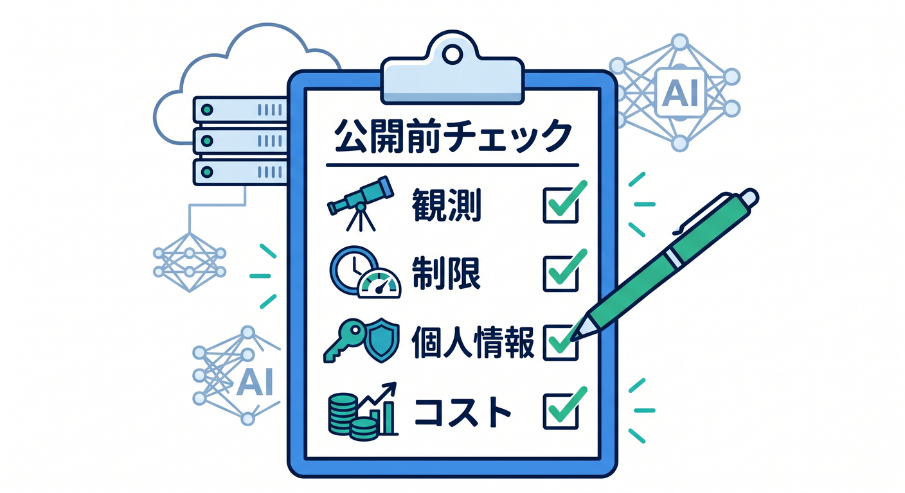
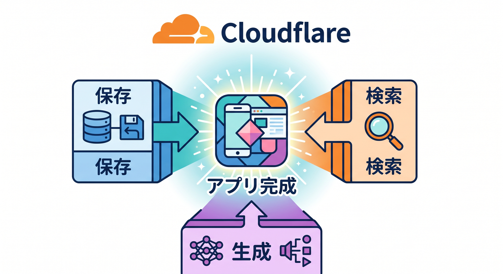

# 第15章：AIドキュメント検索アプリを完成させよう 🏁

最後は、ここまでの機能を小さなAIドキュメント検索アプリにまとめます。  
自分の学習メモやMarkdownを検索できるアプリを作るイメージです。

---

## 1. 完成イメージ 🧭

構成はこうです。

```text
React
  ↓ 質問
Worker API
  ↓
AI Gateway
  ↓
Workers AIでembedding / 回答生成
  ↓
VectorizeまたはAI Search
  ↓
D1 / R2
```

まずはVectorizeで自前RAG、発展でAI Searchを検討します。



---

## 2. データ登録の流れ 📚

学習メモを登録します。

```text
Markdown本文 → R2
タイトルや説明 → D1
embedding → Vectorize
```

AI Searchを使う場合は、データソース接続とindex化の流れを確認します。



---

## 3. 検索の流れ 🔎

ユーザー質問から検索します。

```text
質問
  ↓ embedding
Vectorize query
  ↓ 関連メモ
Workers AIで回答生成
  ↓
出典付きで表示
```

出典を表示すると、回答の確認がしやすくなります。



---

## 4. 本番前チェック ✅

公開前に確認します。

- AI Gatewayで観測できるか
- Rate Limitingがあるか
- promptやqueryの長さ制限があるか
- 権限のない文書が出ないか
- R2 keyやmetadataに個人情報を入れすぎていないか
- Browser Runの対象が許可されたサイトか
- costsとlimitsを確認したか

AI検索は便利ですが、データの扱いに注意します。



---

## 5. 章末チェック ✅

- AIドキュメント検索の全体構成を説明できる
- R2、D1、Vectorizeの役割を分けられる
- AI Gatewayで観測と制御を考えられる
- AI Searchへの発展を説明できる
- 実用AIアプリの安全チェックができる

この章で覚える一言はこれです。  
**CloudflareのAI機能を組み合わせると、保存・検索・生成・観測まで含むAI検索アプリを作れます 🏁**


