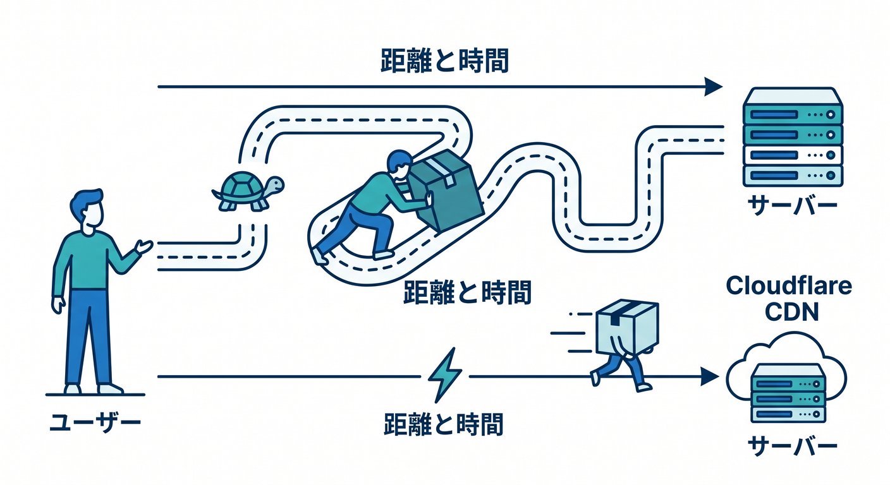
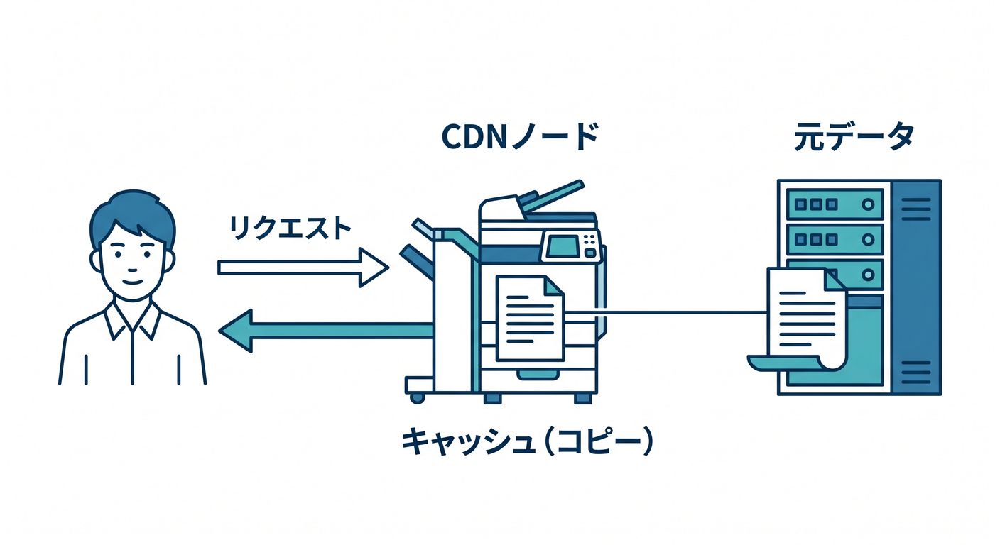
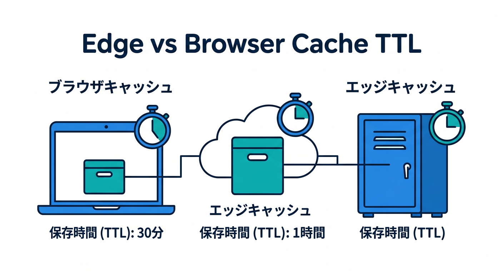
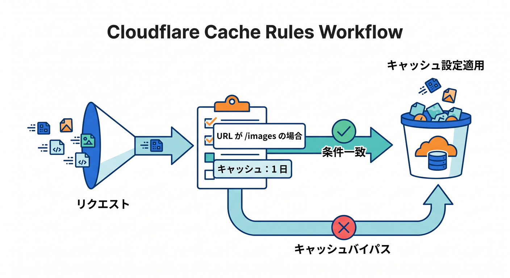
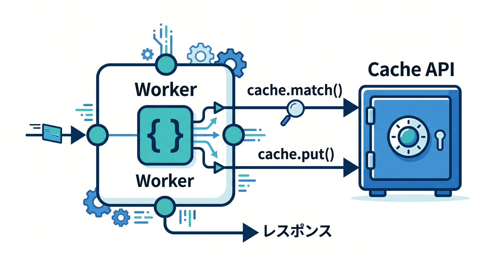

# Cloudflare CDN・キャッシュ・Cache Rules編 15章アウトライン ⚡☁️📦

確認日: 2026-04-24  
主な確認先: Cloudflare Cache (CDN) / Cache Rules / Default cache behavior / Edge and Browser Cache TTL / Workers Cache API 公式ドキュメント

## 第1章　「速くする」って何を速くすること？⚡

まずは、WebサイトやAPIが遅く感じる理由をやさしく整理します。  

画像が重い、サーバーが遠い、毎回同じ処理をしている、という基本から見ます 🐢  
CloudflareのCDNは、ユーザーの近くからコンテンツを返すことで体感速度を上げます。  
ここでは「サーバーを強くする」だけが高速化ではないと理解します。  
キャッシュは、よく使うものを近くに置く仕組みです 📦  
Reactアプリ、画像、CSS、JavaScript、APIレスポンスで向き不向きが違うことも学びます。  
最初から細かい設定ではなく、「何が遅いのか」を言葉にする練習をします。  
この章のゴールは、CDNとキャッシュを“速く見せるための置き場戦略”として理解することです 🚀

## 第2章　CDNは世界中の配達拠点みたいなもの 🌍

CDNはContent Delivery Networkの略で、コンテンツを世界中の拠点から配る仕組みです。  
Cloudflareはグローバルネットワークを使い、ユーザーに近い場所から返せるものを返します ⚡  
オリジンサーバーまで毎回取りに行かなくてよいので、遅延や負荷が減ります。  
ここでは、ブラウザ、Cloudflare Edge、originの位置関係を図で考えます。  

Cloudflareが前段にいると、キャッシュだけでなくセキュリティやルール処理も使いやすくなります 🛡️  
ただし、全部が自動でキャッシュされるわけではありません。  
何がキャッシュされやすいか、何がされにくいかを次章以降で整理します。  
この章のゴールは、CDNが“近くの配達拠点”として働くイメージを持つことです 🚚

## 第3章　キャッシュは「コピーを近くに置く」仕組み 📦

キャッシュとは、一度取得した内容のコピーを一時的に保存することです。  

同じ画像や同じJavaScriptを毎回作り直したり取りに行ったりしないための工夫です 🧠  
CloudflareのEdgeキャッシュ、ブラウザキャッシュ、Worker内のCache APIを分けて見ます。  
特にEdge Cache TTLとBrowser Cache TTLは、保存場所が違うので混同しやすいです。  
EdgeはCloudflare側、Browserはユーザーのブラウザ側です 👀  
キャッシュは速くしますが、古い内容が残るという副作用もあります。  
「速さ」と「新しさ」のバランスを考えるのがキャッシュ設計の基本です。  
この章のゴールは、キャッシュのメリットと危険を両方理解することです ⚖️

## 第4章　Cloudflareは何を自動でキャッシュするの？🔍

Cloudflareにはデフォルトのキャッシュ挙動があります。  
画像、CSS、JavaScriptなどの静的ファイルはキャッシュ対象になりやすいです 🖼️  
一方、POSTリクエスト、`Set-Cookie` 付きレスポンス、`private` や `no-store` は基本的に注意が必要です。  
公式ドキュメントでも、Cache-ControlやExpiresなどのヘッダーが重要になります。  
何も設定しなくてもキャッシュされるものと、明示的なルールが必要なものを分けます。  
動的HTMLやAPIレスポンスは、内容によってキャッシュしてよいか慎重に判断します 🧪  
ここで「キャッシュされない理由」を読める力をつけます。  
この章のゴールは、Cloudflareのデフォルト挙動をざっくり説明できることです ✅

## 第5章　Cache-Controlヘッダーを読めるようになろう 🧾

キャッシュを理解するには、HTTPヘッダーを見る力が大事です。  
`Cache-Control: public, max-age=3600` のような指定を、ゆっくり読みます 👓  
`public`、`private`、`no-store`、`max-age`、`s-maxage` を初心者向けに整理します。  
Cloudflareは、Edge Cache TTLルールで上書きしない限り、originのキャッシュヘッダーを尊重する流れがあります。  
`max-age` はブラウザや共有キャッシュの保存時間、`s-maxage` は共有キャッシュ向けとして理解します。  
Reactのビルド済みアセットでは長め、HTMLやAPIでは短め、という感覚も学びます ⚖️  
ブラウザDevToolsでResponse Headersを見る練習も入れます。  
この章のゴールは、キャッシュ判断の材料としてヘッダーを読めることです 🔎

## 第6章　Cache Rulesの全体像をつかもう 🧩

Cache Rulesは、Cloudflareでキャッシュ挙動を調整する中心機能です。  
どのリクエストに対して、キャッシュ対象にするか、TTLをどうするかを設定できます ⚙️  
ダッシュボード、API、Terraformから作成できることも押さえます。  
Cache Rulesを使うには、対象DNSレコードがCloudflareにproxyされている必要があります ☁️  
Freeでも利用できますが、プランごとに作れるルール数に差があります。  
Page Rulesからの移行文脈も軽く触れますが、主役はCache Rulesです。  
最初はテンプレートやExpression Builderでルールを作る流れを学びます。  
この章のゴールは、Cache Rulesを“キャッシュの条件分岐表”として理解することです 📋

## 第7章　Edge Cache TTLとBrowser Cache TTLを分けて考えよう ⏱️

TTLはTime To Liveの略で、どれくらい新鮮として扱うかの時間です。  
Edge Cache TTLはCloudflareのグローバルネットワーク側の保存時間です ☁️  

Browser Cache TTLはユーザーのブラウザ側の保存時間です 🧑‍💻  
Cloudflareのキャッシュを消しても、ユーザーのブラウザキャッシュは消えない点が重要です。  
画像やハッシュ付きJSは長め、HTMLや頻繁に変わるAPIは短めが基本です。  
長くしすぎると速いけれど、更新が反映されにくくなります。  
短くしすぎると新しいけれど、毎回取りに行きやすくなります。  
この章のゴールは、EdgeとBrowserのTTLを混同しないことです 🧭

## 第8章　静的アセットを上手にキャッシュしよう 🖼️

ReactやViteでビルドすると、CSSやJavaScriptにハッシュ付きファイル名がよく使われます。  
ハッシュ付きファイルは中身が変わると名前も変わるため、長くキャッシュしやすいです 📦  
画像、フォント、CSS、JSをどう扱うかを具体例で見ます。  
一方、`index.html` のような入口HTMLは、更新反映を考えて慎重に扱います。  
Cloudflare CDNで静的ファイルを速く配ると、体感速度に効きやすいです ⚡  
Cache Rulesで特定拡張子だけTTLを変える発想も学びます。  
DevToolsのNetworkタブで読み込み速度とキャッシュ状態を見る練習をします。  
この章のゴールは、静的アセットを安全に長くキャッシュする感覚を持つことです ✅

## 第9章　HTMLとAPIレスポンスは慎重にキャッシュしよう 🧪

HTMLやAPIは、ユーザーや時間によって内容が変わることがあります。  
ログイン状態、個人情報、注文内容、AIの実行結果などは特に注意が必要です 🔐  
`Set-Cookie` 付きレスポンスや `private` 指定はキャッシュしない判断になりやすいです。  
GETの公開データAPIなら短時間キャッシュできる場合があります。  
POSTは通常のCDNキャッシュ対象として考えない方が安全です。  
Cache Rulesで“全部キャッシュ”に寄せる前に、誰に同じ内容を返してよいかを考えます。  
AI APIでは、入力ごとに結果が変わるため、キャッシュ対象をかなり慎重に見ます 🤖  
この章のゴールは、「速くしたい」より先に「同じものを返してよいか」を考えることです 🛡️

## 第10章　Cache Rulesを作る手順を体験しよう 🛠️

ここでは、CloudflareダッシュボードでCache Ruleを作る流れを学びます。  

対象URLを決め、条件式を作り、キャッシュ対象やTTLを設定します ⚙️  
Expression Builderで `Hostname contains "example.com"` のような条件を作ります。  
拡張子、パス、ホスト名ごとにルールを分ける例を見ます。  
最初は画像だけ、CSS/JSだけなど、安全な範囲から始めます 🧪  
設定後はブラウザやCloudflare Traceでルールが効いているか確認します。  
ルールの順序や範囲が広すぎないかもチェックします。  
この章のゴールは、小さなCache Ruleを自分で設計できることです ✅

## 第11章　キャッシュが効いているか確認しよう 👀

キャッシュ設定は、作っただけでは終わりません。  
本当に効いているかを確認する必要があります 🔎  
ブラウザDevTools、レスポンスヘッダー、Cloudflare Trace、Cache Analyticsを使い分けます。  
`CF-Cache-Status` のようなヘッダーを見ると、HIT/MISS/BYPASSなどの状態を確認できます。  
MISSは最初の取得、HITはキャッシュから返った状態として理解します。  
Cloudflare Traceでは、特定URLにどのルールが適用されているか調査できます。  
CopilotにはヘッダーやTrace結果を貼って、状態を説明させます 🤖  
この章のゴールは、キャッシュの効き具合を感覚ではなく証拠で見ることです 📊

## 第12章　Purgeでキャッシュを消す・更新する 🧹

キャッシュは速い反面、古い内容が残ることがあります。  
そのため、更新時にはPurgeでCloudflare側のキャッシュを消す考え方が必要です 🧹  
URL単位、ホスト名単位、全体Purgeなど、影響範囲の違いを学びます。  
何でも全消しすると簡単ですが、負荷が増えたり影響が広くなります。  
画像やJSのファイル名にハッシュをつければ、Purgeに頼りすぎない運用ができます 📦  
ただし、Cloudflare側をPurgeしてもブラウザキャッシュは別問題です。  
更新されないときは、EdgeなのかBrowserなのかを分けて考えます。  
この章のゴールは、キャッシュ更新の安全な流れを理解することです 🔁

## 第13章　Workers Cache APIはいつ使う？🧑‍💻

Cloudflare Workersには、Cache APIを使ってプログラムからキャッシュを扱う方法があります。  

`caches.default.match()`、`cache.put()`、`cache.delete()` の基本を見ます 📦  
ただし、Workers Cache APIはCloudflareの通常CDNキャッシュと完全に同じ感覚ではありません。  
Cache APIの内容はデータセンター単位で、グローバルに自動複製されるものではありません。  
Tiered CacheとCache APIの相性にも注意が必要です。  
通常の静的配信や単純なTTL調整は、まずCache Rulesで考えます。  
Worker内で特別なキャッシュキーやレスポンス加工をしたいときにCache APIを検討します。  
この章のゴールは、Cache RulesとWorkers Cache APIの使い分けを知ることです 🧭

## 第14章　AI・画像・APIでキャッシュ設計を練習しよう 🤖🖼️

ここでは、実例を使ってキャッシュしてよいもの・悪いものを判断します。  
画像サムネイル、公開記事一覧、AI要約API、ユーザー別ダッシュボードを比べます 🧩  
画像や公開CSS/JSは長めキャッシュしやすいです。  
公開記事一覧は短めTTLやPurgeと組み合わせる選択があります。  
AI要約APIは入力依存なので、安易な共有キャッシュは危険です。  
ユーザー別情報は基本的に共有キャッシュしない判断を学びます 🔐  
Copilotにキャッシュ方針をレビューさせるプロンプトも用意します。  
この章のゴールは、実務っぽい題材でキャッシュ判断できることです ✅

## 第15章　総仕上げ：速くて更新しやすい公開アプリにしよう 🏁

最後に、React画面、Workers API、画像、AI APIを含む小さなアプリで総復習します。  
静的アセットは長め、HTMLは慎重、公開GET APIは短め、AI POST APIは基本キャッシュしない、という方針を作ります ⚖️  
Cache Rules、Cache-Control、Purge、DevTools、Cloudflare Traceをまとめて使います。  
「速くなったか」を体感だけでなく、Networkタブやヘッダーで確認します 📊  
更新が反映されないときの切り分け手順も作ります。  
Copilotには最終レビューとして、キャッシュしすぎ・しなさすぎ・秘密情報混入を見てもらいます 🤖  
この章で、Cloudflareらしい“速さと安全のバランス”をまとめます。  
この章のゴールは、自分のアプリにキャッシュ方針を説明付きで設定できることです 🚀

## 参照URL 🔗

- Cloudflare Cache (CDN): https://developers.cloudflare.com/cache/
- Cache Rules: https://developers.cloudflare.com/cache/how-to/cache-rules/
- Cache Rules settings: https://developers.cloudflare.com/cache/how-to/cache-rules/settings/
- Default cache behavior: https://developers.cloudflare.com/cache/concepts/default-cache-behavior/
- Origin Cache Control: https://developers.cloudflare.com/cache/concepts/cache-control/
- Edge and Browser Cache TTL: https://developers.cloudflare.com/cache/how-to/edge-browser-cache-ttl/
- Browser Cache TTL example: https://developers.cloudflare.com/cache/how-to/cache-rules/examples/browser-cache-ttl/
- Cache by status code: https://developers.cloudflare.com/cache/how-to/configure-cache-status-code/
- Workers Cache API: https://developers.cloudflare.com/workers/runtime-apis/cache/
- How the Workers cache works: https://developers.cloudflare.com/workers/reference/how-the-cache-works/

