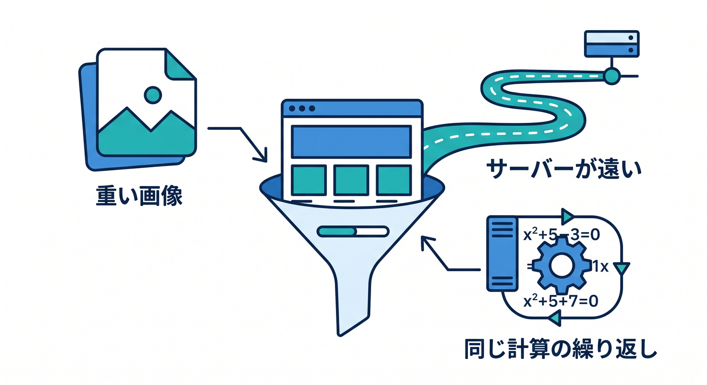
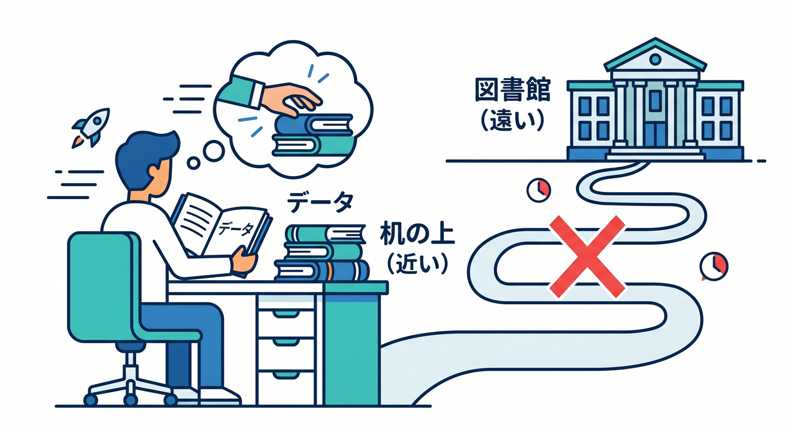
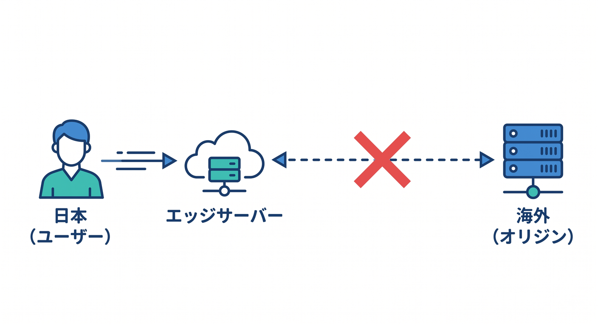
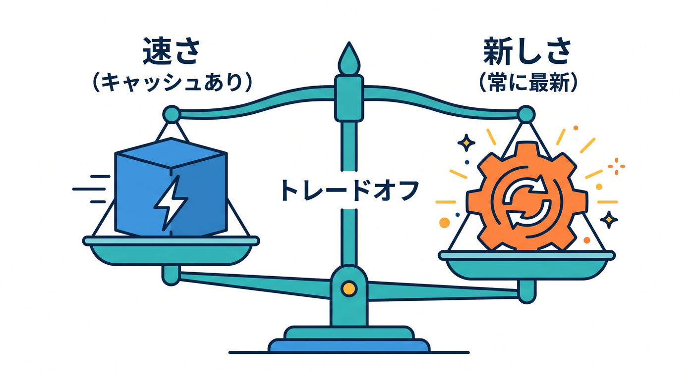
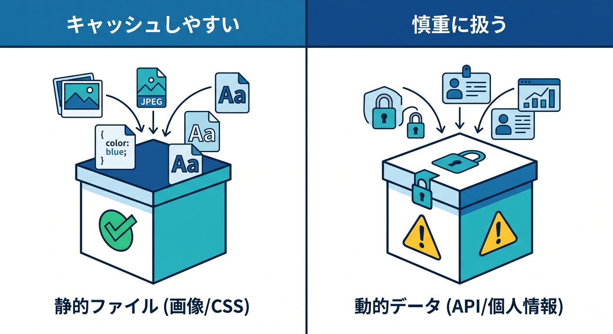

# 第01章：「速くする」って何を速くすること？⚡🚀

Cloudflareのキャッシュを学ぶ前に、まず「速くする」とは何を速くすることなのかを整理します。  
Webサイトやアプリが遅く感じる理由は1つではありません。  
画像が重い、サーバーが遠い、APIが毎回同じ計算をしている、ブラウザがたくさんファイルを取りに行っている、などいろいろあります 😵‍💫


---

## 1. 遅さにはいろいろな種類がある 🐢

「サイトが遅い」と言っても、原因はいくつかに分かれます。

- 最初のHTMLが返るまでが遅い
- 画像が大きくて表示が遅い
- JavaScriptやCSSの読み込みが多い
- APIレスポンスが遅い
- サーバーが遠い
- 毎回同じデータを作り直している

Cloudflare CDNやキャッシュが得意なのは、**同じ内容を何度も速く返すこと**です。  
逆に、毎回ユーザーごとに違う内容を安全に作る処理は、キャッシュだけでは解決できません。

まず「何が遅いのか」を分けることが、高速化の第一歩です 🔎

---

## 2. キャッシュは“近くにコピーを置く”考え方 📦

キャッシュは、一度取得したものを一時的に保存して、次から速く返す仕組みです。  
たとえば、同じロゴ画像を100人が見るなら、毎回originまで取りに行くより、Cloudflareの近い場所から返したほうが速くなります。

イメージは、よく使う教科書を毎回図書館へ借りに行くのではなく、机の上に置いておく感じです 📚  

近くにあれば、取り出すのが速いです。

Cloudflareでは、世界中のEdgeにキャッシュを置けるため、ユーザーの近くから返せる可能性があります。

---

## 3. CloudflareのCDNは“配達距離”を短くする 🌍

ユーザーが日本にいて、originサーバーが遠い国にあると、通信に時間がかかります。  
Cloudflareが間に入ると、キャッシュ済みのファイルをユーザーに近いEdgeから返せます。


つまり、毎回遠くへ取りに行かなくてよくなります 🚚  
これがCDNの大きなメリットです。

ただし、Cloudflareが何でも勝手にキャッシュしてくれるわけではありません。  
どのファイルを、どれくらい、どこに保存するかを考える必要があります。

そこで出てくるのがCache RulesやCache-Controlです。

---

## 4. 速さと新しさはトレードオフ ⚖️

キャッシュを長く置けば、速く返せます。  
でも、内容を更新したときに古いものが残りやすくなります。

たとえば、トップページのHTMLを1週間キャッシュすると、更新しても古いページが見え続けるかもしれません。  
一方、ロゴ画像やハッシュ付きJavaScriptなら、長くキャッシュしても問題になりにくいです。

キャッシュ設計では、いつも次の2つを比べます。


- 速く返したい ⚡
- 新しい内容をすぐ見せたい 🔁

このバランスが大事です。

---

## 5. 何をキャッシュしやすい？何を慎重に見る？🧩

キャッシュしやすいものです。

- 画像
- CSS
- JavaScript
- フォント
- 公開PDF
- ハッシュ付きビルドファイル

慎重に見るものです。

- HTML
- APIレスポンス
- ログイン後の画面
- ユーザーごとに違う情報
- AI APIの結果
- `Set-Cookie` があるレスポンス

とくに個人情報やログイン状態が関わるものは、共有キャッシュしてはいけない場合があります 🔐


---

## 6. Copilotに聞くならこう聞こう 🤖

```text
このWebアプリでキャッシュしてよいもの、慎重に扱うものを分けてください。
Reactの静的アセット、HTML、Workers API、Workers AI APIの観点で、
初心者向けに理由つきで説明してください。
```

キャッシュの相談では、「速くしたいです」だけではなく、どんなURLやレスポンスがあるかを伝えるのがコツです。

---

## 7. 章末チェック ✅

- 遅さには複数の原因があると分かる
- キャッシュは近くにコピーを置く仕組みだと分かる
- CDNは配達距離を短くする仕組みだと分かる
- 速さと新しさにはトレードオフがあると分かる
- キャッシュしやすいものと慎重なものを分けられる

この章で覚える一言はこれです。  
**キャッシュは、同じものを近くから速く返すための置き場戦略です 📦⚡**


