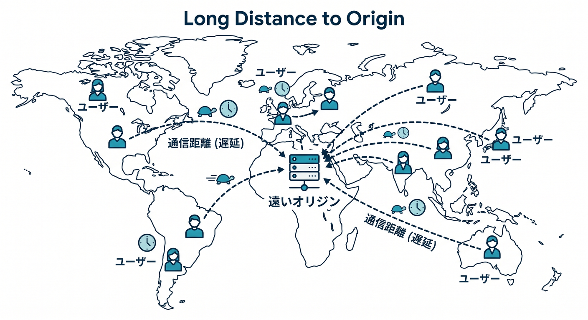
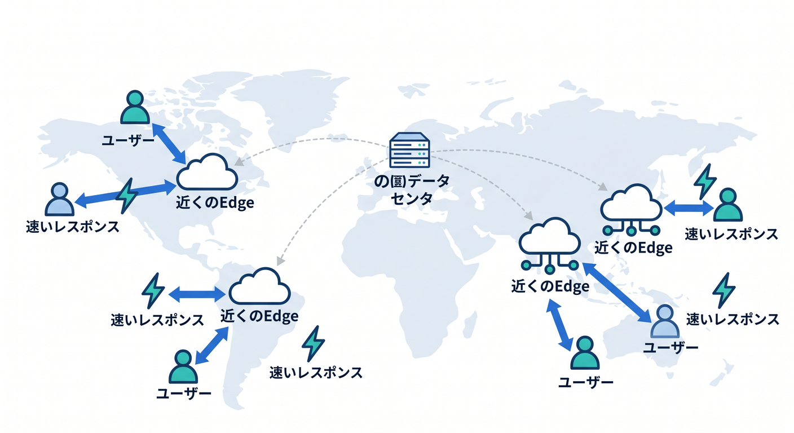
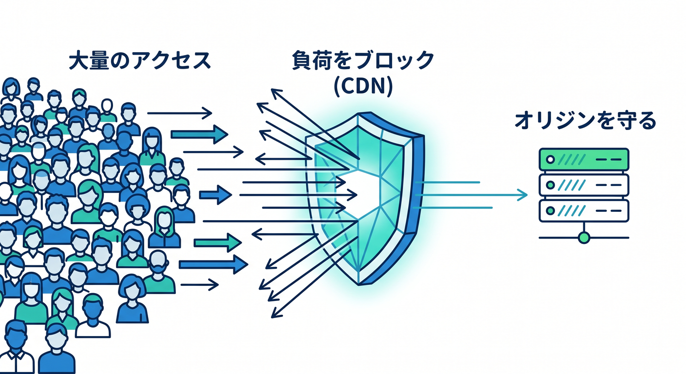
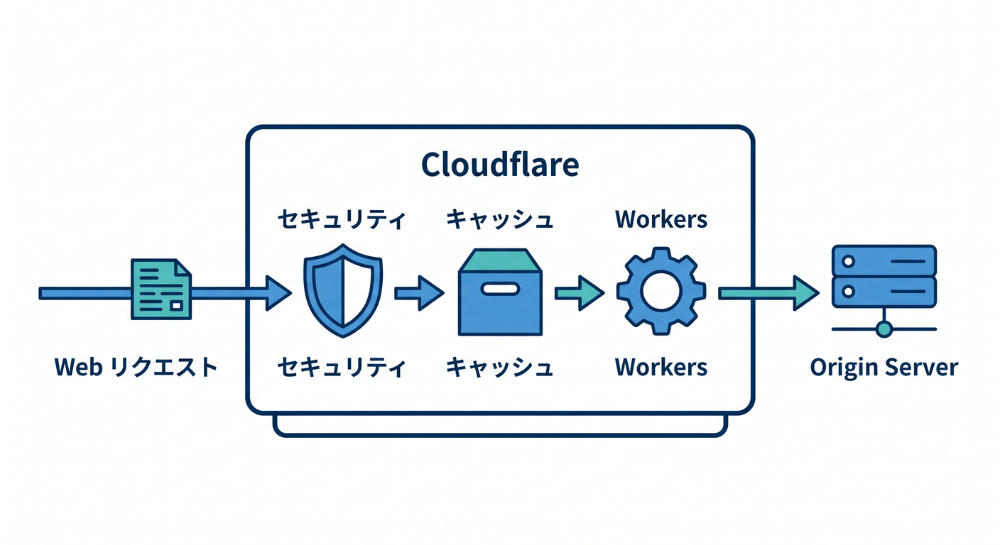
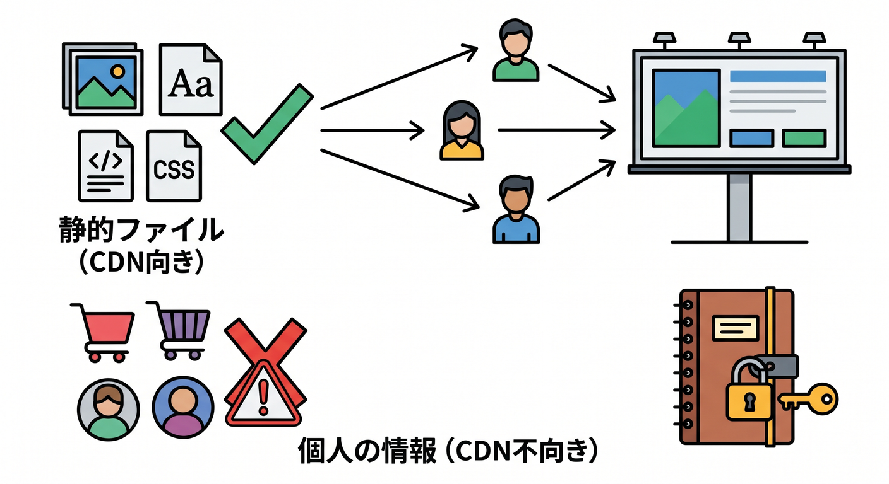
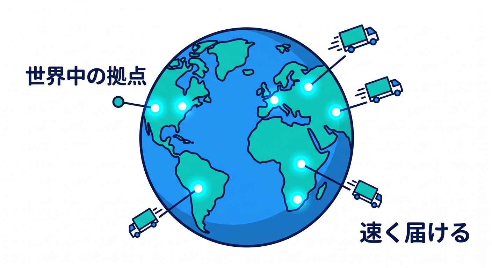

# 第02章：CDNは世界中の配達拠点みたいなもの 🌍🚚

CDNはContent Delivery Networkの略です。  
名前だけ見ると難しそうですが、考え方はかなりシンプルです。  
よく使われるコンテンツをユーザーの近くから配る仕組みです ⚡

---

## 1. originまで毎回取りに行くと遠いことがある 🏢

WebサイトやAPIには、もともとの置き場所があります。  
これをoriginと呼ぶことがあります。

もしユーザーが世界中にいる場合、全員が毎回originまで取りに行くと、距離が遠くなる人が出ます。  
距離が遠いと、通信の往復に時間がかかります。

```text
ユーザー → 遠いorigin → ユーザー
```


CDNは、この距離問題を小さくするために使われます。

---

## 2. Cloudflare Edgeが近くで返す ☁️

Cloudflareは世界中にネットワークを持っています。  
キャッシュできるコンテンツなら、CloudflareのEdgeからユーザーへ返せます。

```text
ユーザー → 近くのCloudflare Edge → ユーザー
```


初回はoriginまで取りに行くことがあります。  
でも、次から同じ内容を返せるなら、Cloudflare Edgeから速く返せます。

この「近くから返す」がCDNの大事な感覚です 🌍

---

## 3. CDNはサーバー負荷も減らせる 💪

CDNのメリットは速度だけではありません。  
originへ届くリクエスト数を減らせます。

たとえば、1万人が同じ画像を見たとします。  
毎回originが画像を返すと、originに負荷がかかります。  
Cloudflareがキャッシュから返せば、originはかなり楽になります。

これは、アクセスが増えたときに重要です。  
速くなるだけでなく、originを守る効果もあります 🛡️


---

## 4. CloudflareはCDN以外の役割も持つ 🧩

Cloudflareが前段にいると、CDN以外の機能も使いやすくなります。

- DNS
- SSL/TLS
- WAF
- Bot対策
- Cache Rules
- Workers
- Rate Limiting

つまりCloudflareは、ただのファイル配達係ではありません。  
Webアプリの入口で、速さ・安全性・ルール処理をまとめて扱う場所です。


ただし、この章ではまずCDNの「近くから返す」役割に集中します 😊

---

## 5. CDNで速くなりやすいもの 🖼️

CDNで速くなりやすいのは、同じ内容を多くの人が見るものです。

- ロゴ画像
- 商品画像
- CSS
- JavaScript
- フォント
- 公開資料PDF
- 静的なドキュメント

これらは、一度キャッシュされると多くのユーザーに再利用しやすいです。

逆に、ユーザーごとに違う情報はCDNの共有キャッシュに向きません。  
マイページや注文履歴などは慎重に扱います 🔐


---

## 6. CDNとWorkersの関係 🧑‍💻

Cloudflare Workersは、CloudflareのEdgeでコードを動かす仕組みです。  
Workersはキャッシュの前後で処理に関わることができます。

たとえば、Workerでリクエストを受けて、キャッシュできるレスポンスを返すことがあります。  
また、Cache APIを使ってWorkerからキャッシュを扱うこともできます。

ただし、まずは次の順番で考えると分かりやすいです。

1. 静的ファイルはCDNとCache Rulesで考える
2. APIはキャッシュしてよいか判断する
3. 特別な制御が必要ならWorkers Cache APIを見る

---

## 7. 章末チェック ✅

- CDNはユーザーの近くから返す仕組みだと分かる
- originまでの距離を短くできると分かる
- CDNはorigin負荷も減らせると分かる
- 画像やCSS/JSはCDNと相性がよいと分かる
- WorkersとCDNは組み合わせて考えられる

この章で覚える一言はこれです。  
**CDNは、世界中にあるCloudflareの配達拠点からコンテンツを届ける仕組みです 🌍🚚**


