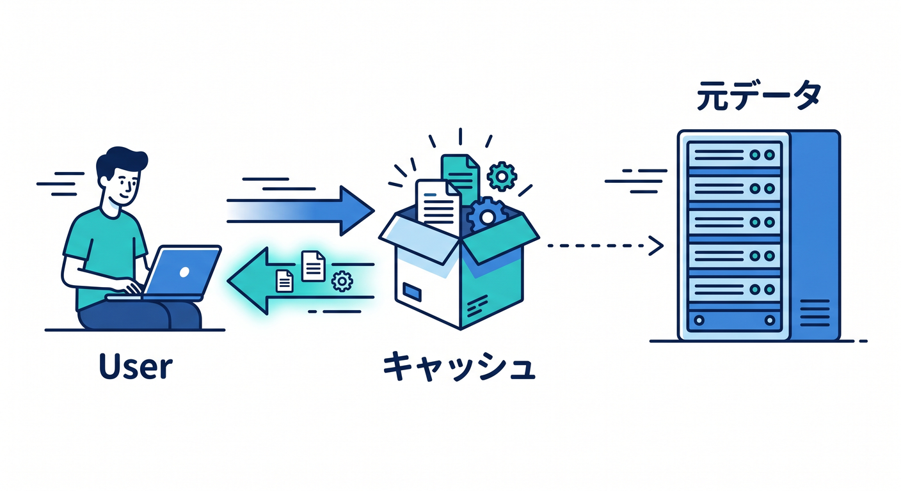
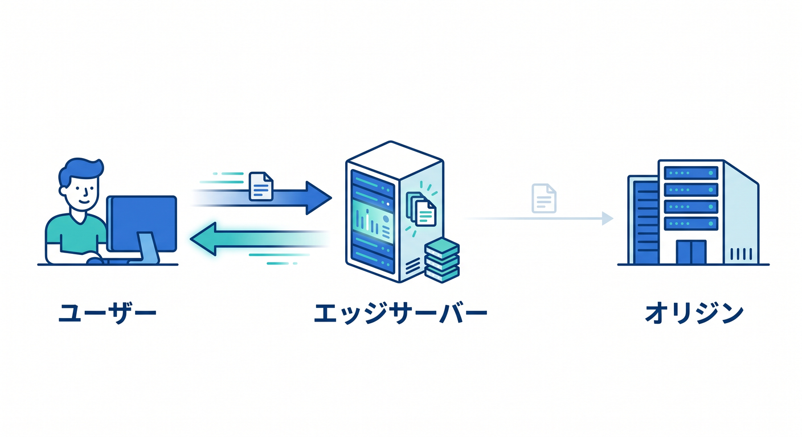
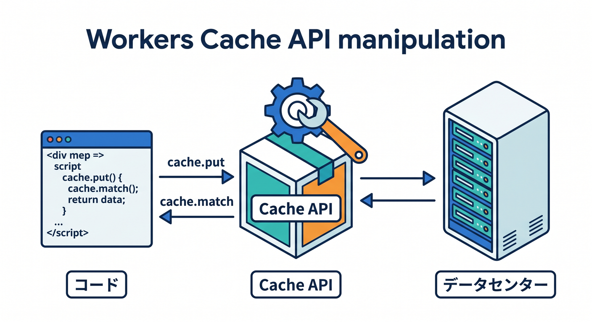
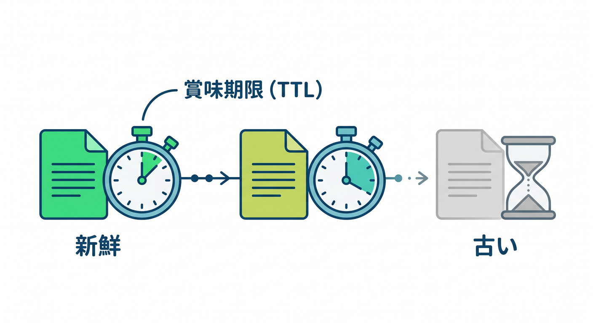
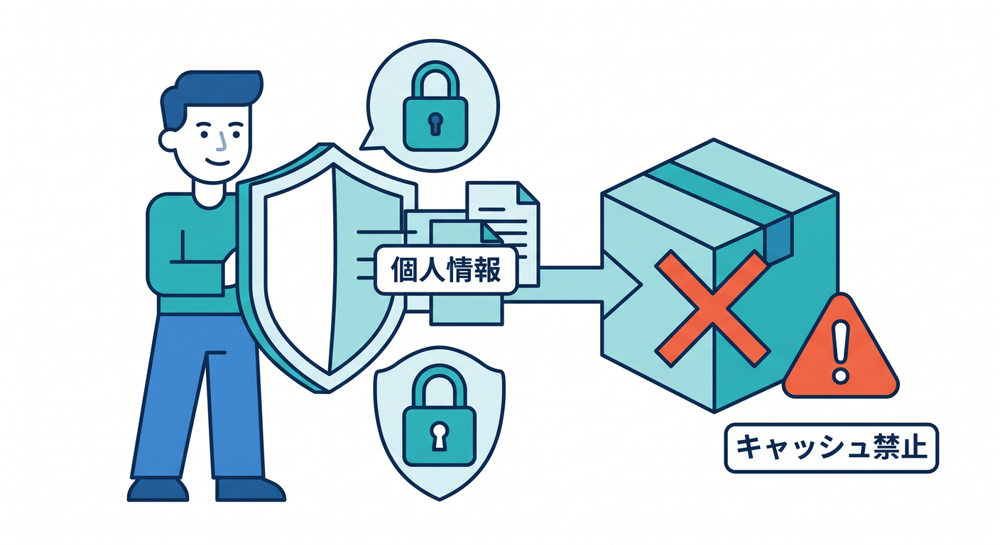

# 第03章：キャッシュは「コピーを近くに置く」仕組み 📦⚡

キャッシュは、Web高速化の中心になる考え方です。  
一度取ってきたものを一時的に保存し、次から速く返します。  
でも、保存場所がいくつかあるので、まず種類を分けて理解しましょう 😊

---

## 1. キャッシュは“もう一度使うための保存” 📚

キャッシュとは、よく使うものを再利用するために保存することです。  
たとえば同じ画像を何度も見るなら、毎回遠くから取ってくる必要はありません。

```text
1回目: originから取る
2回目: 近くのキャッシュから返す
```

この2回目以降が速くなります。

ただし、保存した内容が古くなる可能性もあります。

---

## 2. EdgeキャッシュはCloudflare側の保存 ☁️

Edgeキャッシュは、Cloudflareのネットワーク側に置かれるキャッシュです。  
ユーザーに近いCloudflare Edgeから返せるので、速度改善に効きやすいです。


たとえば画像やCSSがEdgeにキャッシュされていれば、originまで行かずに返せます。  
これにより、ユーザーの待ち時間とoriginの負荷を減らせます。

Cache Rulesでよく扱うのは、このEdge側のキャッシュ挙動です。

---

## 3. BrowserキャッシュはユーザーPC側の保存 🧑‍💻

Browserキャッシュは、ユーザーのブラウザ内に保存されるキャッシュです。  
一度読み込んだCSSやJSを、次回ブラウザが再利用できます。

これはとても速いです。  
なぜなら、ネットワークに取りに行かず、PC内から読めるからです。


ただし注意点があります。  
Cloudflare側のキャッシュをPurgeしても、ユーザーのブラウザキャッシュは消えません。

ここを混同すると「Cloudflareで消したのにまだ古い！」となります 😵‍💫

---

## 4. Workers Cache APIはプログラムから扱うキャッシュ 🧑‍💻

WorkersにはCache APIがあります。  
これはWorkerのコードから `caches.default.match()` や `cache.put()` を使ってキャッシュを扱う方法です。


ただし、通常のCDNキャッシュとまったく同じ感覚ではありません。  
Workers Cache APIはデータセンター単位のキャッシュとして考える必要があります。

初心者はまずこう覚えましょう。

- 普通の静的ファイルやTTL調整: Cache Rules
- Worker内で細かく制御したい: Cache API

---

## 5. キャッシュには賞味期限がある ⏱️

キャッシュは永遠に使うものではありません。  
どれくらい新鮮として扱うかを決める必要があります。

この時間をTTLと呼びます。  
TTLはTime To Liveの略です。


例です。

- 画像: 1日から長めでもよい場合が多い
- ハッシュ付きJS: かなり長くしやすい
- HTML: 短めにしたいことが多い
- API: 内容によって慎重に判断

TTLは、速さと更新反映のバランスを決める設定です ⚖️

---

## 6. キャッシュしない方がよいもの 🔐

キャッシュは便利ですが、何でも保存してよいわけではありません。

キャッシュに向かないものです。

- ログイン後の個人情報
- 注文履歴
- ユーザーごとに違うダッシュボード
- 秘密情報を含むAPIレスポンス
- Cookieで状態が変わるレスポンス

共有キャッシュに個人情報を置くと、別の人に見える危険があります。  

速さより安全が優先です。

---

## 7. 章末チェック ✅

- キャッシュは再利用のための保存だと分かる
- EdgeキャッシュとBrowserキャッシュを区別できる
- Workers Cache APIはプログラムから扱うものだと分かる
- TTLはキャッシュの賞味期限だと分かる
- 個人情報はキャッシュに向かないと分かる

この章で覚える一言はこれです。  
**キャッシュは速くする道具ですが、保存場所と賞味期限を分けて考える必要があります 📦⏱️**

