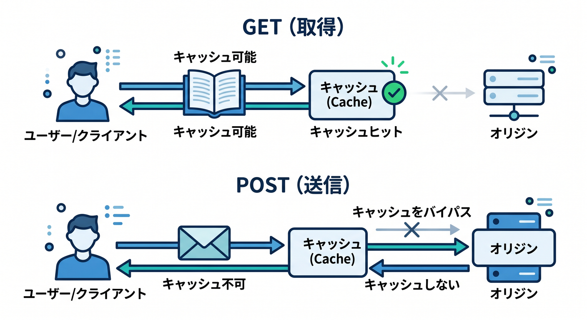
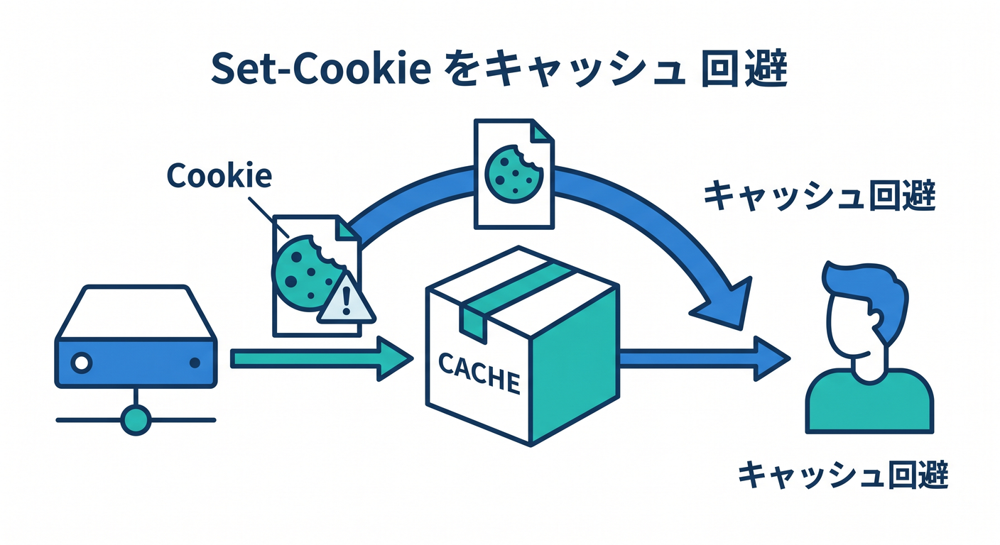
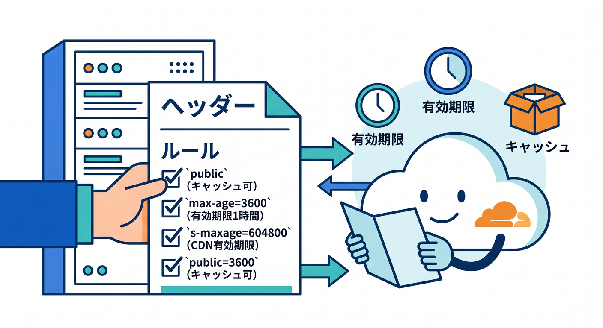
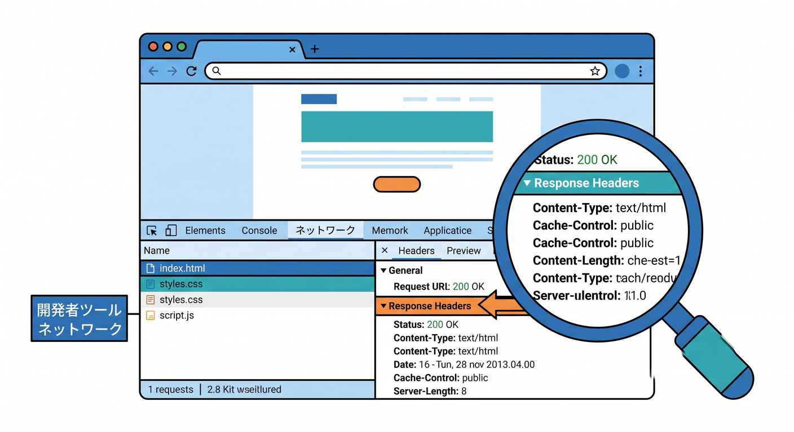

# 第04章：Cloudflareは何を自動でキャッシュするの？🔍☁️

Cloudflareを通したからといって、すべてが自動でキャッシュされるわけではありません。  
Cloudflareにはデフォルトのキャッシュ挙動があります。  
この章では「何がキャッシュされやすいか」「何がされにくいか」を整理します 😊

---

## 1. 静的ファイルはキャッシュされやすい 🖼️

Cloudflareは、画像やCSS、JavaScriptなどの静的ファイルと相性がよいです。  
これらは多くのユーザーに同じ内容を返すことが多いからです。


キャッシュされやすい例です。

- `.png`
- `.jpg`
- `.webp`
- `.css`
- `.js`
- `.woff2`
- `.pdf`

ただし、ヘッダーやルールによって挙動は変わります。  
「拡張子だけ見れば絶対キャッシュ」と思い込まないようにしましょう。

---

## 2. GET以外は基本的に慎重に見る 🧪

Cloudflareのデフォルトキャッシュでは、GETリクエストが中心です。  
POSTやPUTのようなリクエストは、通常はキャッシュ対象として考えません。


たとえば、フォーム送信やAI要約APIへのPOSTは、毎回入力内容が違います。  
これを共有キャッシュすると危険です。

まずはこう覚えましょう。

- GET: キャッシュ候補になることがある
- POST: 基本キャッシュしない前提で考える

API高速化でも、何でもキャッシュするのではなく、メソッドを見ます 🔎

---

## 3. `Set-Cookie` があるレスポンスは注意 🍪

`Set-Cookie` は、ブラウザにCookieを保存させるヘッダーです。  
ログイン状態やユーザー識別に関わることがあります。

Cloudflareのデフォルト挙動では、`Set-Cookie` があるレスポンスはキャッシュされない方向になります。  

これは安全のためにとても大事です。

たとえばログイン後のページを共有キャッシュしてしまうと、別の人に見える危険があります。  
Cloudflareが慎重に扱うのは自然です 🔐

---

## 4. Cache-Controlが強い判断材料になる 🧾

originが返す `Cache-Control` ヘッダーは、キャッシュ判断の重要な材料です。


たとえば次のような指定があります。

```http
Cache-Control: public, max-age=3600
```

これは、公開キャッシュ可能で、一定時間保存してよいという意味です。

一方、次のような指定はキャッシュしない方向です。

```http
Cache-Control: no-store
```

Cloudflareは、Edge Cache TTLルールで上書きしない限り、originのヘッダーを尊重する流れがあります。

---

## 5. 何もヘッダーがない場合もある 😶

すべてのレスポンスに分かりやすいCache-Controlが付いているとは限りません。  
ヘッダーがない場合、CloudflareのデフォルトTTLやステータスコードによる判断が関わることがあります。

このときにCache Rulesを使うと、より明示的に設定できます。

たとえば「画像だけ1日Edgeに保存する」「特定パスはキャッシュしない」のようにできます。

デフォルト挙動に任せるより、教材や実務ではルールとして見える形にすると理解しやすいです 👀

---

## 6. まず見るべきレスポンスヘッダー 🔎

ブラウザDevToolsのNetworkタブで、対象リクエストのResponse Headersを見ます。


見るものです。

- `Cache-Control`
- `Expires`
- `Set-Cookie`
- `CF-Cache-Status`
- `Content-Type`

これらを見ると、キャッシュされそうか、されなさそうかのヒントが分かります。

---

## 7. 章末チェック ✅

- 静的ファイルはキャッシュされやすいと分かる
- GET以外は慎重に見ると分かる
- `Set-Cookie` があるレスポンスは注意だと分かる
- `Cache-Control` が重要だと分かる
- DevToolsでヘッダーを見る習慣が持てる

この章で覚える一言はこれです。  
**Cloudflareのキャッシュ判断は、ファイルの種類・メソッド・ヘッダーを見て考えます 🔍📦**

