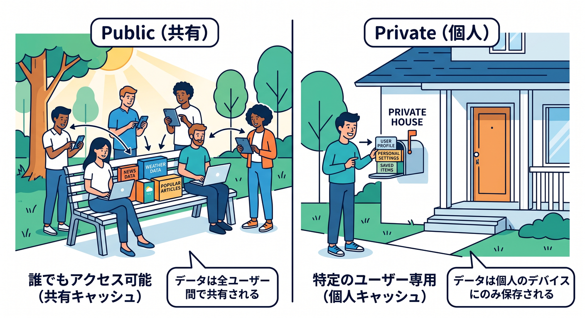
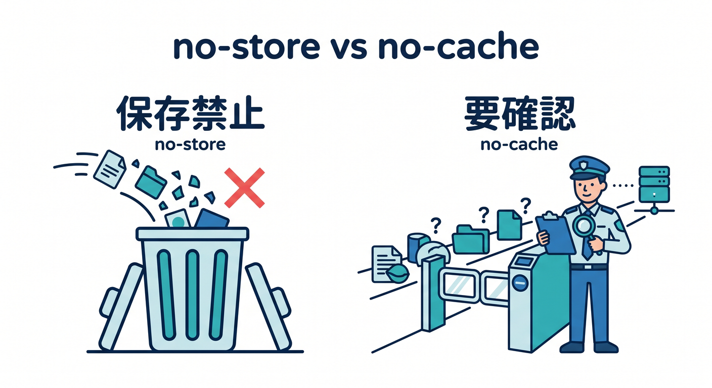
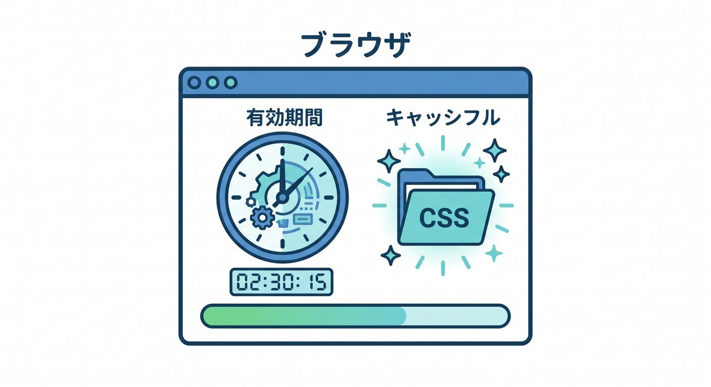
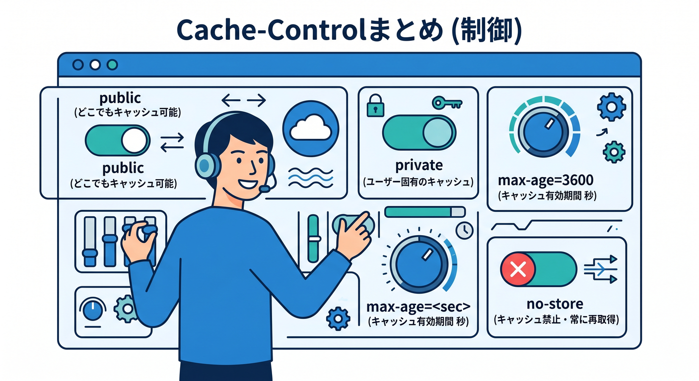

# 第05章：Cache-Controlヘッダーを読めるようになろう 🧾👓

キャッシュを理解するには、HTTPヘッダーを読む力がとても大事です。  
中でも `Cache-Control` は、キャッシュ方針を伝える中心的なヘッダーです。  
この章では、よく見る指定を初心者向けに整理します 😊

---

## 1. Cache-Controlはキャッシュへの指示書 📋

`Cache-Control` は、レスポンスをどのようにキャッシュしてよいかを伝えるヘッダーです。


例です。

```http
Cache-Control: public, max-age=3600
```

これはざっくり言うと、公開キャッシュしてよく、3600秒は新鮮として扱える、という意味です。  
3600秒は1時間です。

HTTPヘッダーは難しく見えますが、よく出る単語だけ覚えればかなり読めます。

---

## 2. `public` と `private` 🔐

`public` は、共有キャッシュに保存してよいという意味です。  
CloudflareのようなCDNでキャッシュしやすい指定です。

```http
Cache-Control: public, max-age=86400
```

`private` は、ユーザーのブラウザなど個人用キャッシュ向けで、共有キャッシュには向きません。

```http
Cache-Control: private, max-age=300
```

ログイン後の画面や個人情報を含むレスポンスでは、`private` や `no-store` を考えます。


---

## 3. `no-store` と `no-cache` 🧯

`no-store` は、保存しないでという強い指定です。

```http
Cache-Control: no-store
```

秘密情報や個人情報では大事です。

`no-cache` は名前が少し紛らわしいです。  
完全に保存禁止というより、使う前に再確認してね、というニュアンスです。


初心者のうちは、こう覚えましょう。

- `no-store`: 保存しない
- `no-cache`: 使う前に確認が必要

---

## 4. `max-age` はブラウザにも関わる ⏱️

`max-age` は、何秒間新鮮として扱えるかを示します。


```http
Cache-Control: public, max-age=31536000
```

31536000秒は約1年です。  
ハッシュ付きJSやCSSでは、長い `max-age` が使われることがあります。

ただし、HTMLに長すぎる `max-age` を付けると、更新が反映されにくくなることがあります。

長くするなら、ファイル名が変わる仕組みとセットで考えましょう 📦

---

## 5. `s-maxage` は共有キャッシュ向け ☁️

`s-maxage` は、CDNのような共有キャッシュ向けの保存時間を指定します。


```http
Cache-Control: public, max-age=60, s-maxage=3600
```

この例では、ブラウザ側は短め、Cloudflareのような共有キャッシュ側は長め、という考え方ができます。

Cloudflareでは、Edge Cache TTLとBrowser Cache TTLを別に考える場面があります。  
`s-maxage` と `max-age` の違いを知っておくと理解しやすくなります。

---

## 6. DevToolsでヘッダーを見よう 👀

Microsoft EdgeやChromeで、次の流れで確認できます。

1. F12でDevToolsを開く
2. Networkタブを開く
3. ページを再読み込みする
4. 対象ファイルをクリックする
5. Headersを見る

ここで `Cache-Control`、`CF-Cache-Status`、`Age` などを確認します。  
最初は1つの画像ファイルを選んで見るだけで十分です。

---

## 7. 章末チェック ✅

- `Cache-Control` はキャッシュの指示書だと分かる
- `public` と `private` の違いが分かる
- `no-store` と `no-cache` の違いをざっくり説明できる
- `max-age` と `s-maxage` の役割が分かる
- DevToolsでResponse Headersを見られる

この章で覚える一言はこれです。  
**Cache-Controlを読めると、Cloudflareがなぜキャッシュするか・しないかを考えやすくなります 🧾🔎**


