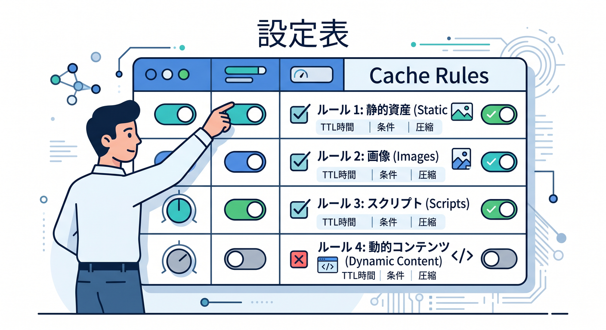
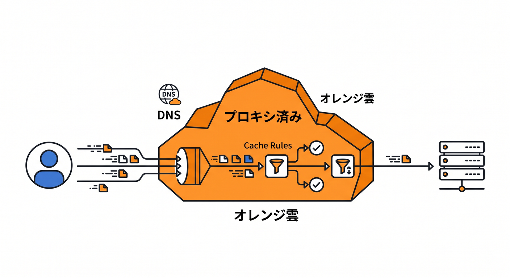
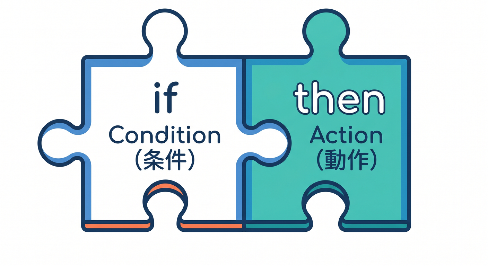
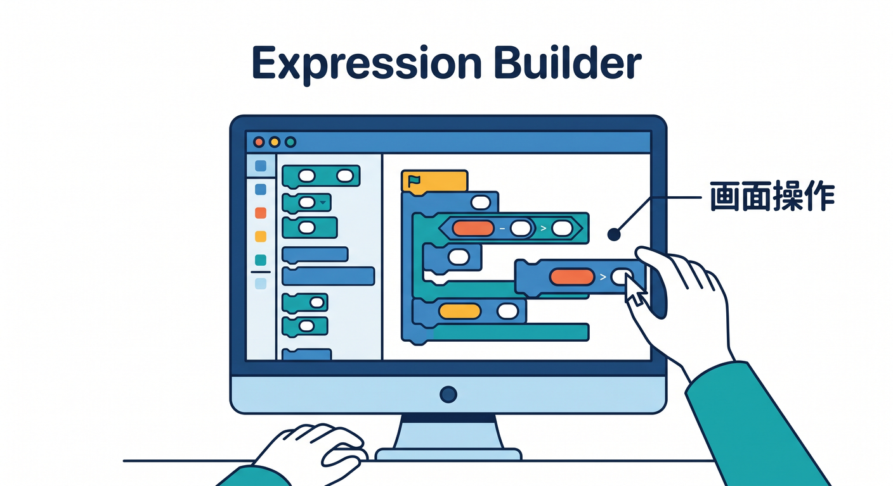
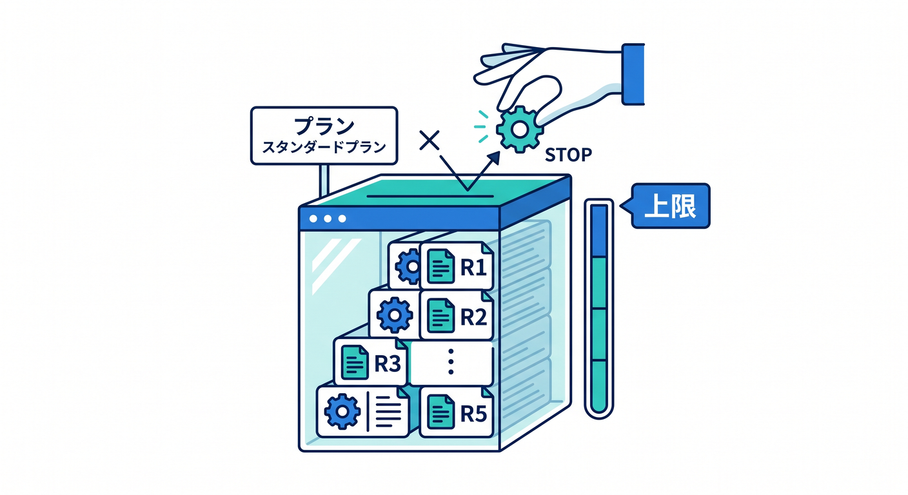
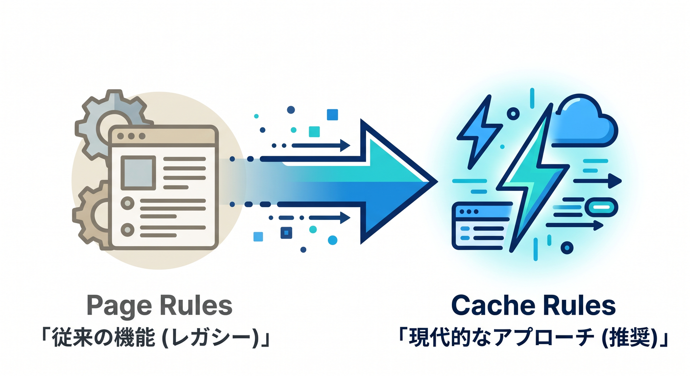
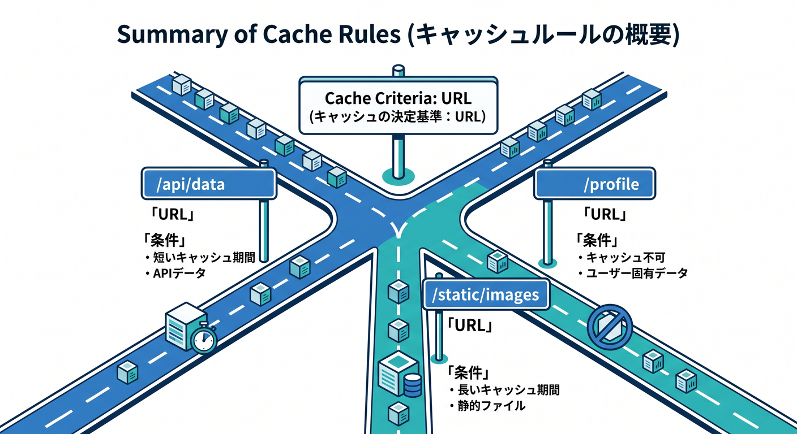

# 第06章：Cache Rulesの全体像をつかもう 🧩⚙️

Cache Rulesは、Cloudflareでキャッシュ挙動を調整する中心機能です。  
どのリクエストをキャッシュ対象にするか、どれくらい保存するかをルールとして設定できます。  
この章では、Cache Rulesを“条件付きのキャッシュ設定表”として理解します 😊



---

## 1. Cache Rulesでできること 📋

Cache Rulesでは、リクエスト条件に応じてキャッシュ設定を変えられます。

たとえば、次のような設定ができます。

- 画像だけキャッシュする
- `/assets/*` は長くキャッシュする
- `/api/*` はキャッシュしない
- 特定ホスト名だけBrowser TTLを変える
- ステータスコードごとにTTLを変える

何となく全体に設定するのではなく、URLや条件ごとにキャッシュ方針を分けられるのが強みです。

---

## 2. Cache RulesにはproxyされたDNSが必要 ☁️

Cache Rulesを使うには、対象のドメインやサブドメインがCloudflareを通っている必要があります。  
つまり、DNSレコードがproxied、いわゆるオレンジ雲の状態であることが重要です。



Cloudflareを通らない通信には、CloudflareのCache Rulesは効きません。

まず確認することはこれです。

- 対象ホスト名がCloudflare Zoneにあるか
- DNSレコードがあるか
- Proxy statusが有効か

キャッシュ設定の前に、通信がCloudflareを通っているかを見ましょう 🔎

---

## 3. ルールは条件と動作でできている 🧠

Cache Ruleは、大きく分けると2つの部品でできています。



**条件**  
どのリクエストに当てるか。

**動作**  
当たったときに何をするか。

例です。

```text
条件: パスが /assets/ で始まる
動作: Edgeで1日キャッシュする
```

この形で考えると、Cache Rulesはプログラムの `if` 文に少し似ています。

---

## 4. Expression Builderから始めよう 🛠️

Cloudflareダッシュボードでは、Expression Builderを使って条件を作れます。  



いきなり式を手書きしなくても、画面から選んで条件を組めます。

よく使う条件です。

- Hostname
- URI Path
- File extension
- Query string
- Request method

最初は、`URI Path starts with "/assets/"` のような分かりやすい条件から始めるのがおすすめです。

---

## 5. プランごとにルール数の上限がある 📦

Cache Rulesは便利ですが、作れる数にはプランごとの上限があります。  



公式ドキュメントでは、Free、Pro、Business、Enterpriseで利用可能数が異なると案内されています。

初心者が学習する段階では、少ないルールで分かりやすく設計するのが大事です。

たとえば、最初は次の3つで十分です。

- 静的アセット用
- HTML用
- API用

細かく分けすぎると、あとで自分でも分からなくなります 😵‍💫

---

## 6. Page RulesではなくCache Rulesを中心に見る 🧭

昔のCloudflare教材ではPage Rulesがよく出てきました。  
しかし、現在のキャッシュ調整ではCache Rulesを中心に見るのが自然です。



Page Rulesからの移行文脈はありますが、新しく学ぶならCache Rulesを優先しましょう。  
機能ごとに専用のRulesへ分かれているため、何を設定しているかが見えやすいです。

この教材でも、Cache Rulesを主役にします。

---

## 7. 章末チェック ✅

- Cache Rulesは条件付きのキャッシュ設定だと分かる
- proxyされたDNSが必要だと分かる
- 条件と動作に分けて考えられる
- Expression Builderから始められる
- Page RulesよりCache Rulesを中心に学ぶ理由が分かる

この章で覚える一言はこれです。  
**Cache Rulesは、URLや条件ごとにキャッシュ方針を変えるためのルール表です 🧩⚙️**


