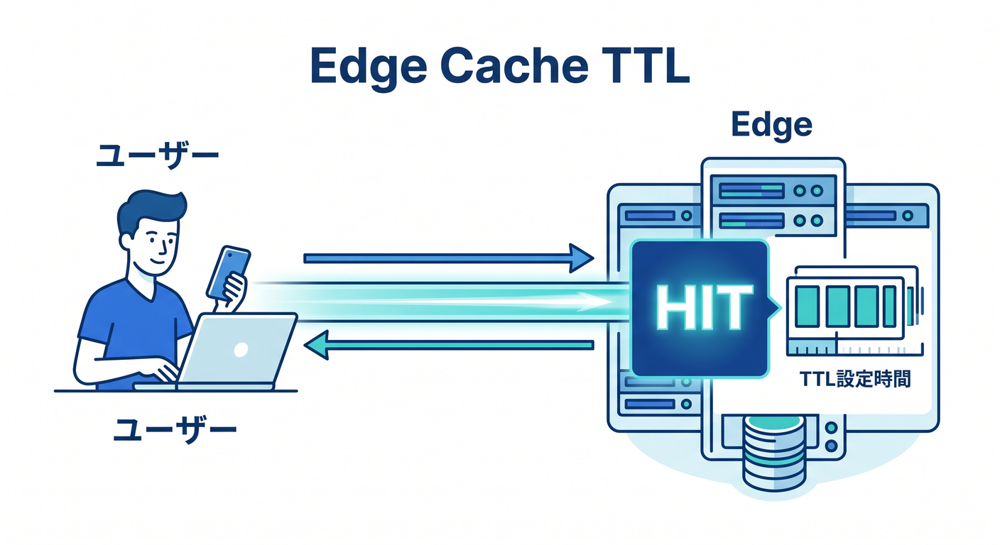
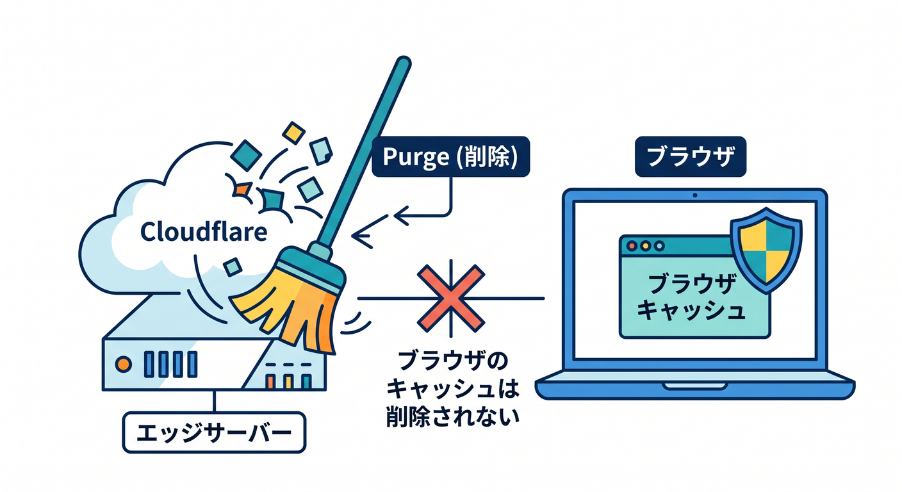
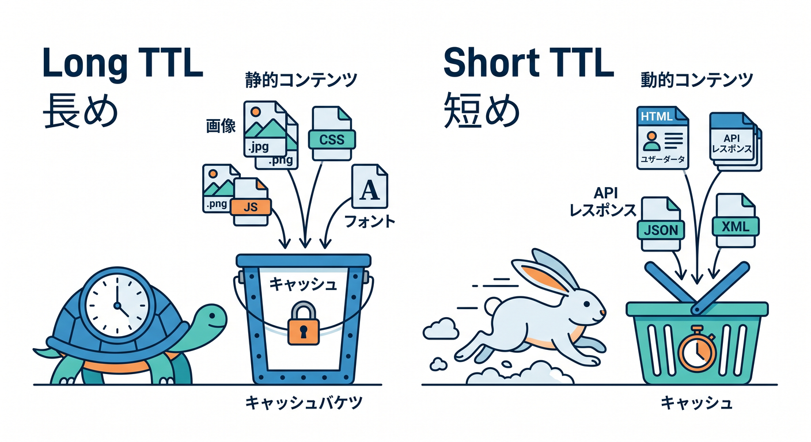
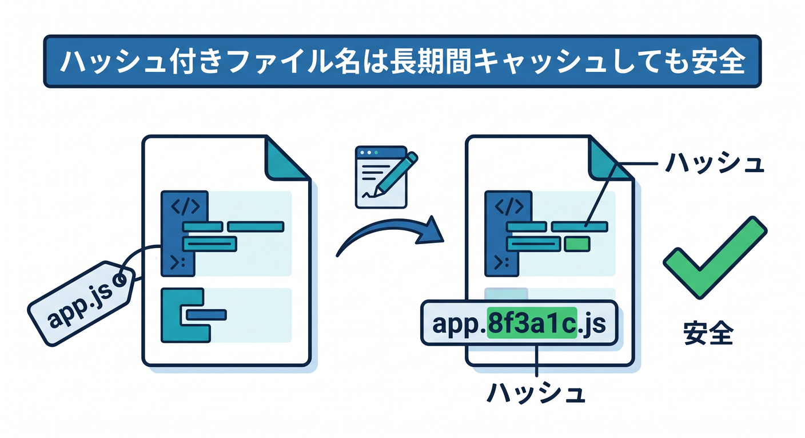
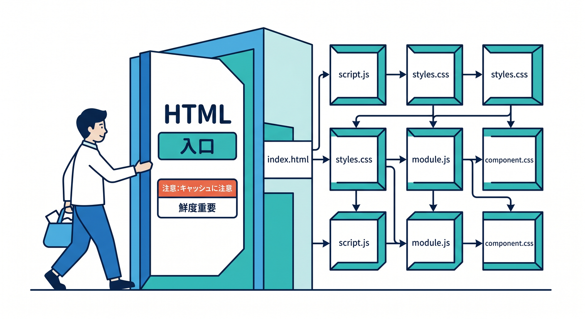
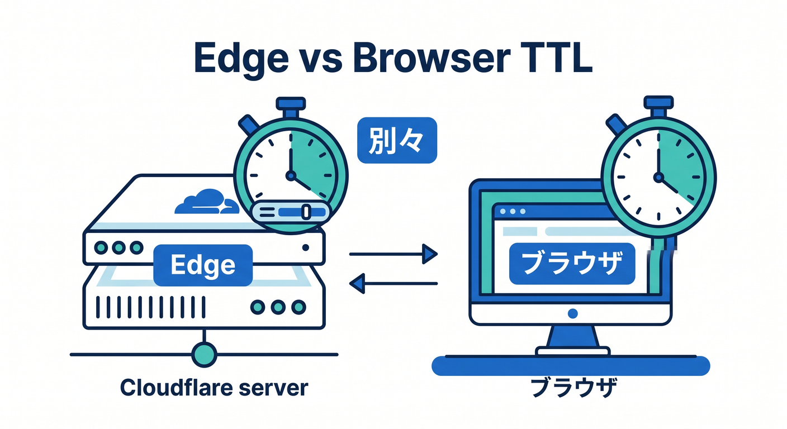

# 第07章：Edge Cache TTLとBrowser Cache TTLを分けて考えよう ⏱️☁️

TTLはTime To Liveの略で、キャッシュをどれくらい新鮮として扱うかを表します。  
Cloudflareでは、Edge Cache TTLとBrowser Cache TTLを分けて考えることが大事です。  
この2つを混同すると、更新トラブルで迷子になりやすいです 😵‍💫

---

## 1. Edge Cache TTLはCloudflare側の時間 ☁️

Edge Cache TTLは、Cloudflareのグローバルネットワーク側でどれくらいキャッシュするかです。  
ユーザーに近いCloudflare Edgeに保存される時間と考えると分かりやすいです。



たとえば、画像をEdgeで1日キャッシュするなら、同じ画像へのアクセスをCloudflareから速く返せます。

```text
ユーザー → Cloudflare Edge でHIT → 速い
```

originまで取りに行く回数を減らせるため、速度と負荷の両方に効きます。

---

## 2. Browser Cache TTLはユーザーのブラウザ側の時間 🧑‍💻

Browser Cache TTLは、ユーザーのブラウザ内でどれくらいキャッシュするかです。  
これはCloudflareのEdgeとは別の場所です。

ブラウザキャッシュが効くと、ネットワークへ取りに行かずにPC内から読み込めます。  


とても速いですが、更新が反映されにくくなることがあります。

重要な注意点です。

**CloudflareのキャッシュをPurgeしても、ユーザーのブラウザキャッシュは消えません。**



この違いは必ず覚えましょう 🔐

---

## 3. 長くしてよいもの・短くしたいもの ⚖️

長くしやすいものです。

- ハッシュ付きJavaScript
- ハッシュ付きCSS
- バージョン付き画像
- フォント

短くしたいものです。

- `index.html`
- 頻繁に更新される記事一覧
- APIレスポンス
- 設定JSON

ファイル名が変わるものは長くキャッシュしやすいです。  
同じURLのまま中身だけ変わるものは短めにする方が安全です。



---

## 4. ハッシュ付きファイル名はキャッシュに強い 📦

ReactやViteのビルドでは、次のようなファイル名になることがあります。

```text
app.8f3a1c.js
style.91ab2.css
```

中身が変わるとファイル名も変わります。  
そのため、古いファイルを長くキャッシュしていても、新しいHTMLが新しいファイル名を参照すれば問題になりにくいです。

これが、静的アセットを長くキャッシュしやすい理由です ✨



---

## 5. HTMLは入口なので慎重に扱う 🚪

`index.html` はアプリの入口です。  
ここが古いままだと、新しいJSやCSSを読みに行かないことがあります。



そのため、HTMLは短めのTTLにしたり、originのCache-Controlを尊重したりすることが多いです。

静的アセットは長め、HTMLは慎重。  
この基本を覚えるだけで、キャッシュ事故をかなり減らせます。

---

## 6. CopilotにTTL方針を相談する 🤖

```text
React + ViteアプリをCloudflareで公開します。
index.html、assets/*.js、assets/*.css、画像、APIレスポンスについて、
Edge Cache TTLとBrowser Cache TTLをどう考えるべきか初心者向けに表で説明してください。
```

TTLは数字だけでなく、理由を説明できることが大事です。

---

## 7. 章末チェック ✅

- Edge Cache TTLはCloudflare側の保存時間だと分かる
- Browser Cache TTLはユーザーのブラウザ側の保存時間だと分かる
- Purgeしてもブラウザキャッシュは消えないと分かる
- ハッシュ付きファイルは長くキャッシュしやすいと分かる
- HTMLは慎重に扱うべきだと分かる

この章で覚える一言はこれです。  
**EdgeとBrowserは別の場所。TTLも別々に考えよう ⏱️☁️**


