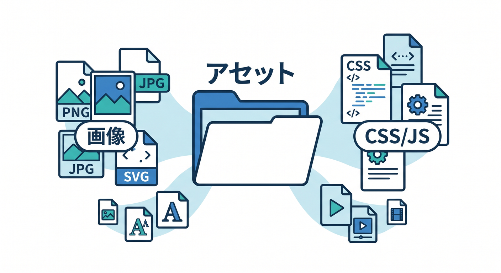
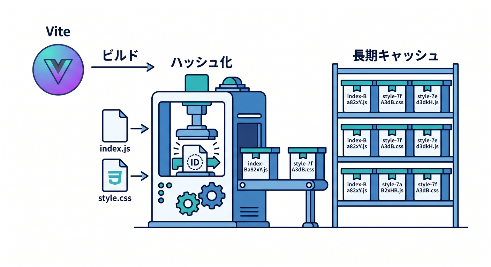
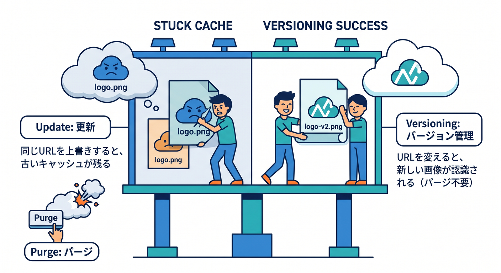
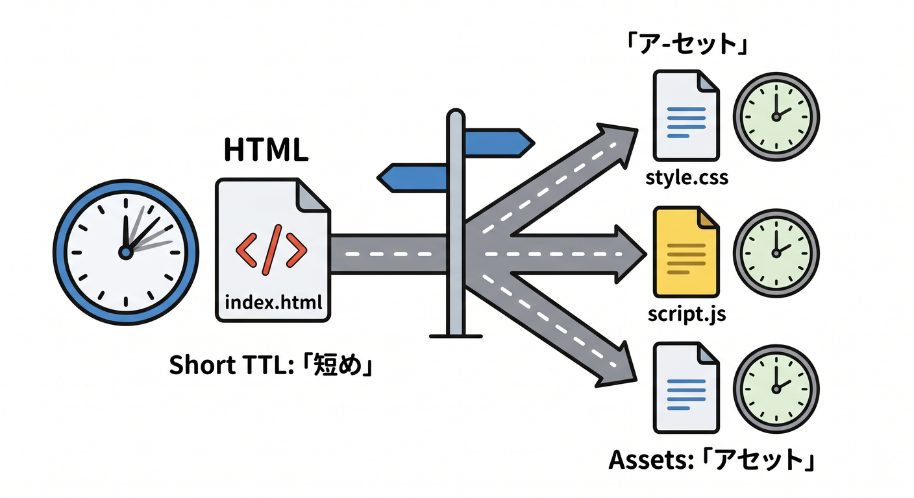
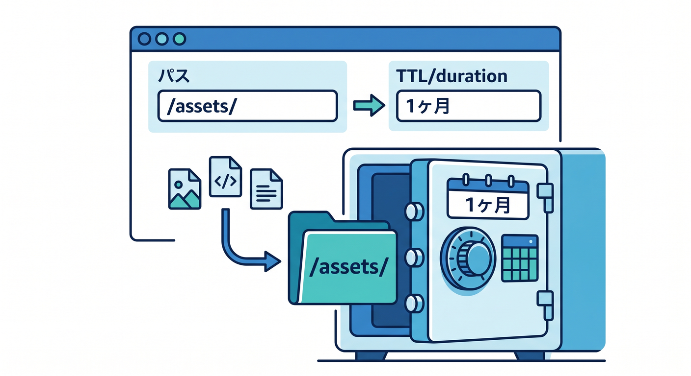
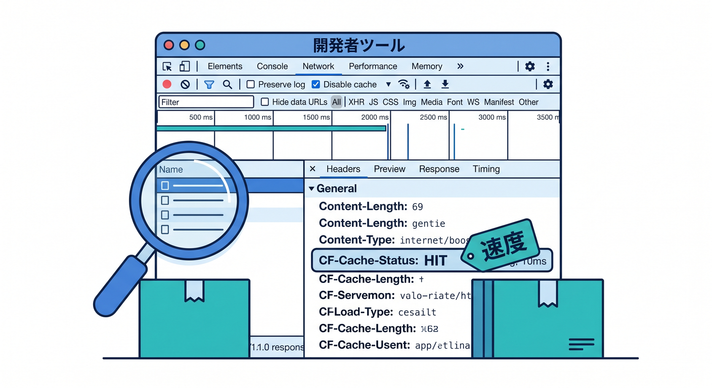
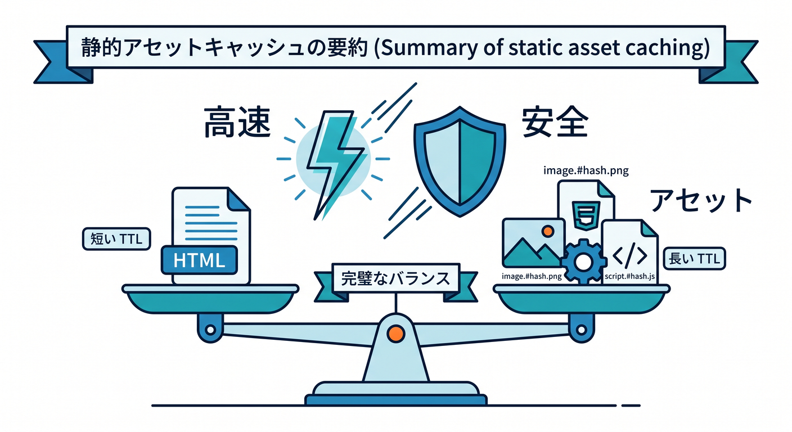

# 第08章：静的アセットを上手にキャッシュしよう 🖼️📦

静的アセットは、Cloudflare CDNとキャッシュの効果を感じやすい対象です。  
画像、CSS、JavaScript、フォントなどは、多くのユーザーに同じ内容を返すことが多いからです。  
この章では、静的アセットを安全に速く配る考え方を学びます ⚡

---

## 1. 静的アセットとは何か 🧩

静的アセットとは、アプリの表示に使うファイルのことです。

例です。

- 画像
- CSS
- JavaScript
- フォント
- アイコン
- PDF

ReactやViteのアプリでは、ビルド後に `assets` フォルダへJSやCSSが出力されることがあります。

これらはキャッシュと相性が良いことが多いです。



---

## 2. ハッシュ付きJS/CSSは長くキャッシュしやすい 🧾

Viteでビルドすると、ファイル名にハッシュが付くことがあります。

```text
assets/index-Ba82xY.js
assets/index-9aPq3L.css
```

中身が変わると名前も変わります。  
つまり、古いファイルを長くキャッシュしても、新しいビルドでは別のURLになります。

そのため、ハッシュ付きファイルは長めのTTLにしやすいです。  
これはモダンなフロントエンドでよく使われるキャッシュ戦略です ✨



---

## 3. 画像もキャッシュ効果が大きい 🖼️

画像はサイズが大きくなりやすく、読み込み速度に影響しやすいです。  
Cloudflare Edgeから画像を返せると、体感速度が上がりやすいです。

ただし、画像URLが同じまま中身だけ変わる場合は注意が必要です。  
たとえば `logo.png` を上書きすると、古いロゴが残ることがあります。

安全な方法です。

- `logo-v2.png` のように名前を変える
- ファイル名にハッシュを入れる
- 更新時にPurgeする



---

## 4. `index.html` は長くキャッシュしすぎない 🚪

Reactアプリの入口HTMLは、JSやCSSへのリンクを持っています。  
ここが古いままだと、新しいアセットを読みに行かないことがあります。

そのため、`index.html` は短め、または慎重なキャッシュ設定にするのが基本です。

例です。

```text
index.html: 短め
assets/*.js: 長め
assets/*.css: 長め
images/*: 中から長め
```

全部同じTTLにしないことが大事です ⚖️



---

## 5. Cache Ruleの例 🛠️

たとえば、`/assets/` 配下を長めにキャッシュしたいなら、次のように考えます。

```text
条件:
URI Path starts with "/assets/"

動作:
Eligible for cache
Edge TTL: 1 month
Browser TTL: 1 month
```

ただし、これはハッシュ付きアセットを想定した例です。  
同じURLで中身を上書きする運用なら、長すぎるTTLは危険です。



---

## 6. DevToolsで確認する 👀

Networkタブで、JSやCSSや画像をクリックします。  
確認するものです。

- Status
- Size
- Time
- Response Headers
- `Cache-Control`
- `CF-Cache-Status`

2回目の読み込みで速くなっているか、HITになっているかを見ると、キャッシュの効果を確認しやすいです。



---

## 7. 章末チェック ✅

- 静的アセットの種類を説明できる
- ハッシュ付きJS/CSSが長期キャッシュに向く理由が分かる
- 画像更新時の注意点が分かる
- `index.html` は慎重に扱うべきだと分かる
- `/assets/` 向けCache Ruleの考え方が分かる

この章で覚える一言はこれです。  
**静的アセットは長く、入口HTMLは慎重に。これがフロントエンドのキャッシュ基本です 🖼️⚡**


