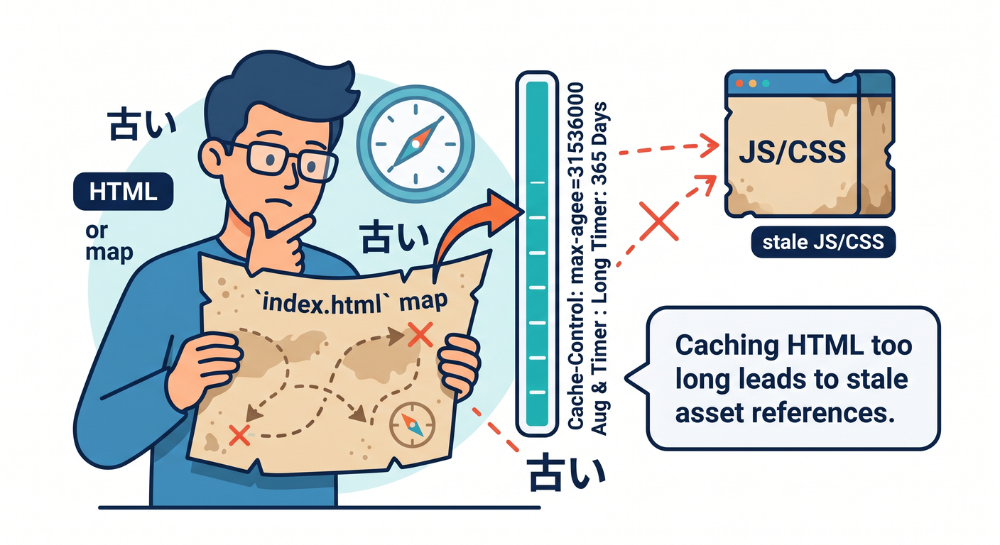
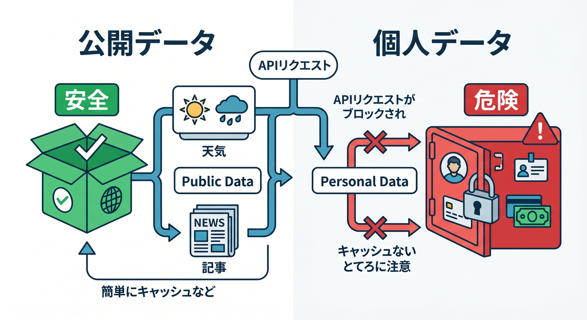
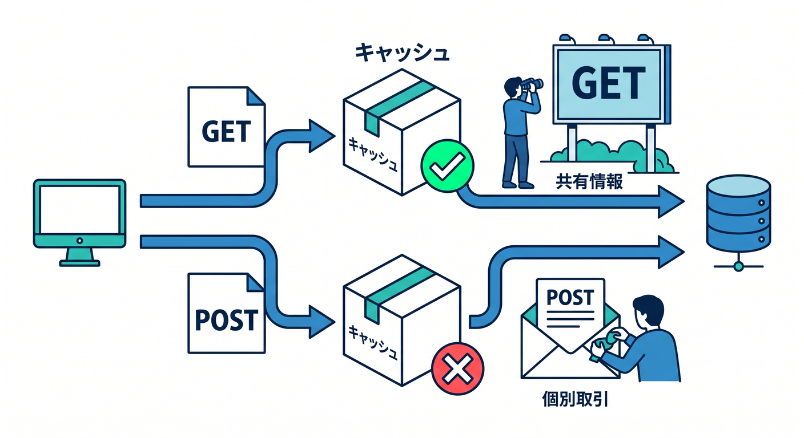
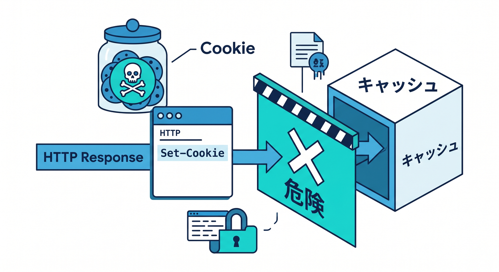
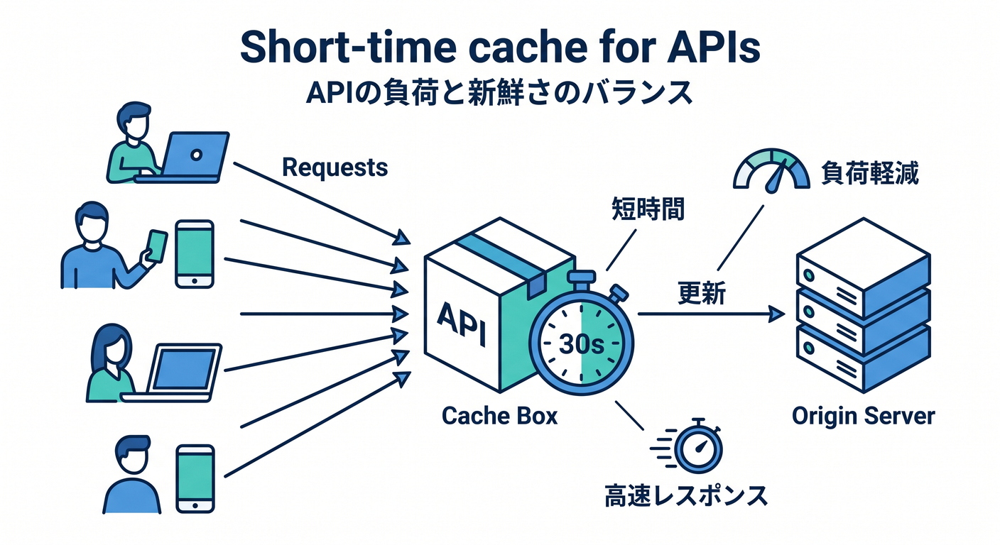
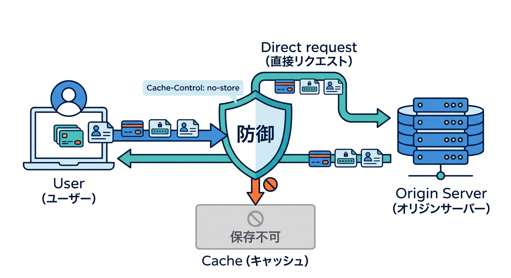

# 第09章：HTMLとAPIレスポンスは慎重にキャッシュしよう 🧪🔐

画像やCSSはキャッシュしやすいですが、HTMLやAPIレスポンスは慎重に扱う必要があります。  
理由は、ユーザーや時間によって内容が変わることが多いからです。  
この章では「キャッシュしてよいAPI」と「危険なAPI」を分けて考えます 😊

---

## 1. HTMLはユーザーに見える入口 🚪

HTMLは、Webページの入口です。  
Reactアプリなら `index.html` がJSやCSSを読み込む起点になります。



HTMLを長くキャッシュしすぎると、アプリ更新後も古いJSを参照し続けることがあります。  
そのため、HTMLは静的アセットより慎重に扱います。

公開サイトでも、トップページや記事ページは更新頻度に応じてTTLを考える必要があります。

---

## 2. APIレスポンスは内容によって判断する 🔎

APIには、キャッシュしやすいものと危険なものがあります。

キャッシュ候補になりやすい例です。

- 公開記事一覧
- 公開商品一覧
- 天気のように一定時間同じでよいデータ
- マスターデータ

慎重に扱う例です。

- ログインユーザー情報
- 注文履歴
- 管理画面データ
- 個人設定
- 支払い情報



APIは「誰が見ても同じ内容か？」を最初に考えます 🧠

---

## 3. GETとPOSTを分ける 🧪

GETは、情報を取得するためのリクエストです。  
同じURLなら同じ内容を返す設計にしやすいため、キャッシュ候補になることがあります。

POSTは、データ送信や処理実行に使われます。  
入力内容によって結果が変わるため、通常のCDNキャッシュ対象として考えないほうが安全です。



AI要約APIのように、ユーザーが文章をPOSTして結果を得るものは、基本的に共有キャッシュしない前提で考えます 🤖

---

## 4. Cookieがあるレスポンスは危険信号 🍪

Cookieは、ユーザーの状態に関わることがあります。  
`Set-Cookie` があるレスポンスは、共有キャッシュすると危険な場合があります。

Cloudflareのデフォルト挙動でも、`Set-Cookie` 付きレスポンスはキャッシュされない方向になります。



もしキャッシュしたい場合でも、なぜCookieがあるのかを必ず確認します。  
初心者のうちは、Cookieが関わるレスポンスはキャッシュしない、と考えるのが安全です 🔐

---

## 5. 短時間キャッシュという選択 ⏱️

APIレスポンスでも、短時間だけキャッシュするなら有効な場合があります。

たとえば、公開記事一覧を30秒から5分キャッシュするような設計です。  
これなら更新反映もそこそこ早く、アクセス集中時の負荷も減らせます。



```http
Cache-Control: public, s-maxage=300
```

ただし、誰に返しても同じ公開データであることが前提です。

---

## 6. キャッシュしない指定も立派な設計 🛡️

速くしたいからといって、何でもキャッシュする必要はありません。  
キャッシュしないことも、正しい設計です。

例です。



```http
Cache-Control: no-store
```

ログイン後のユーザー情報や管理画面APIでは、こうした指定が自然です。  
安全性が必要な場所では、速さより情報漏えい防止を優先します。

---

## 7. 章末チェック ✅

- HTMLは入口なので慎重にキャッシュすると分かる
- APIは誰に返しても同じかで判断すると分かる
- GETとPOSTを分けて考えられる
- Cookie付きレスポンスは注意だと分かる
- キャッシュしないことも正しい設計だと分かる

この章で覚える一言はこれです。  
**APIキャッシュは「同じURLなら誰に同じ内容を返してよいか」から考えます 🧪🔐**

