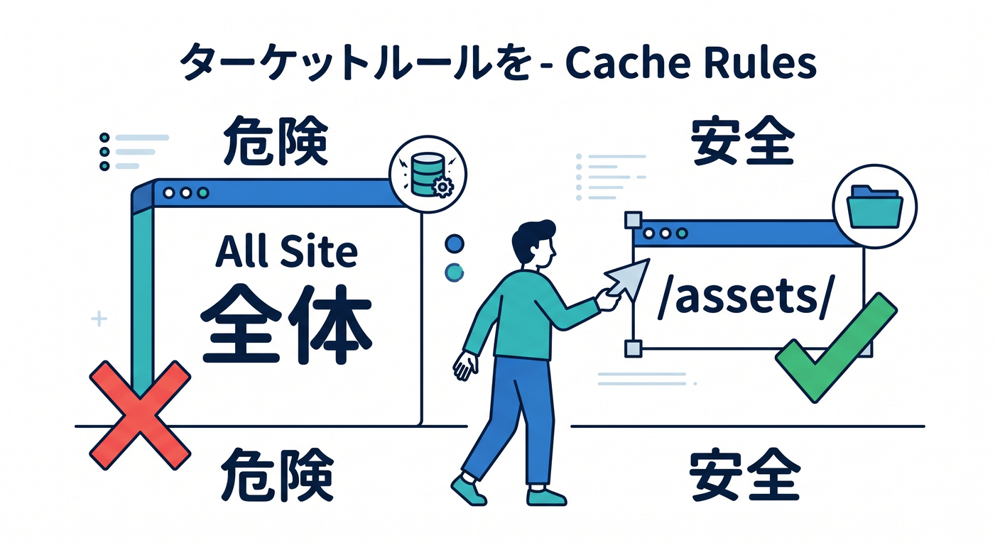
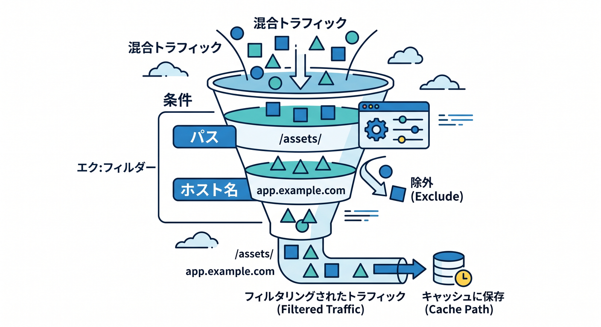
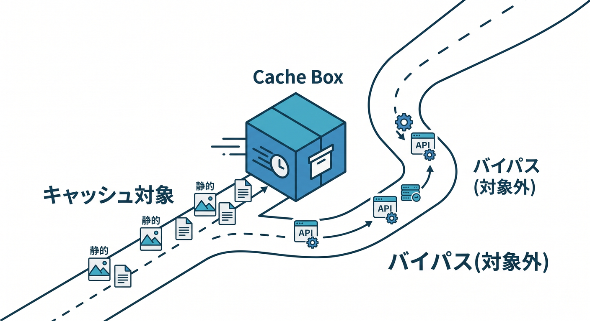
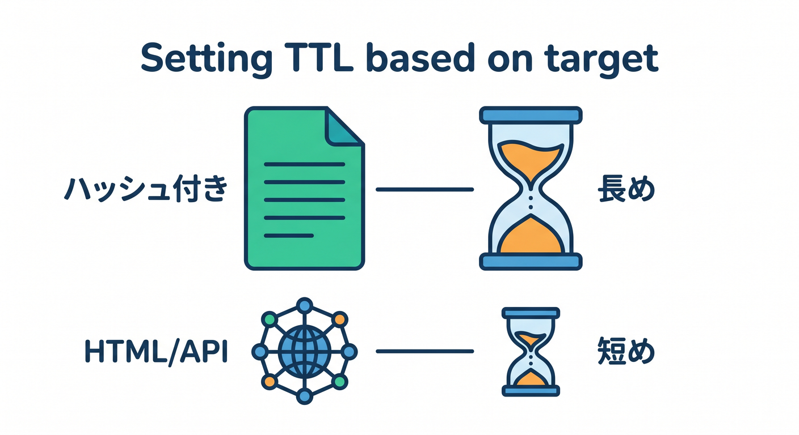
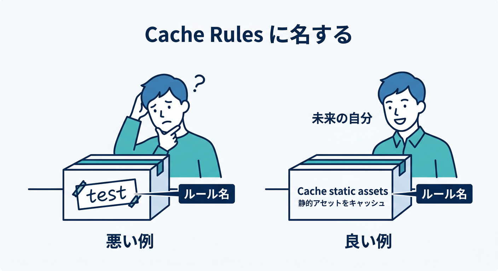
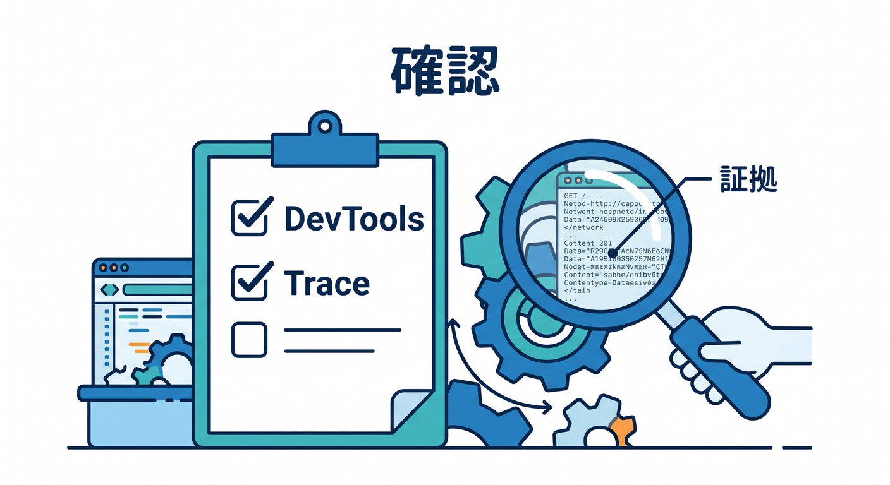

# 第10章：Cache Rulesを作る手順を体験しよう 🛠️⚙️

ここでは、実際にCache Ruleを作る流れを教材として整理します。  
本番ドメインでいきなり広いルールを作るのではなく、まず安全な範囲から始めます。  
おすすめは画像や `/assets/` 配下の静的ファイルです 😊

---

## 1. まず対象を決める 🎯

Cache Ruleを作る前に、何をキャッシュしたいか決めます。

悪い例です。

```text
サイト全体を速くしたいので全部キャッシュ
```

良い例です。

```text
/assets/ 配下のJSとCSSを長めにキャッシュしたい
```



対象が具体的なほど、安全に設定できます。

---

## 2. 条件を作る 🧩

CloudflareダッシュボードのCache Rulesでは、条件を作ります。  
Expression Builderを使うと、画面から選びやすいです。

例です。

```text
URI Path starts with "/assets/"
```

または、ホスト名で分けることもあります。

```text
Hostname equals "app.example.com"
```



最初は、パスやホスト名のように目で確認しやすい条件から始めるのが安全です。

---

## 3. キャッシュ対象にする 📦

条件を作ったら、対象をキャッシュするかどうかを決めます。

静的アセットなら、次のような方針が考えられます。

```text
Cache eligibility: Eligible for cache
```

一方、APIやログイン系なら、キャッシュしない方針もあります。

```text
Cache eligibility: Bypass cache
```



キャッシュする設定だけでなく、キャッシュしない設定もCache Rulesの大事な使い方です。

---

## 4. TTLを決める ⏱️

次にTTLを決めます。

例です。

```text
Edge TTL: 1 day
Browser TTL: 1 day
```

ただし、対象によって適切な時間は変わります。

- ハッシュ付きアセット: 長め
- 画像: 中から長め
- HTML: 短め
- 公開API: 短め
- 個人情報API: キャッシュしない



TTLは「なんとなく長く」ではなく、更新頻度と安全性で決めます ⚖️

---

## 5. ルール名を分かりやすくする 🏷️

ルール名はあとで見返すために大切です。

良い例です。

```text
Cache static assets under /assets for 1 day
Bypass cache for /api/private
Short cache for public article list
```

悪い例です。

```text
test
rule1
cache
```



半年後の自分が読んでも分かる名前にしましょう 🧑‍💻

---

## 6. 設定後に必ず確認する 👀

Cache Ruleは作って終わりではありません。  
対象URLで本当に効いているか確認します。

確認方法です。

- ブラウザDevTools
- `CF-Cache-Status`
- Cloudflare Trace
- Cache Analytics



Cloudflare公式でも、Cache RulesのトラブルシュートにはCloudflare Traceで特定URLにルールが発火しているか確認する導線が案内されています。

---

## 7. 章末チェック ✅

- Cache Ruleを作る前に対象を決められる
- パスやホスト名で条件を作れる
- EligibleとBypassの違いが分かる
- TTLを対象ごとに考えられる
- 設定後にTraceやDevToolsで確認できる

この章で覚える一言はこれです。  
**Cache Rulesは、小さく作って、効いている証拠まで確認するのが基本です 🛠️✅**

