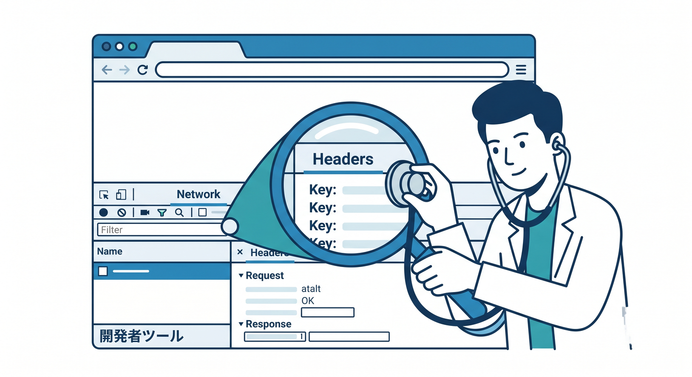
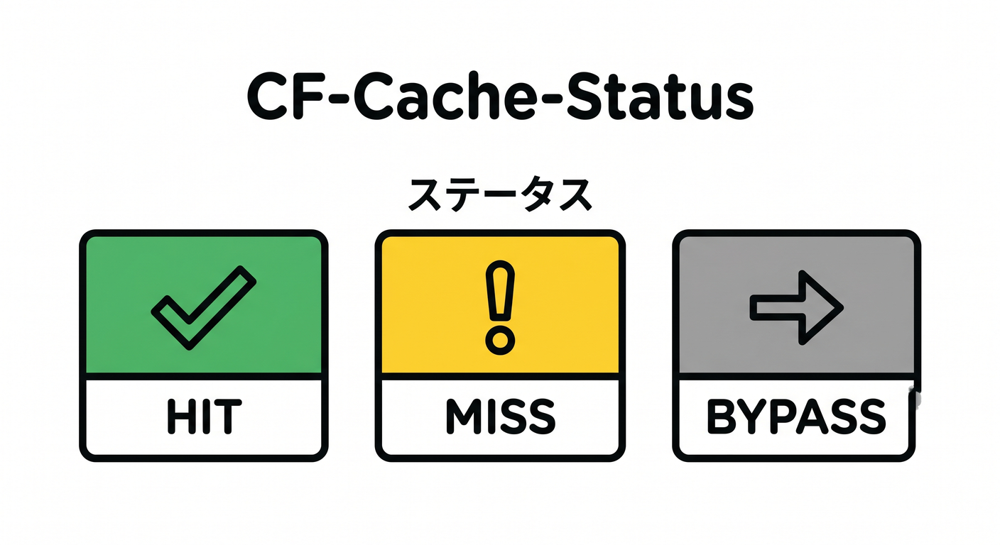
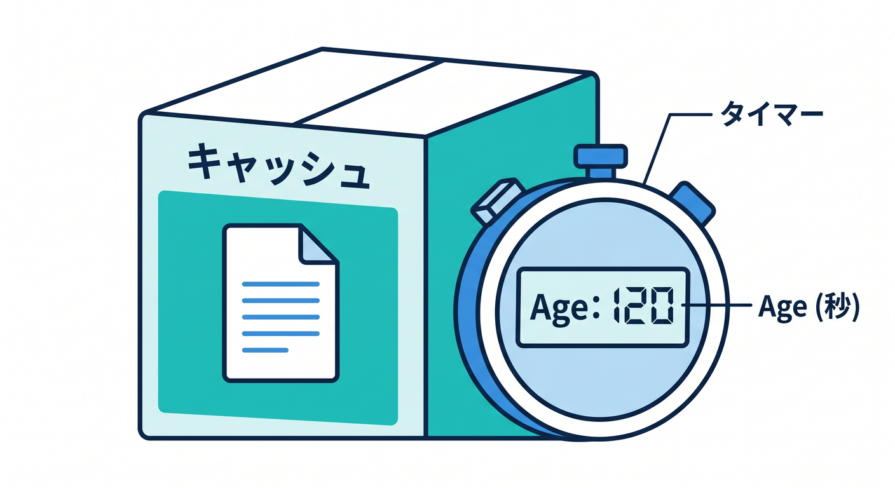
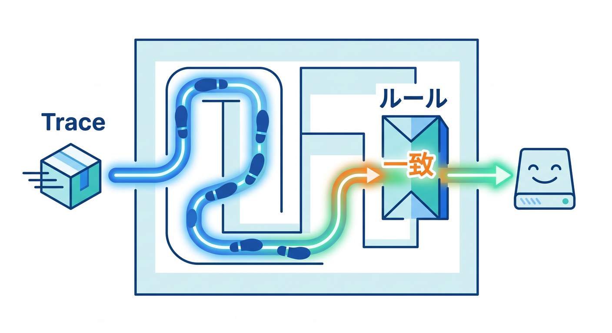
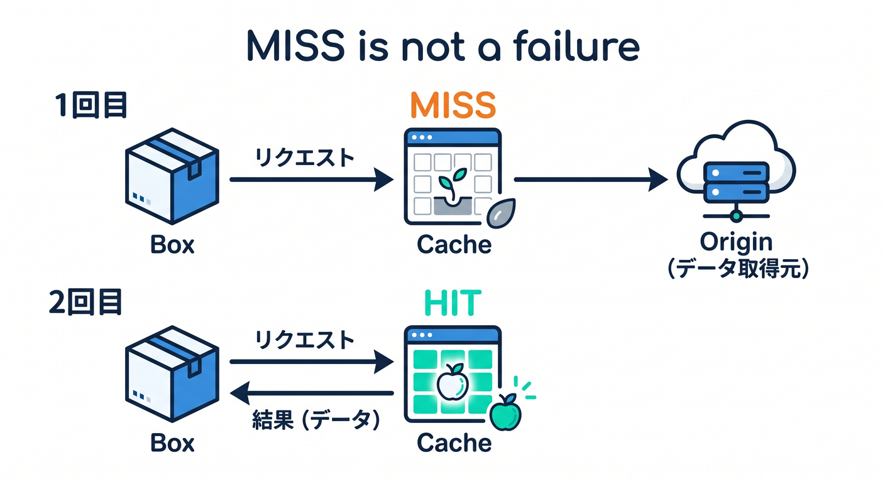

# 第11章：キャッシュが効いているか確認しよう 👀📊

キャッシュ設定は、作っただけでは意味がありません。  
実際に効いているか、どの状態なのかを確認する必要があります。  
この章では、DevTools、ヘッダー、Cloudflare Traceを使って証拠を見る練習をします 🔎

---

## 1. まずブラウザDevToolsを見る 🧑‍💻

Microsoft EdgeやChromeでF12を押し、Networkタブを開きます。  
ページを再読み込みすると、読み込まれたファイルが一覧で出ます。

見るものです。

- ファイル名
- Status
- Size
- Time
- Response Headers
- Cache-Control
- CF-Cache-Status



最初は画像やCSSなど、分かりやすい静的ファイルを1つ選びましょう。

---

## 2. `CF-Cache-Status` を見る 📦

Cloudflareを通ったレスポンスでは、`CF-Cache-Status` が見えることがあります。  
これはCloudflare側のキャッシュ状態を知る手がかりです。

よく見る状態です。

- `HIT`: キャッシュから返った
- `MISS`: キャッシュになく、originなどへ取りに行った
- `BYPASS`: キャッシュを使わなかった
- `DYNAMIC`: 動的扱いでキャッシュされていない
- `EXPIRED`: 期限切れで再取得が必要



最初のアクセスがMISSで、次のアクセスがHITになることもあります。  
1回だけ見て判断しないのがコツです。

---

## 3. `Age` ヘッダーもヒントになる ⏱️

`Age` ヘッダーは、キャッシュされてからどれくらい時間が経ったかを示すことがあります。  
たとえば `Age: 120` なら、約120秒キャッシュにあると考えられます。

ただし、すべてのケースで必ず期待通りに出るとは限りません。  
`CF-Cache-Status`、`Cache-Control`、`Age` をセットで見ます。



キャッシュ調査では、1つのヘッダーだけで決めつけないことが大事です。

---

## 4. Cloudflare Traceでルール適用を見る 🔍

Cache Ruleが効いているか分からないときは、Cloudflare Traceが役立ちます。  
特定のURLに対して、どのルールが適用されているかを確認できます。

確認したいことです。

- そもそもCloudflareを通っているか
- Cache Ruleが発火しているか
- 期待したルールが当たっているか
- 別のルールに上書きされていないか



Cache Rulesは条件が少し違うだけで効かないことがあります。  
Traceで見ると、推測ではなく証拠で確認できます 📊

---

## 5. MISSは失敗とは限らない 🧠

`MISS` が出ると「失敗した」と思うかもしれません。  
でも、最初のアクセスではMISSになることがあります。

流れはこうです。

```text
1回目: MISS → 取りに行って保存
2回目: HIT → キャッシュから返す
```



そのため、同じURLを複数回確認します。  
また、クエリ文字列が違うと別URLとして扱われる場合があります。

---

## 6. Copilotにヘッダーを読ませる 🤖

```text
以下はCloudflare経由で取得したレスポンスヘッダーです。
キャッシュが効いているか、なぜそう判断できるかを初心者向けに説明してください。

---
ここにResponse Headersを貼る
---
```

ヘッダーの読み方を練習すると、キャッシュの理解が一気に進みます。

---

## 7. 章末チェック ✅

- DevToolsのNetworkタブでヘッダーを見られる
- `CF-Cache-Status` の基本状態を説明できる
- MISSが必ず失敗ではないと分かる
- Cloudflare Traceでルール適用を確認できる
- ヘッダーを証拠としてキャッシュ状態を判断できる

この章で覚える一言はこれです。  
**キャッシュは体感だけでなく、ヘッダーとTraceで証拠を見るものです 👀📊**

