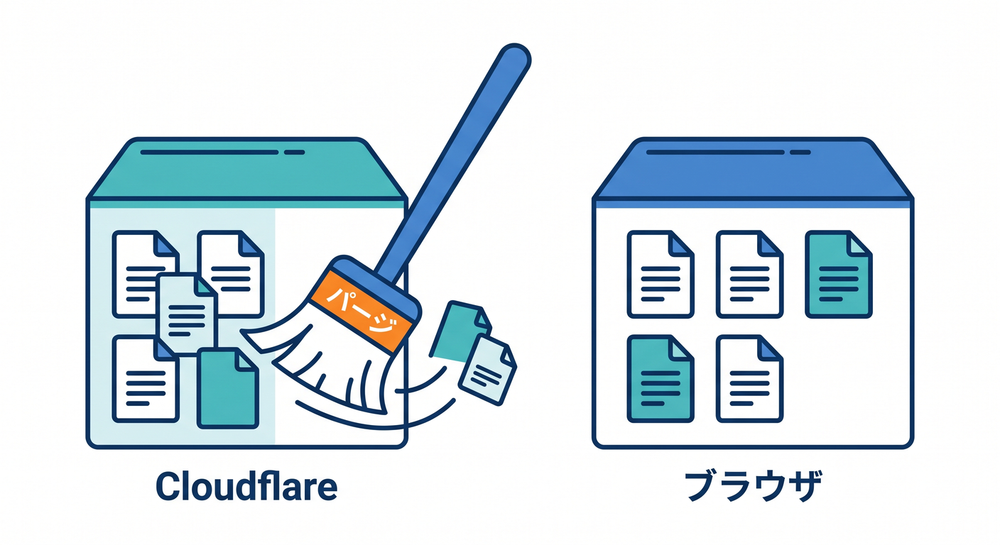
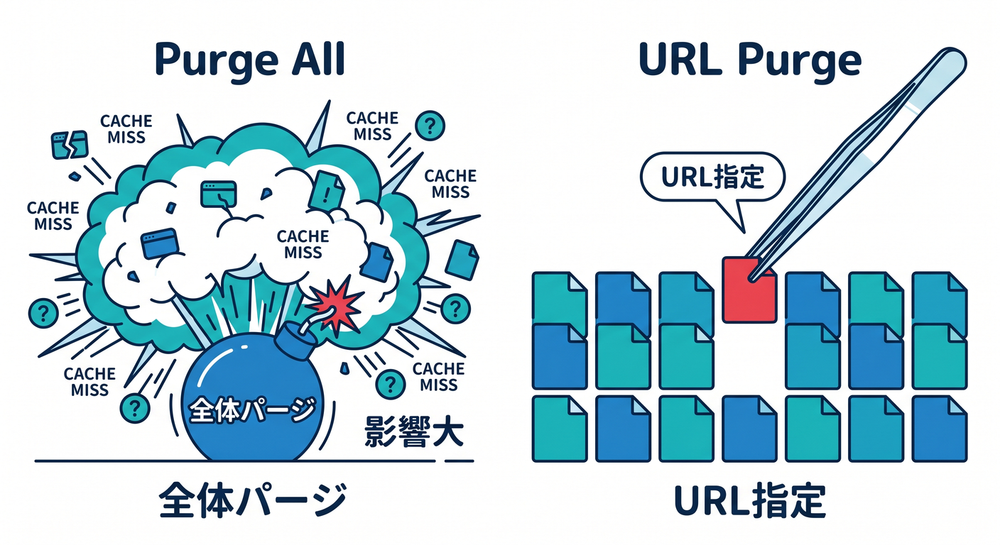
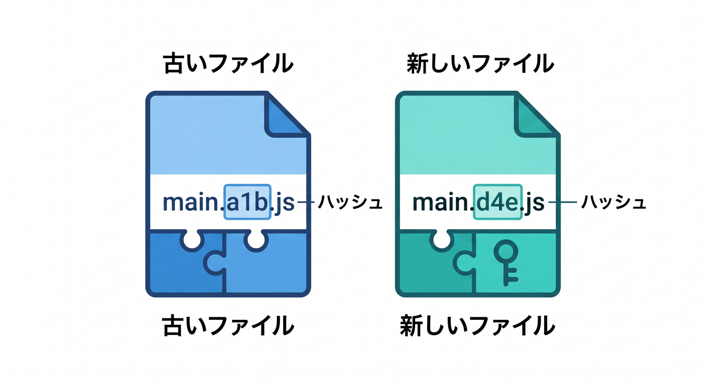
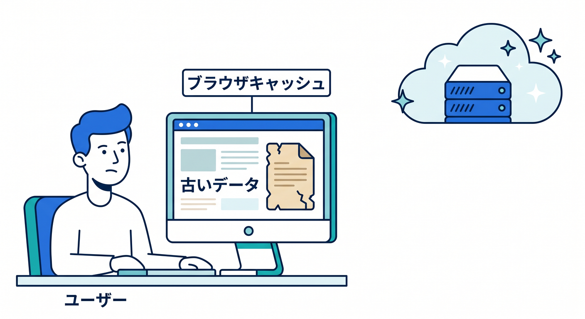
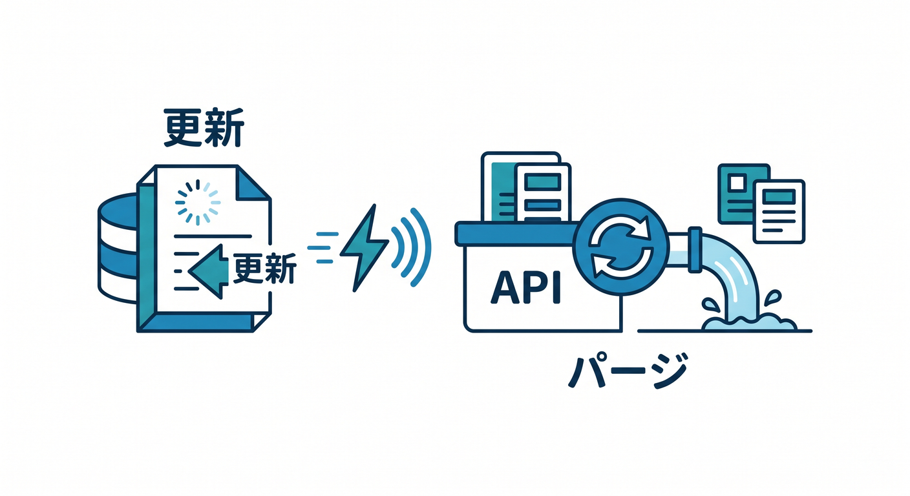
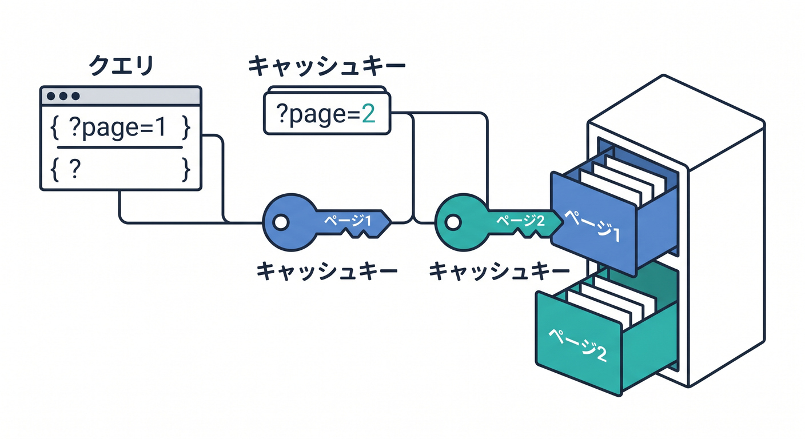

# 第12章：Purgeでキャッシュを消す・更新する 🧹🔁

キャッシュは速くするために便利ですが、古い内容が残ることがあります。  
そのときに使う考え方がPurgeです。  
この章では、Cloudflare側のキャッシュを消す流れと注意点を学びます 😊

---

## 1. PurgeはCloudflare側のキャッシュ削除 🧹

Purgeは、Cloudflareのキャッシュから指定した内容を消す操作です。  
古い画像やCSSが残っているときに使うことがあります。



ただし、Purgeは魔法ではありません。  
Cloudflare側のキャッシュを消しても、ユーザーのブラウザキャッシュは別です。

ここを混同すると、Purgeしたのにまだ古く見える、という状態になります。

---

## 2. 全部消すより範囲を絞る 🎯

キャッシュ削除には、影響範囲があります。

- URL単位でPurge
- ホスト名単位でPurge
- Prefix単位でPurge
- 全体Purge



全体Purgeは簡単ですが、影響が大きいです。  
多くのファイルが一気にMISSになり、originへのアクセスが増える可能性があります。

まずは、必要なURLだけ消す考え方を持ちましょう。

---

## 3. ファイル名を変えるとPurgeに頼りすぎない 📦

フロントエンドでは、ファイル名にハッシュを付ける方法がよく使われます。

```text
main.a1b2c3.js
main.d4e5f6.js
```



中身が変わるとURLも変わるので、古いキャッシュと新しいファイルが衝突しにくくなります。  
これにより、Purgeに頼りすぎない運用ができます。

React + Viteのビルドでは、この考え方と相性がよいです。

---

## 4. ブラウザキャッシュは別問題 🧑‍💻

ユーザーのブラウザに保存されたキャッシュは、CloudflareのPurgeでは消えません。  
Browser Cache TTLを長くしている場合、ユーザー側に古いファイルが残ることがあります。



これを避けるには、次の考え方が重要です。

- 入口HTMLは長くキャッシュしすぎない
- ハッシュ付きアセットを使う
- 同じURLで中身だけ上書きしない
- 必要に応じてブラウザの強制再読み込みで確認する

Cloudflare側とブラウザ側を分けて考えましょう。

---

## 5. APIレスポンスのPurge 🧪

公開GET APIを短時間キャッシュしている場合、データ更新時にPurgeしたいことがあります。  
たとえば、記事一覧APIです。

```text
GET /api/articles
```



記事を更新したら、このURLのキャッシュを消すことで新しい一覧を返しやすくできます。

ただし、APIのURLにクエリがある場合は注意です。

```text
/api/articles?page=1
/api/articles?page=2
```



URLが違えば、キャッシュキーも違う可能性があります。

---

## 6. Copilotに更新手順を作らせる 🤖

```text
CloudflareでReactアプリと公開GET APIをキャッシュしています。
デプロイ時に、どのキャッシュをPurgeすべきか、
どれはハッシュ付きファイル名で対応すべきかを整理してください。
```

Purgeの相談では、ファイル名が変わるものと変わらないものを分けるのが大事です。

---

## 7. 章末チェック ✅

- PurgeはCloudflare側のキャッシュ削除だと分かる
- 全体Purgeは影響が大きいと分かる
- ハッシュ付きファイル名でPurgeに頼りすぎない運用ができる
- ブラウザキャッシュはPurgeで消えないと分かる
- APIレスポンスのPurgeではURL単位に注意できる

この章で覚える一言はこれです。  
**Purgeは更新の道具。でも、ファイル名設計とTTL設計でPurgeしすぎない運用を目指します 🧹🔁**

