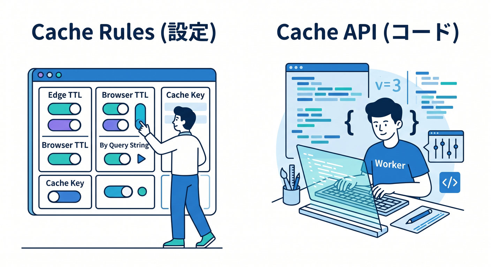
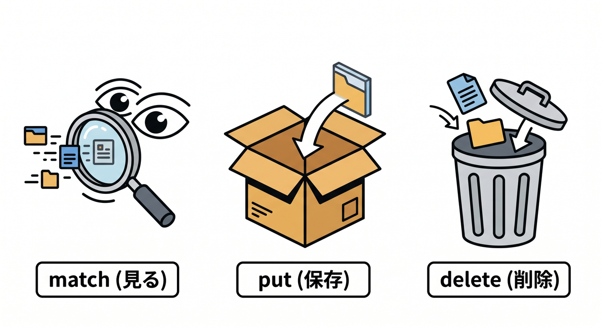
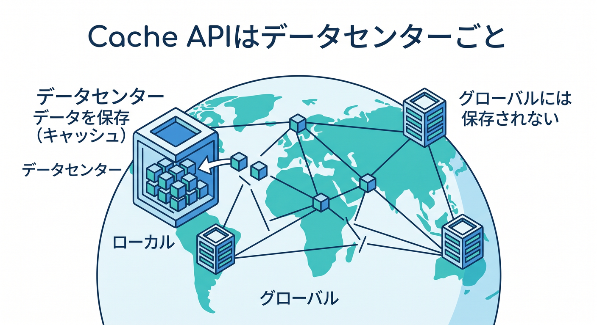
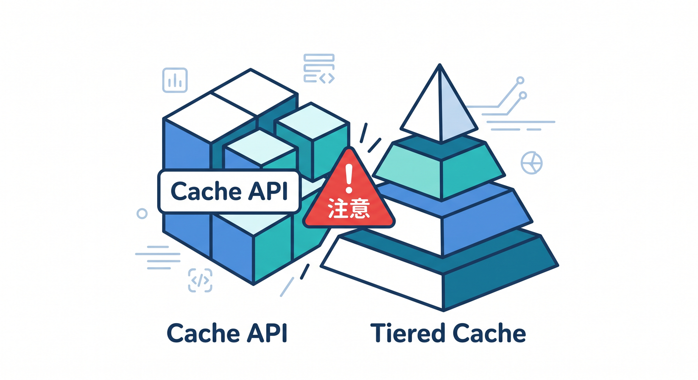
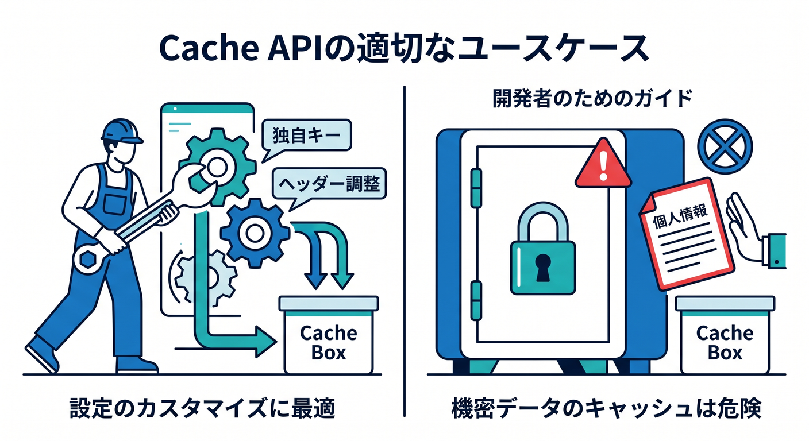
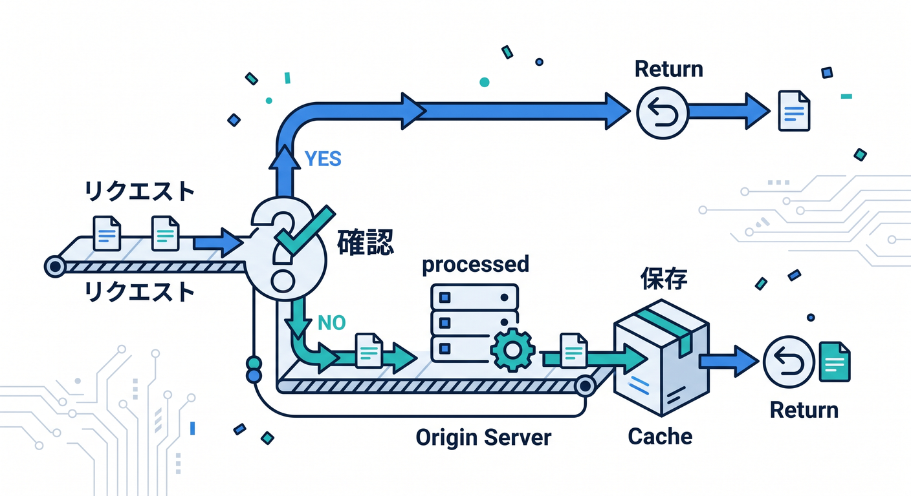

# 第13章：Workers Cache APIはいつ使う？🧑‍💻📦

CloudflareにはCache Rulesだけでなく、Workersから使えるCache APIもあります。  
Cache APIを使うと、Workerのコードからキャッシュを読み書きできます。  
ただし、最初から何でもCache APIでやろうとしないことが大事です 😊

---

## 1. Cache RulesとCache APIは役割が違う 🧭

Cache Rulesは、Cloudflareの設定としてキャッシュ挙動を決めるものです。  
URLやホスト名、拡張子などの条件でTTLやキャッシュ可否を設定します。

Workers Cache APIは、Workerのコードからキャッシュを扱うものです。

```ts
const cache = caches.default;
const cached = await cache.match(request);
```



つまり、設定で済むことはCache Rules、コードで細かく制御したいことはCache API、という感覚です。

---

## 2. Cache APIの基本メソッド 🛠️

よく使うのは3つです。

```ts
const cache = caches.default;
```

```ts
await cache.match(request);
```

```ts
await cache.put(request, response);
```

```ts
await cache.delete(request);
```



`match` はキャッシュを見る、`put` は保存する、`delete` は削除する、という役割です。  
ブラウザのCache APIに似ていますが、Cloudflare Workersならではの違いもあります。

---

## 3. Cache APIはデータセンター単位と考える ☁️

重要な注意点です。  
Workers Cache APIで保存した内容は、グローバルに自動複製されるものではありません。

Cache APIは、Workerが実行されたデータセンターのキャッシュに対して動くと考えます。  
そのため、別の地域からアクセスすると、まだキャッシュがないことがあります。



これは悪いことではなく、そういう性質の道具です。  
グローバルCDN全体のTTL調整とは違うものとして理解しましょう。

---

## 4. Tiered Cacheとは相性に注意 ⚠️

CloudflareにはTiered Cacheの考え方があります。  
originへのアクセスを減らすために、階層的にキャッシュを使う仕組みです。

ただし、Workers Cache APIの `cache.put` はTiered Cacheと互換ではないと公式ドキュメントで案内されています。  
Tiered Cacheを活かしたい場合は、通常の `fetch()` によるキャッシュ挙動を考える必要があります。



初心者は、まずこう覚えましょう。

**グローバルなCDN設計はCache Rules中心。特殊なWorker内制御だけCache API。**

---

## 5. Cache APIが向いている場面 🧪

Cache APIが向いているのは、たとえば次のような場面です。

- originのヘッダーを調整してから保存したい
- Worker内で特別なキャッシュキーを使いたい
- 遅い外部APIの結果を短時間だけ保存したい
- レスポンスを加工してからキャッシュしたい



ただし、個人情報やCookie付きレスポンスは慎重に扱います。  
`Set-Cookie` があるレスポンスはキャッシュされない、または扱いに注意が必要です。

---

## 6. 小さな疑似コード例 👀

```ts
export default {
  async fetch(request: Request): Promise<Response> {
    const cache = caches.default;
    const cached = await cache.match(request);

    if (cached) {
      return cached;
    }

    const response = new Response("slow result", {
      headers: {
        "Cache-Control": "public, max-age=60",
      },
    });

    await cache.put(request, response.clone());
    return response;
  },
};
```



この例は考え方を見るためのものです。  
本番では、メソッド、URL、ユーザー情報、ヘッダーをもっと慎重に確認します。

---

## 7. 章末チェック ✅

- Cache RulesとCache APIの違いが分かる
- `match`、`put`、`delete` の役割が分かる
- Cache APIはデータセンター単位だと分かる
- Tiered Cacheとの注意点が分かる
- 特殊な制御が必要なときにCache APIを検討できる

この章で覚える一言はこれです。  
**普通のキャッシュ方針はCache Rules、Worker内の特別制御はCache APIです 🧑‍💻📦**

