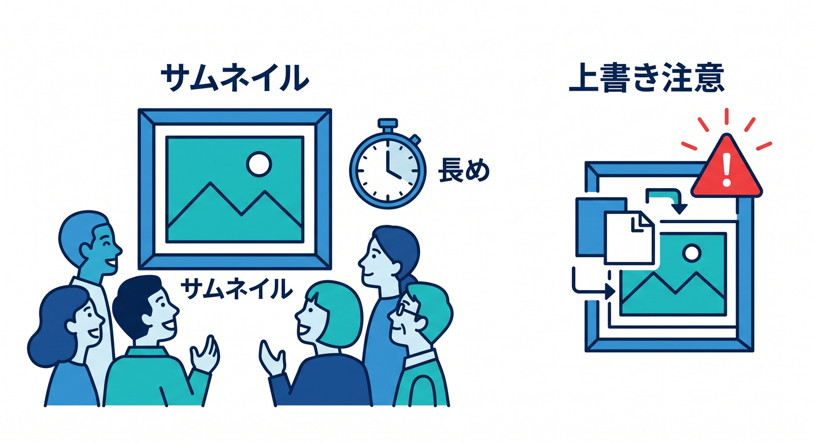
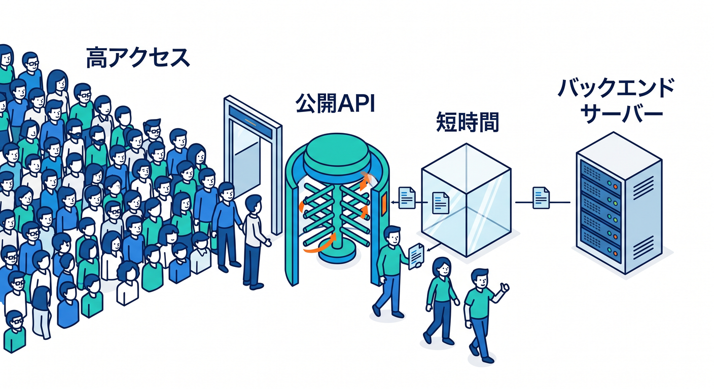
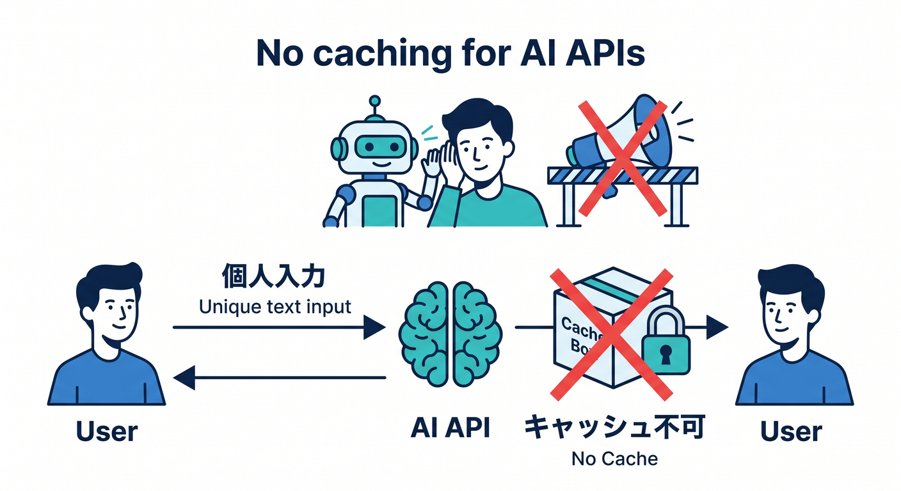
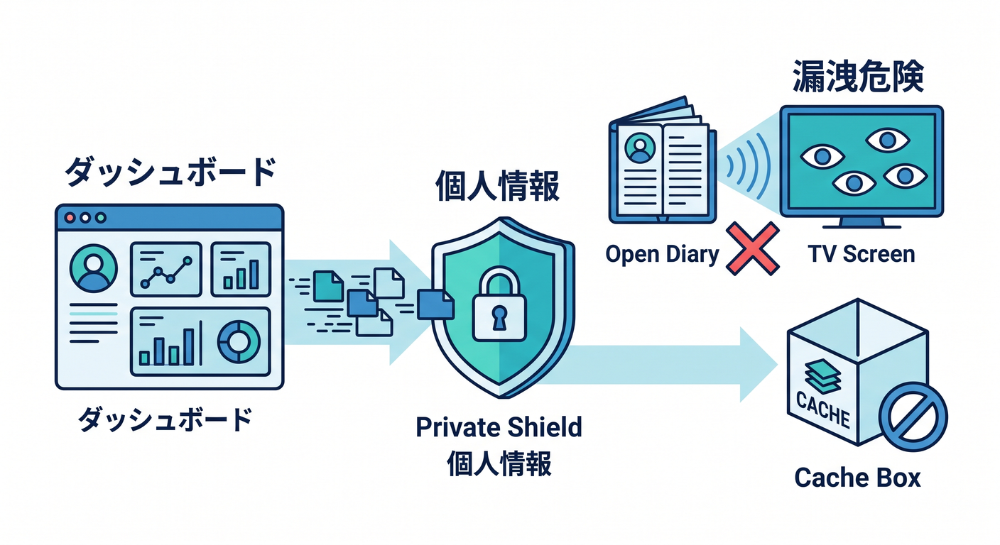
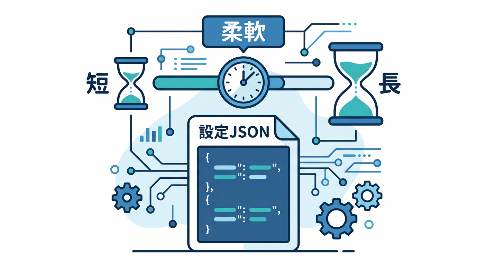
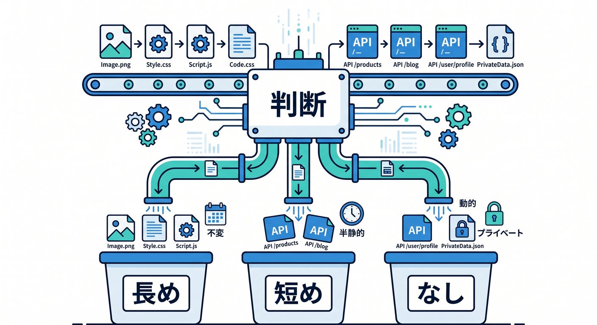

# 第14章：AI・画像・APIでキャッシュ設計を練習しよう 🤖🖼️

ここまで学んだ内容を、具体例で練習します。  
キャッシュは「速くしたい」だけでは決められません。  
同じ内容を誰に返してよいか、どれくらい古くてもよいかを考えます 🧠

---

## 1. 画像サムネイル 🖼️

画像サムネイルは、キャッシュしやすい代表例です。  
同じURLの画像を多くの人が見ることが多いからです。

方針例です。

```text
Edge TTL: 長め
Browser TTL: 中から長め
更新方法: ファイル名変更またはPurge
```



ただし、同じURLで画像を上書きするなら注意が必要です。  
古い画像が見える可能性があります。

---

## 2. 公開記事一覧API 📰

公開記事一覧は、誰が見ても同じ内容なら短時間キャッシュ候補になります。

例です。

```text
GET /api/articles
```

方針例です。

```text
Edge TTL: 60秒から5分
Browser TTL: 短めまたは尊重
更新時: 必要に応じてPurge
```



アクセスが多いサイトでは、短時間キャッシュでも効果があります。  
ただし、管理者が更新した内容をすぐ見せたい場合はTTLを短くします。

---

## 3. AI要約API 🤖

AI要約APIは、ユーザーが入力した文章によって結果が変わります。

例です。

```text
POST /api/summarize
```

これは通常の共有CDNキャッシュには向きません。  
入力内容がユーザーごとに違い、個人的な文章を含むこともあるからです。

方針例です。

```text
共有キャッシュ: 基本しない
Rate Limiting: 検討
AI Gateway: ログや制御に使う
```



速さより安全とコスト管理を優先します 🔐

---

## 4. ユーザー別ダッシュボード 🔐

ログイン後のダッシュボードは、基本的に共有キャッシュしません。

例です。

```text
GET /api/me
GET /api/orders
GET /dashboard
```

これらはユーザーごとに違う内容です。  
間違って共有キャッシュすると、情報漏えいにつながる可能性があります。

方針例です。

```http
Cache-Control: no-store
```



ここでは速さより安全が最優先です。

---

## 5. 公開設定JSON ⚙️

アプリの公開設定JSONは、内容によってキャッシュできます。

例です。

```text
GET /config.json
```

頻繁に変わらないなら短時間から中時間キャッシュできます。  
ただし、設定変更をすぐ反映したい場合は短めにします。

```text
Edge TTL: 5分
Browser TTL: 1分
```



このように、同じJSONでも用途で方針が変わります。

---

## 6. 判断表 ✅

| 対象 | キャッシュ方針 |
|---|---|
| ハッシュ付きJS/CSS | 長め |
| 画像サムネイル | 中から長め |
| `index.html` | 短め |
| 公開記事一覧API | 短時間なら候補 |
| AI要約POST API | 基本共有キャッシュしない |
| ユーザー別情報 | キャッシュしない |



この表をベースに、自分のアプリへ当てはめて考えましょう。

---

## 7. 章末チェック ✅

- 画像がキャッシュ向きだと分かる
- 公開GET APIは短時間キャッシュ候補になると分かる
- AI POST APIは共有キャッシュに慎重だと分かる
- ユーザー別情報はキャッシュしないと判断できる
- 対象ごとにTTL方針を説明できる

この章で覚える一言はこれです。  
**キャッシュ設計は、対象ごとに「同じ内容を返してよいか」で判断します 🤖🖼️**

