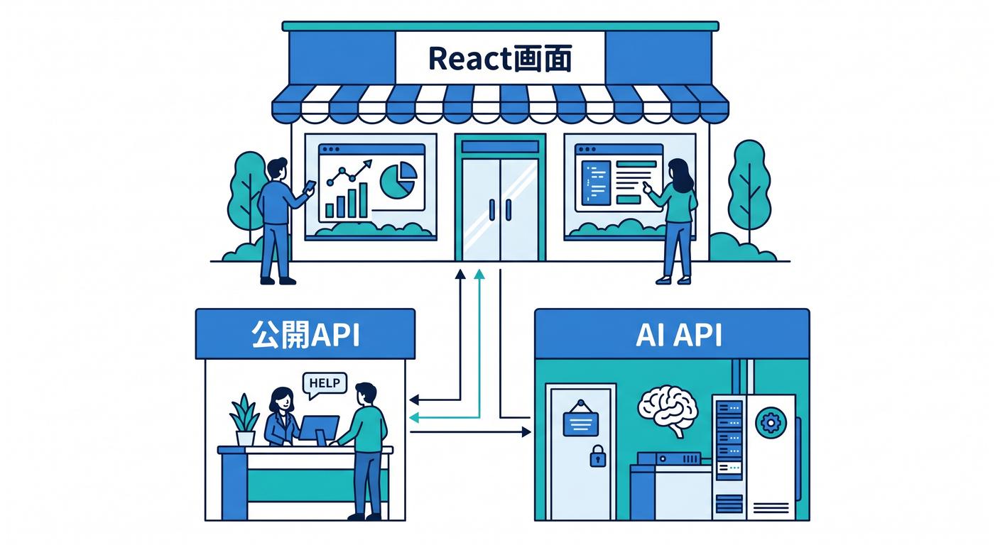
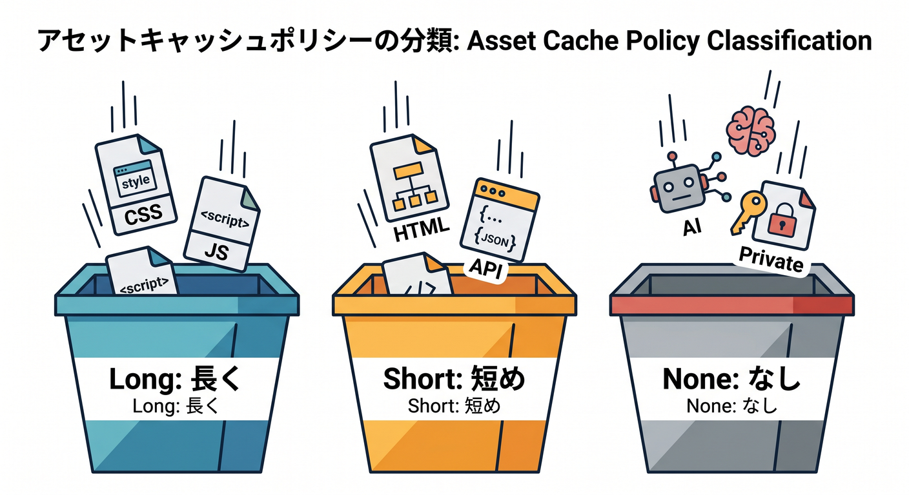
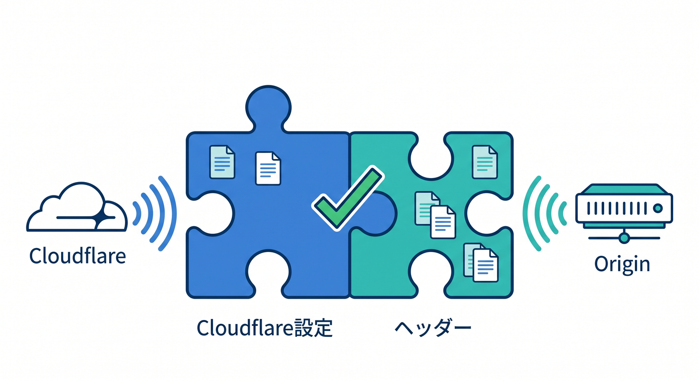
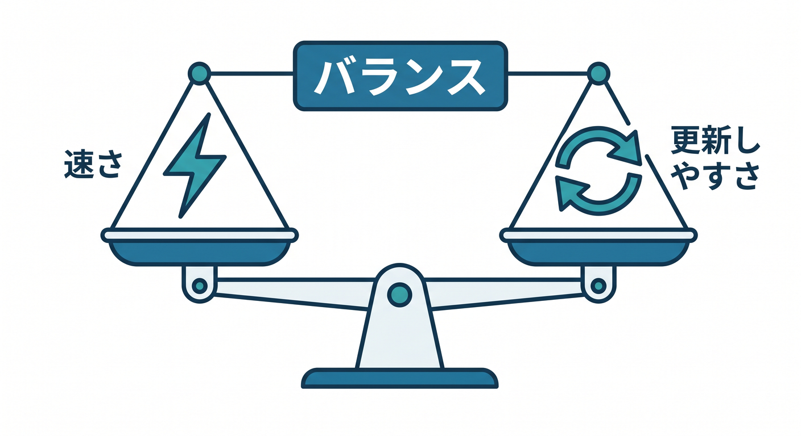
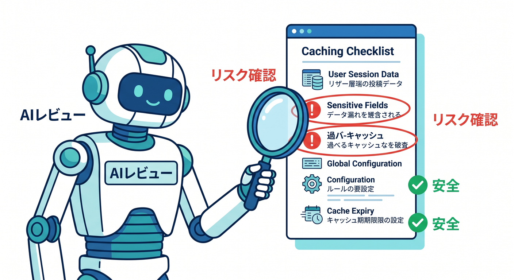
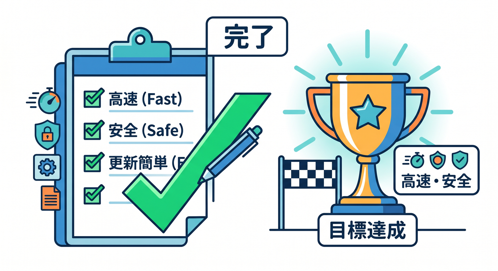

# 第15章：総仕上げ：速くて更新しやすい公開アプリにしよう 🏁⚡

最後は、Cloudflare CDN・キャッシュ・Cache Rulesの考え方を1つの小さなアプリにまとめます。  
目標は、ただ速いだけではなく、更新しやすく、安全なキャッシュ方針を持つことです 🚀

---

## 1. 題材アプリの構成 🧩

題材は、React画面、Workers API、画像、AI APIを含む小さなアプリです。

```text
React画面
  ├─ CSS / JS / 画像
  ├─ 公開記事一覧API
  └─ AI要約API
```



この構成には、キャッシュしやすいものと慎重に扱うものが混ざっています。  
だから総仕上げにちょうどよいです。

---

## 2. まず分類する 📦

対象を分類します。

**長くキャッシュしやすい**
- ハッシュ付きJS
- ハッシュ付きCSS
- バージョン付き画像

**短めにする**
- `index.html`
- 公開記事一覧API
- `config.json`

**基本キャッシュしない**
- AI要約POST API
- ユーザー別API
- Cookie付きレスポンス



分類できれば、Cache Rulesもかなり作りやすくなります。

---

## 3. Cache Rulesの方針を作る ⚙️

例として、次のような方針を作ります。

```text
Rule 1:
/assets/* は長めにキャッシュ

Rule 2:
/images/* は中から長めにキャッシュ

Rule 3:
/api/public/* は短時間キャッシュ

Rule 4:
/api/ai/* はキャッシュしない
```


最初はこのくらいシンプルで十分です。  
細かすぎるルールは、あとで管理が難しくなります。

---

## 4. Cache-Controlも合わせて考える 🧾

Cloudflare側のCache Rulesだけでなく、originやWorkerが返す `Cache-Control` も重要です。

公開APIなら、たとえば次のようにできます。

```http
Cache-Control: public, s-maxage=300, max-age=60
```

AI APIや個人情報APIなら、次のようにします。

```http
Cache-Control: no-store
```



ヘッダーとCloudflareルールの両方を見て、矛盾しないようにします。

---

## 5. 確認手順を作る 👀

公開後に確認する流れです。

1. DevToolsでNetworkを見る
2. `CF-Cache-Status` を確認する
3. 2回読み込んでHIT/MISSを見る
4. Cloudflare Traceでルール適用を見る
5. 更新後に古い内容が残らないか確認する
6. 必要ならPurgeする


キャッシュは設定だけでなく、確認手順までセットで完成です。

---

## 6. 更新しやすい運用にする 🔁

速いけれど更新できないアプリは困ります。  
更新しやすさも設計に入れます。

基本方針です。

- JS/CSSはハッシュ付きファイル名にする
- HTMLは長くキャッシュしすぎない
- 画像はファイル名変更かPurgeを使う
- 公開APIは短時間TTLにする
- AI APIや個人情報はキャッシュしない



この方針なら、速さと更新のバランスを取りやすいです ⚖️

---

## 7. Copilotに最終レビューを頼む 🤖

```text
CloudflareでReact + Workers API + Workers AIアプリを公開します。
以下のキャッシュ方針について、キャッシュしすぎ、しなさすぎ、
個人情報漏えい、更新反映トラブルの観点でレビューしてください。

方針:
- /assets/* は長期キャッシュ
- /images/* は1日キャッシュ
- /api/public/* は5分キャッシュ
- /api/ai/* は no-store
```



AIには、リスク観点を明示してレビューさせると有効です。

---

## 8. 章末チェック ✅

- アプリ内の対象をキャッシュ方針ごとに分類できる
- Cache Rulesをシンプルに設計できる
- Cache-ControlとCloudflare設定を合わせて考えられる
- DevToolsとCloudflare Traceで確認できる
- 速さと更新しやすさのバランスを説明できる



この章で覚える一言はこれです。  
**よいキャッシュ設計は、速さ・安全・更新しやすさを同時に考えることです 🏁⚡**

