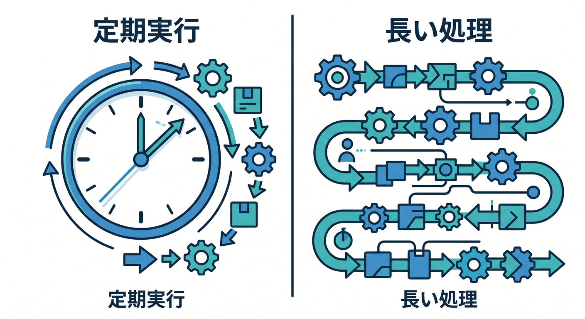
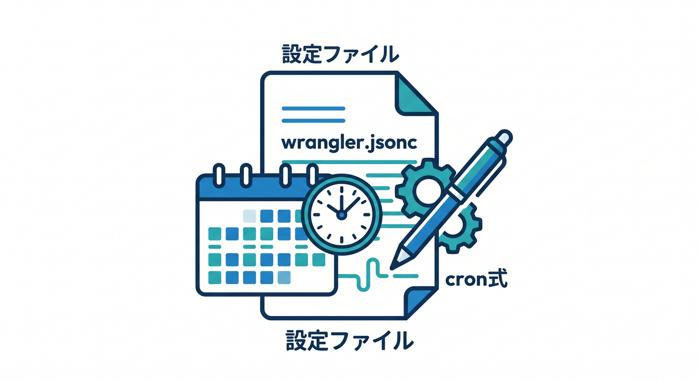
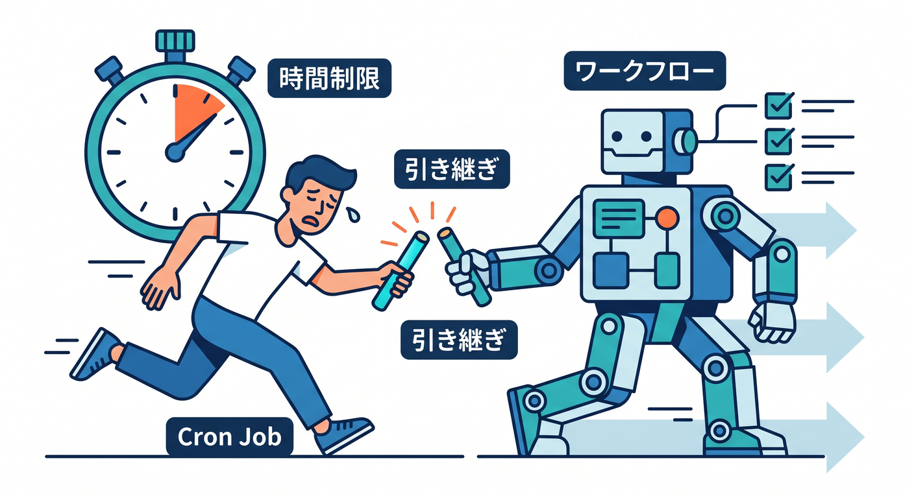
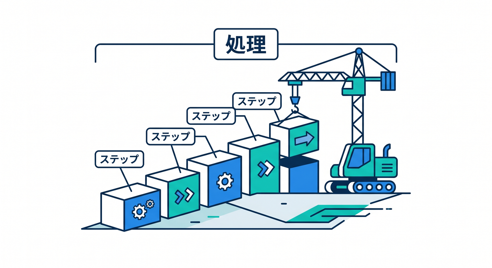
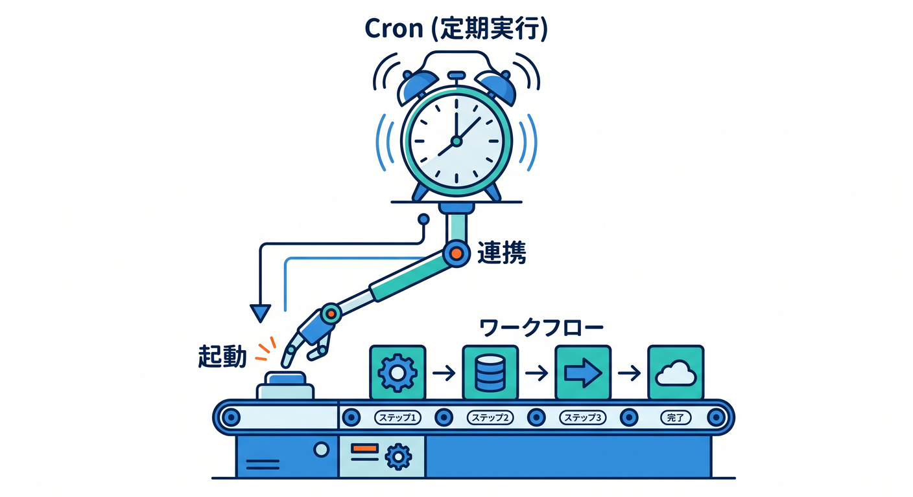

# Cloudflare Cron TriggersとWorkflowsで“運用できる自動化”を学ぶ 15章アウトライン 🕰️🔁✨

確認日: 2026-04-24  
主な確認先: Cloudflare Workers Cron Triggers / Scheduled handler / Workers Limits / Workflows Overview / Build your first Workflow / Trigger Workflows / Sleeping and retrying / Workflows Limits / Workflows Pricing 公式ドキュメント

## 第1章　定期実行と長い処理って何だろう 🕰️

アプリには、ユーザー操作とは別に自動で動かしたい処理があります。  
毎朝の集計、古いデータの掃除、R2画像の後処理、AIの埋め込み生成などです。  
Cron Triggersは決まった時間にWorkerを動かす仕組みです。  
Workflowsは複数ステップの長い処理を、retryや待機込みで進める仕組みです 🔁  
この章のゴールは、CronとWorkflowsが必要になる場面を説明できることです ✅

## 第2章　Cron Triggersの基本を知ろう ⏰

Cron Triggersは、cron式をWorkerへひもづけ、`scheduled()` handlerを実行します。  
公式ドキュメントでは、定期的なメンテナンスや外部APIからのデータ取得に向くと案内されています。  
実行時刻はUTC基準なので、日本時間とのずれに注意します。  
まずは「毎朝データを集計するWorker」を題材にします 🌅  
この章のゴールは、Cron Triggerの役割とUTCの注意点を理解することです。

## 第3章　wrangler.jsoncにcronを書こう ⚙️

Cron Triggersは、Wrangler管理のWorkerなら `wrangler.jsonc` の `triggers.crons` に書きます。  
`0 0 * * *` のようなcron式で、いつ動かすかを指定します。  
環境ごとにcron設定を分けることもできます。  
Dashboardで設定する方法もありますが、教材では設定ファイル管理を基本にします 🛠️  
この章のゴールは、cron設定を安全に書けることです。

## 第4章　scheduled() handlerを書こう 🧩

Cron Triggerで動くWorkerには、`scheduled(controller, env, ctx)` handlerを書きます。  
HTTPの `fetch()` とは別の入口です。  
`controller.cron` や `controller.scheduledTime` を使うと、どのcronで起動したかを扱えます。  
D1へ集計結果を保存する小さな例で学びます 🗄️  
この章のゴールは、scheduled handlerの基本形を書けることです。

## 第5章　ローカルでCronをテストしよう 🧪

Cronは時間にならないと動かないため、テスト方法が大切です。  
公式ドキュメントでは、`wrangler dev` 中に `/cdn-cgi/handler/scheduled` を呼ぶ方法が案内されています。  
`cron` queryや `time` queryで、特定の実行条件を試せます。  
Windows PowerShellでの確認コマンドも扱います。  
この章のゴールは、Cronをローカルで手動実行して確認できることです。

## 第6章　Cronで定期メンテナンスを作ろう 🧹

Cronの代表例は、古い一時データの削除や集計更新です。  
KV、D1、R2を使ったアプリでは、期限切れデータの整理が必要になります。  
削除処理は慎重に行い、対象件数や実行ログを残します。  
一度に大量削除せず、少しずつ処理する設計も学びます 🧯  
この章のゴールは、Cronで安全なメンテナンス処理を作ることです。

## 第7章　Cronだけでは長い処理に弱い理由 🐢

Cron Triggerは定期実行に便利ですが、長い多段処理を全部持たせるのは難しいことがあります。  
Workersには実行時間やCPU時間のlimitsがあり、失敗時にどこまで進んだかも管理が必要です。  
画像処理、AI埋め込み生成、外部API連携のような処理は、段階管理が欲しくなります。  
そこでWorkflowsの出番です 🔁  
この章のゴールは、CronとWorkflowsの役割分担を理解することです。

## 第8章　Workflowsの基本を知ろう 🔁

Cloudflare Workflowsは、Workers上でdurable multi-step applicationsを作る仕組みです。  
複数のstepをつなぎ、失敗時のretryや状態の永続化を扱えます。  
公式ドキュメントでは、分・時間・週にまたがる処理も扱える実行エンジンとして案内されています。  
`step.do()` で処理を区切り、完了したstepの結果を保持します。  
この章のゴールは、Workflowsの全体像をつかむことです。

## 第9章　最初のWorkflowを作ろう 🛠️

Workflowsでは、Workflowクラスを作り、Workerからbinding経由でinstanceを作成します。  
`WorkflowEntrypoint`、`WorkflowStep`、`WorkflowEvent` などの型を使います。  
まずは「受付 → D1保存 → 通知ログ」の3stepで小さく作ります。  
Wrangler設定とTypeScriptの型も一緒に整えます。  
この章のゴールは、動くWorkflowの最小形を理解することです。

## 第10章　step.do()で処理を分けよう 🧱

Workflowsでは、1つの長い処理をstepに分けます。  
`step.do("名前", async () => { ... })` の形で、処理単位を明確にします。  
ステップ名はログや調査にも関係するため、分かりやすく付けます。  
外部API呼び出し、D1保存、R2読み書きなどをstepごとに整理します 🧭  
この章のゴールは、長い処理を安全なstepへ分割できることです。

## 第11章　RetryとNonRetryableErrorを学ぼう 🔁

Workflowsでは、stepごとにretryを考えられます。  
一時的な外部API失敗はretryしたい一方、入力不正のような失敗はretryしても直りません。  
公式ドキュメントでは、retry設定や `NonRetryableError` が案内されています。  
何をretryし、何を失敗として止めるかを設計します 🧯  
この章のゴールは、長い処理の失敗を分類できることです。

## 第12章　sleep()で待つ処理を作ろう 😴

Workflowsは、途中で待つ処理も扱えます。  
`step.sleep()` や `step.sleepUntil()` を使うと、数秒後、数時間後、数日後に続きから進める設計ができます。  
外部サービスの反映待ち、承認待ち、再チェックなどに便利です。  
CronやQueuesだけでは書きにくい「待ってから次へ」を学びます。  
この章のゴールは、待機を含むWorkflow設計を理解することです。

## 第13章　CronからWorkflowを起動しよう 🌉

Cron TriggersとWorkflowsは組み合わせられます。  
Cronで毎朝起動し、実際の長い処理はWorkflowへ渡す構成です。  
公式ドキュメントでも、Cron TriggersからWorkflowsを実行できることが案内されています。  
毎朝のAI埋め込み更新、R2未処理ファイルの巡回、日次レポート生成を題材にします 🌅  
この章のゴールは、定期実行と長い処理を分ける設計を作れることです。

## 第14章　Queues・D1・R2・AIと組み合わせよう 🧩

CronとWorkflowsは、他のCloudflareサービスと組み合わせると実務感が出ます。  
D1で処理対象を管理し、R2からファイルを読み、Queuesで大量処理を分散し、AI GatewayやWorkers AIでAI処理を行います。  
Workflowsは全体の進行管理、Queuesは大量ジョブの分配、D1は状態保存という分担にします。  
この章のゴールは、サービスの役割分担を設計できることです。

## 第15章　日次AIレポート自動生成を完成させよう 📊

最後は、Cron + Workflows + D1 + R2 + AIを組み合わせた小さな日次レポート自動生成を作ります。  
Cronで毎朝Workflowを起動し、Workflowがデータ収集、要約、保存、通知をstepごとに進めます。  
失敗時のretry、処理済み管理、ログ、limits、pricing、Copilotレビューまで確認します。  
本番ではUTC、重複起動、外部API制限、個人情報ログに注意します ✅  
この章のゴールは、運用できる自動化の全体像を説明できることです。

---

## 参照URL

- https://developers.cloudflare.com/workers/configuration/cron-triggers/
- https://developers.cloudflare.com/workers/examples/cron-trigger/
- https://developers.cloudflare.com/workers/platform/limits/
- https://developers.cloudflare.com/workflows/
- https://developers.cloudflare.com/workflows/get-started/guide/
- https://developers.cloudflare.com/workflows/build/trigger-workflows/
- https://developers.cloudflare.com/workflows/build/sleeping-and-retrying/
- https://developers.cloudflare.com/workflows/reference/limits/
- https://developers.cloudflare.com/workflows/reference/pricing/
- https://developers.cloudflare.com/queues/
- https://developers.cloudflare.com/d1/
- https://developers.cloudflare.com/r2/
- https://developers.cloudflare.com/workers-ai/
- https://developers.cloudflare.com/ai-gateway/
