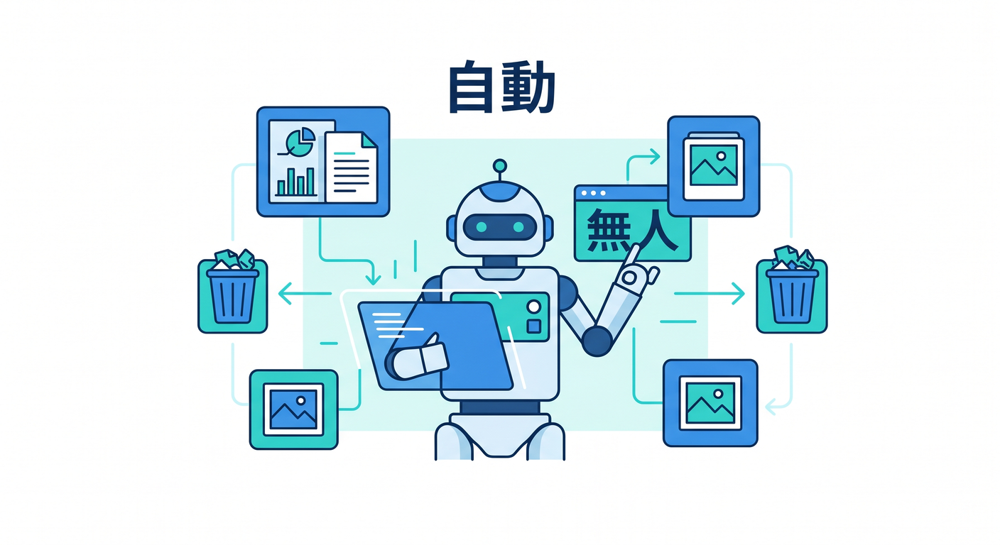
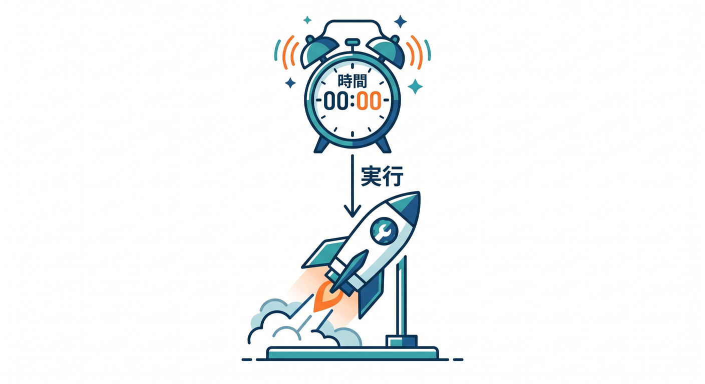
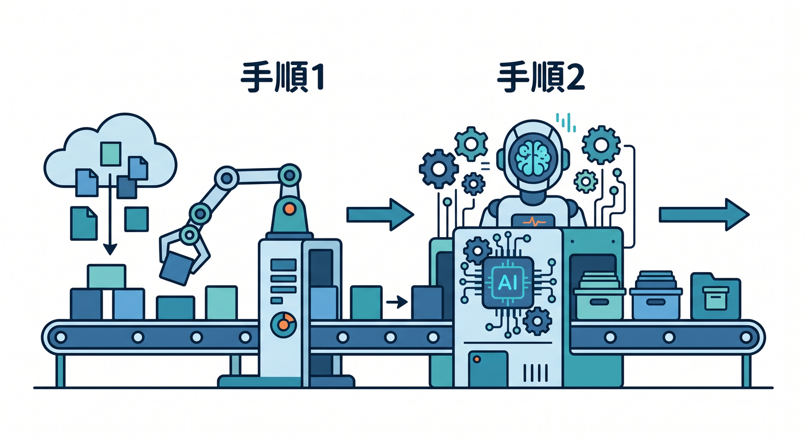
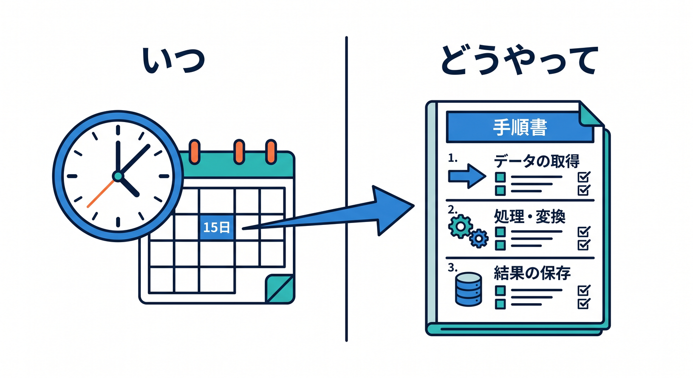
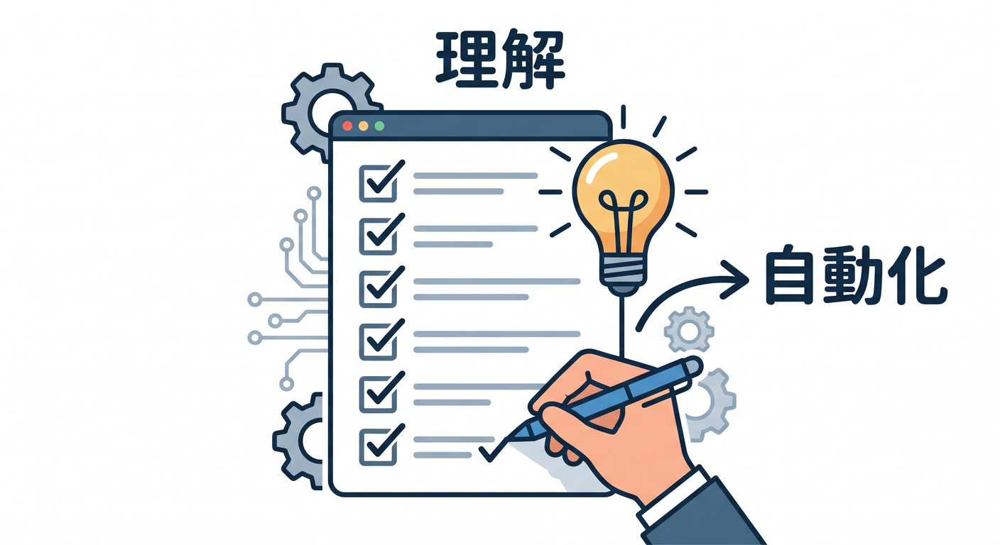

# 第01章：定期実行と長い処理って何だろう 🕰️

ここまでのアプリは、ユーザーがボタンを押したらWorkerが動く、という形が多かったはずです。  
でも実際のアプリでは、ユーザー操作がなくても自動で動いてほしい処理があります。  
この章では、Cron TriggersとWorkflowsに入る前の全体像をつかみます 😊

---

## 1. 自動で動かしたい処理 🌅



たとえば、こんな処理です。

- 毎朝レポートを作る
- 古い一時データを削除する
- R2にある未処理画像を確認する
- D1の集計テーブルを更新する
- AIで記事を要約する
- 埋め込みデータを作り直す

人が毎回ボタンを押さなくても、決まった時間に動いてほしい処理です。

---

## 2. Cron Triggersの役割 ⏰



Cron Triggersは、決まった時間にWorkerを動かす仕組みです。

```text
毎日 00:00 UTC
  ↓
Workerのscheduled()が動く
```

「毎朝」「毎時」「毎週月曜」のような処理に向いています。

---

## 3. Workflowsの役割 🔁



Workflowsは、長い処理や複数ステップの処理を進める仕組みです。

```text
step 1: データを集める
step 2: AIで要約する
step 3: R2へ保存する
step 4: 通知する
```

失敗時のretryや、途中で待つ処理も扱いやすくなります。

---

## 4. CronとWorkflowsの分担 🧭



ざっくり分けるとこうです。

```text
Cron Triggers → いつ始めるか
Workflows → 何をどの順番で進めるか
```

Cronが目覚まし時計、Workflowsが作業手順書のようなイメージです。

---

## 5. 章末チェック ✅



- 自動で動かしたい処理の例が分かる
- Cron Triggersは定期実行だと分かる
- Workflowsは長い多段処理に向くと分かる
- CronとWorkflowsの分担が分かる
- AIやR2後処理ともつながると分かる

この章で覚える一言はこれです。  
**Cronは“いつ動かすか”、Workflowsは“どう進めるか”を担当します 🕰️**
