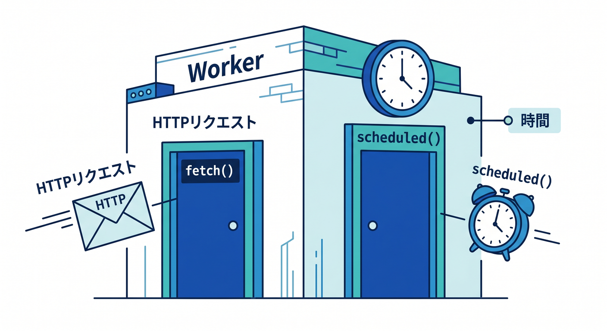
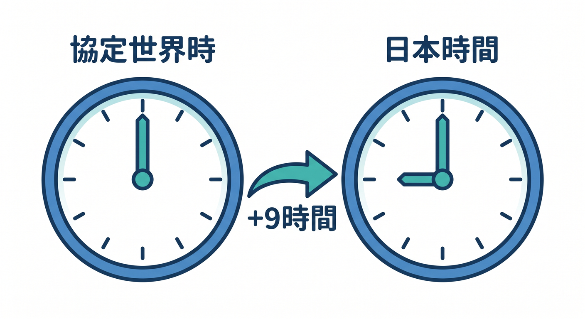
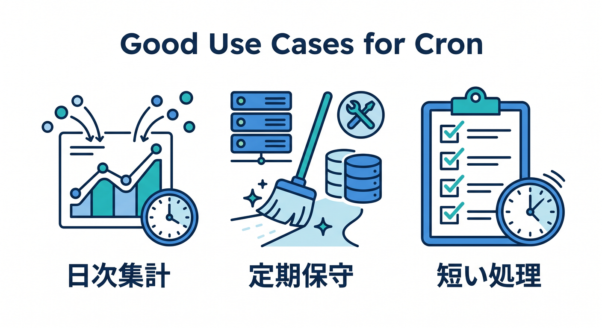
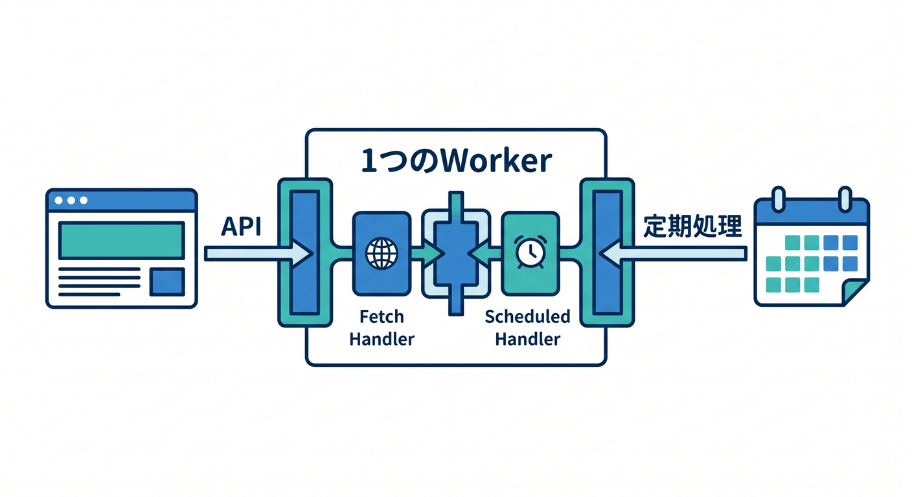
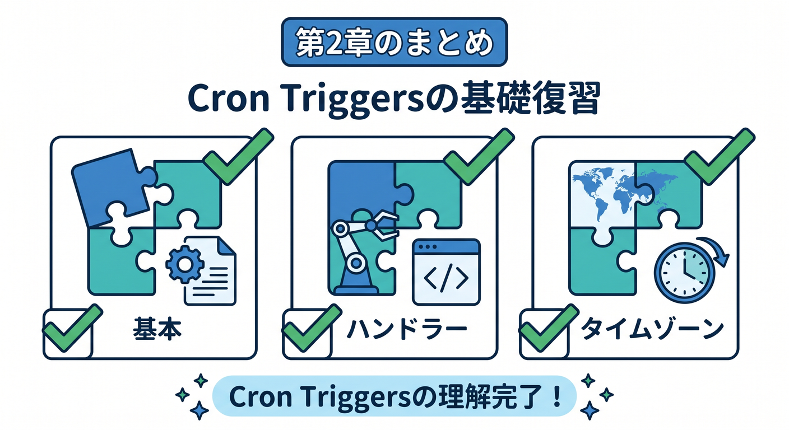

# 第02章：Cron Triggersの基本を知ろう ⏰

Cron Triggersは、Cloudflare Workersを決まった時間に動かすための仕組みです。  
毎朝の集計や定期メンテナンスに向いています。

---

## 1. scheduled() handlerが動く 🧩



Cron Triggerで動くWorkerには、`scheduled()` handlerを書きます。

```ts
export default {
  async scheduled(controller, env, ctx): Promise<void> {
    console.log("cron fired", controller.cron);
  },
} satisfies ExportedHandler<Env>;
```

HTTPリクエストを受ける `fetch()` とは別の入口です。

---

## 2. UTC基準に注意 🌏



CloudflareのCron TriggersはUTC時刻で実行されます。  
日本時間とは9時間ずれます。

```text
UTC 00:00 → 日本時間 09:00
UTC 21:00 → 日本時間 翌朝 06:00
```

「日本時間の毎朝6時」にしたいなら、UTCでは前日の21時です。

---

## 3. Cronに向いている処理 🧭



Cronは、定期的に始めたい処理に向いています。

- 毎朝の集計
- 毎時の外部APIチェック
- 期限切れデータの掃除
- 日次レポート作成
- 未処理ジョブの確認

長すぎる処理は、WorkflowsやQueuesへ分けることを考えます。

---

## 4. 1つのWorkerにfetchもscheduledも書ける 🚪



Workerには、HTTP用の `fetch()` とCron用の `scheduled()` を両方書けます。

```ts
export default {
  async fetch(request, env): Promise<Response> {
    return Response.json({ ok: true });
  },

  async scheduled(controller, env, ctx): Promise<void> {
    console.log("scheduled task");
  },
} satisfies ExportedHandler<Env>;
```

APIと定期処理を同じWorkerで管理することもできます。

---

## 5. 章末チェック ✅



- Cron TriggerはWorkerを定期実行する仕組みだと分かる
- `scheduled()` handlerを書くと分かる
- CronはUTC基準だと分かる
- 日本時間へ変換して考えられる
- 長い処理はWorkflowsやQueuesも考えると分かる

この章で覚える一言はこれです。  
**Cron Triggersは、UTCのスケジュールでWorkerのscheduled()を動かします ⏰**
