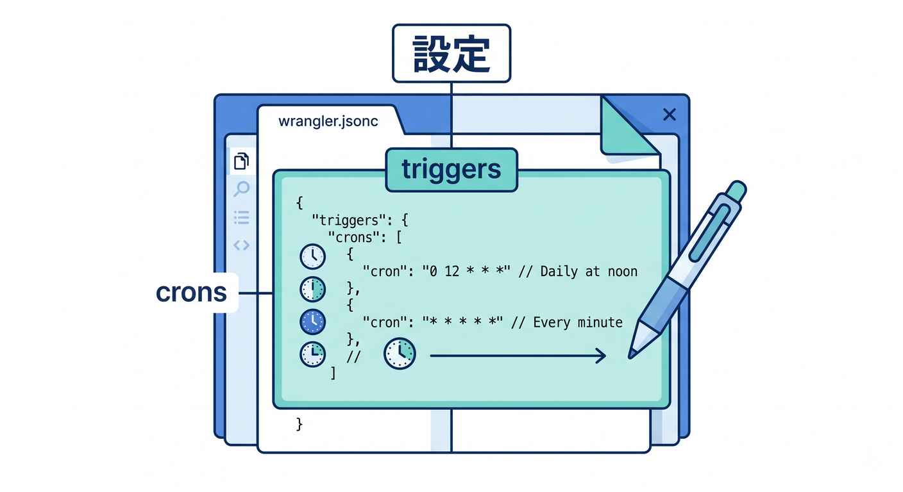
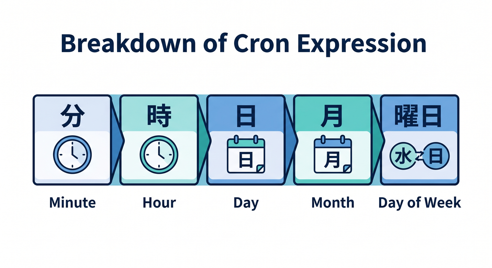
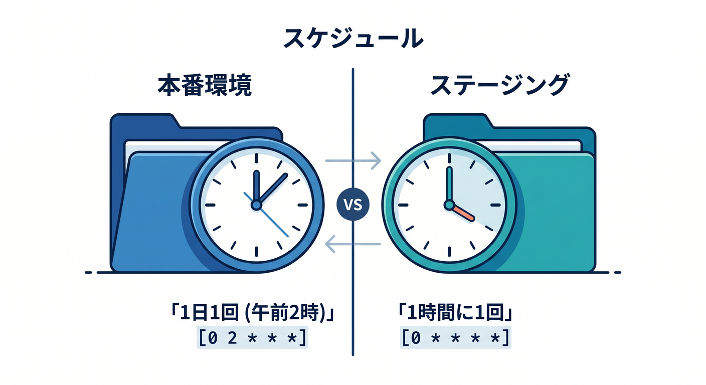
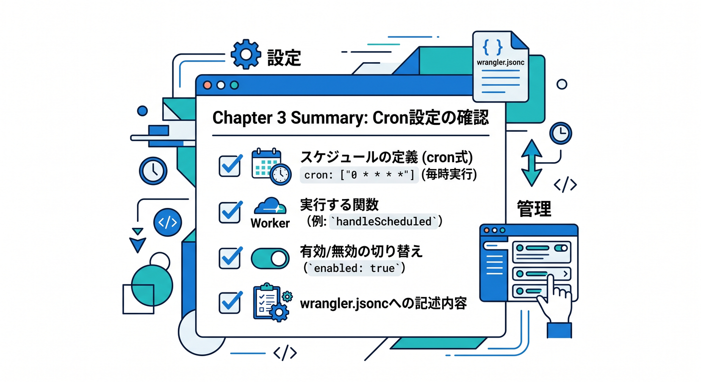

# 第03章：wrangler.jsoncにcronを書こう ⚙️

Cron Triggersを使うには、いつ動かすかを設定します。  
Wranglerで管理するWorkerでは、`wrangler.jsonc` に書くのが分かりやすいです。

---

## 1. triggers.cronsを書く 🛠️



`wrangler.jsonc` に `triggers` を追加します。

```jsonc
{
  "triggers": {
    "crons": [
      "0 0 * * *"
    ]
  }
}
```

この例では、毎日UTC 00:00にWorkerが起動します。

---

## 2. cron式の基本 🧭



cron式は5つの場所で時刻を表します。

```text
分 時 日 月 曜日
```

例を見ます。

```text
*/5 * * * *     → 5分ごと
0 * * * *       → 毎時0分
0 0 * * *       → 毎日UTC 00:00
0 21 * * *      → 日本時間の毎朝6時
```

CloudflareではUTC基準で考えます。

---

## 3. 環境ごとに分ける 🌱



開発環境と本番環境でcron頻度を変えたいことがあります。

```jsonc
{
  "env": {
    "staging": {
      "triggers": {
        "crons": ["*/30 * * * *"]
      }
    }
  }
}
```

本番だけ毎日実行、stagingは30分ごとに確認、という分け方ができます。

---

## 4. Dashboardと設定ファイルを混ぜすぎない 🧯


Wrangler管理のWorkerでは、Cron Triggersは設定ファイルで管理するのが安全です。  
Dashboardで手で変えた内容と、`wrangler.jsonc` がずれると混乱します。

```text
チーム開発 → 設定ファイルに寄せる
一時確認 → Dashboardも便利
```

学習では、まず `wrangler.jsonc` で管理します。

---

## 5. 章末チェック ✅



- `triggers.crons` の書き方が分かる
- cron式の5項目が分かる
- UTCで時刻を考えると分かる
- 環境ごとにcron設定を分けられる
- Dashboardと設定ファイルの混在に注意できる

この章で覚える一言はこれです。  
**Cronの時刻は、wrangler.jsoncのtriggers.cronsで管理します ⚙️**
