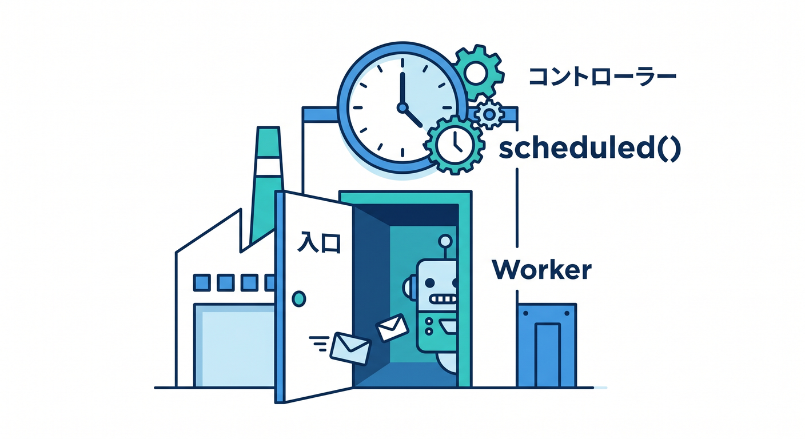
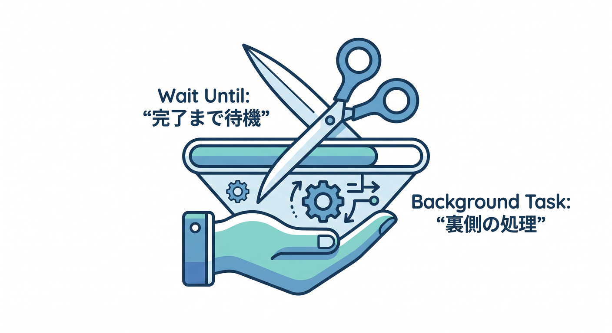
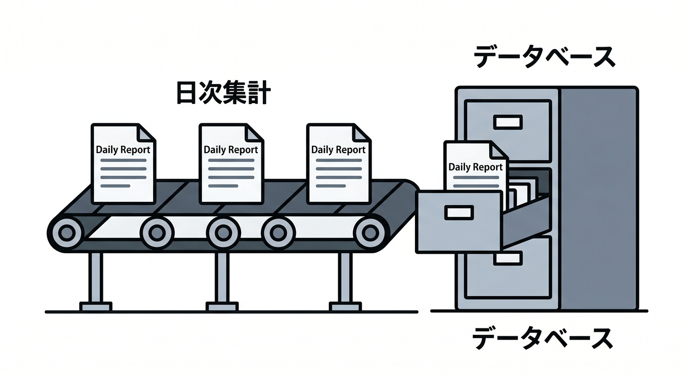
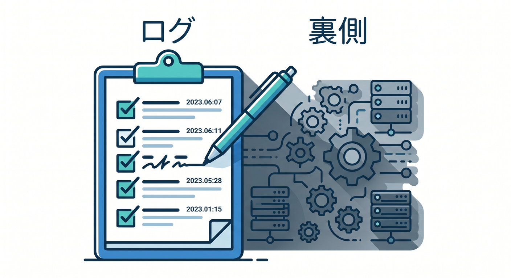
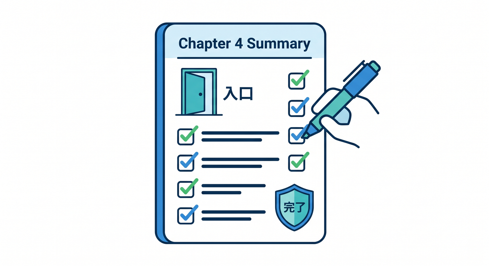

# 第04章：scheduled() handlerを書こう 🧩

Cron TriggerでWorkerが起動したときに呼ばれるのが `scheduled()` handlerです。  
この章では、定期集計の入口を作ります。

---

## 1. 基本形 🧱



まずは最小の形です。

```ts
export interface Env {
  DB: D1Database;
}

export default {
  async scheduled(controller, env, ctx): Promise<void> {
    console.log("cron", controller.cron);
    console.log("scheduledTime", controller.scheduledTime);
  },
} satisfies ExportedHandler<Env>;
```

`controller.cron` で、どのcron式から起動したか分かります。

---

## 2. ctx.waitUntilを使う 🧭



非同期処理を最後まで進めたい場合、`ctx.waitUntil()` を使うことがあります。

```ts
export default {
  async scheduled(controller, env, ctx): Promise<void> {
    ctx.waitUntil(runDailySummary(env));
  },
} satisfies ExportedHandler<Env>;
```

処理を関数へ分けると読みやすくなります。

---

## 3. D1へ集計結果を保存する 🗄️



日次集計の例です。

```ts
async function runDailySummary(env: Env): Promise<void> {
  const today = new Date().toISOString().slice(0, 10);

  await env.DB.prepare(
    "INSERT OR REPLACE INTO daily_reports (date, created_at) VALUES (?, ?)"
  )
    .bind(today, new Date().toISOString())
    .run();
}
```

同じ日付で二重実行されても壊れにくいようにします。

---

## 4. ログを残す 📋



Cronは裏で動くので、ログが大切です。

```ts
console.log("daily summary started", {
  cron: controller.cron,
  scheduledTime: controller.scheduledTime,
});
```

あとで「いつ動いたか」を追えるようにします。

---

## 5. 章末チェック ✅



- `scheduled()` handlerの基本形が分かる
- `controller.cron` と `scheduledTime` を知っている
- `ctx.waitUntil()` の使いどころが分かる
- D1へ集計結果を保存できる
- Cron処理ではログが大切だと分かる

この章で覚える一言はこれです。  
**scheduled()は、Cron Triggerで動くWorkerの入口です 🧩**
