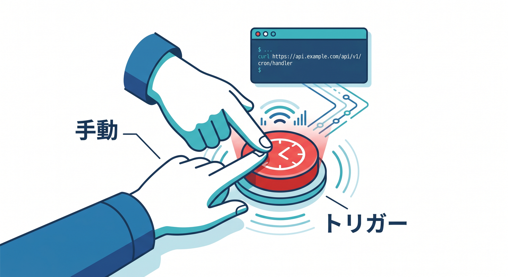
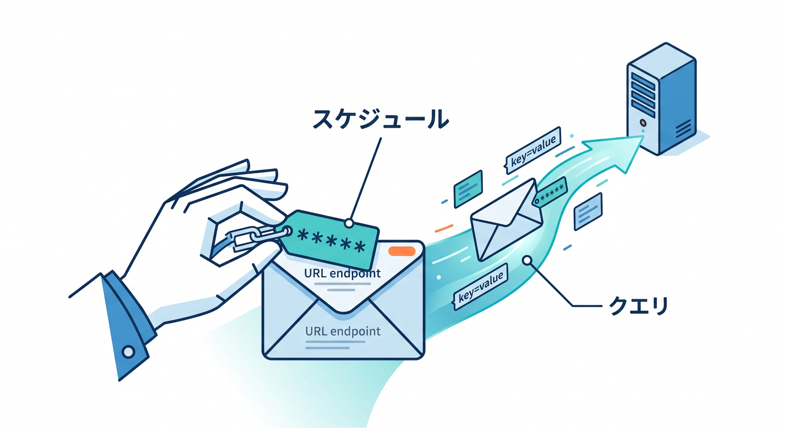
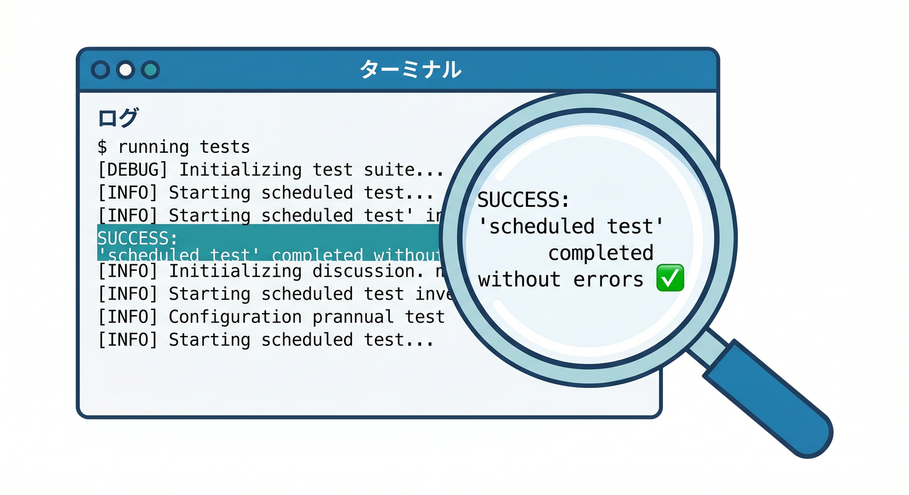
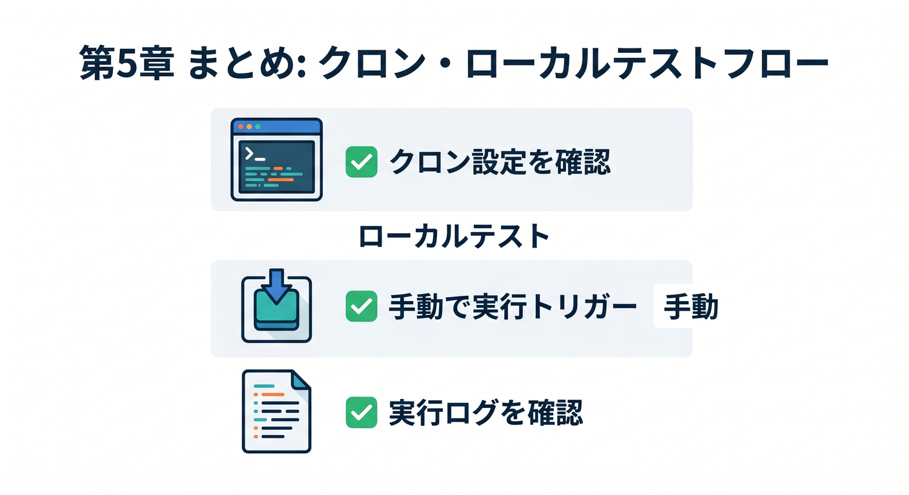

# 第05章：ローカルでCronをテストしよう 🧪

Cronは時間にならないと動かないため、待って確認するのは大変です。  
Cloudflare Workersでは、ローカル開発中に手動でscheduled handlerを呼べます。

---

## 1. wrangler devを起動する 🚀


まずローカル開発サーバーを起動します。

```powershell
npx wrangler dev
```

通常は `http://localhost:8787` でWorkerが動きます。

---

## 2. scheduled handlerを呼ぶ 📞



公式ドキュメントでは、次のURLでCronをテストできると案内されています。

```powershell
curl "http://localhost:8787/cdn-cgi/handler/scheduled"
```

PowerShellで `curl` が分かりにくい場合は、`Invoke-WebRequest` でも確認できます。

```powershell
Invoke-WebRequest "http://localhost:8787/cdn-cgi/handler/scheduled"
```

---

## 3. cron queryを付ける ⏰



どのcron式として呼ぶかを指定できます。

```powershell
Invoke-WebRequest "http://localhost:8787/cdn-cgi/handler/scheduled?cron=*+*+*+*+*"
```

`+` はURL内のスペース代わりとして使っています。

---

## 4. テスト用ログを見る 👀



scheduled handler内にログを入れておきます。

```ts
console.log("scheduled test", {
  cron: controller.cron,
  scheduledTime: controller.scheduledTime,
});
```

ターミナルに出力されれば、ローカルで起動確認できています。

---

## 5. 章末チェック ✅



- `wrangler dev` でローカル起動できる
- `/cdn-cgi/handler/scheduled` を呼べる
- PowerShellで手動テストできる
- cron queryを付けて確認できる
- ログでscheduled handlerの動作を確認できる

この章で覚える一言はこれです。  
**Cronは待たずに、ローカルでscheduled handlerを手動実行して確認できます 🧪**
