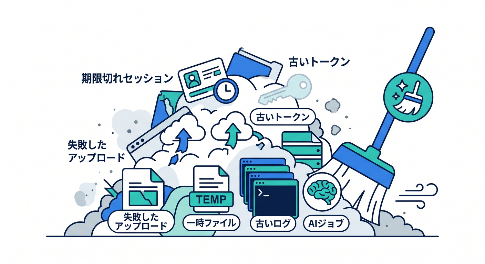
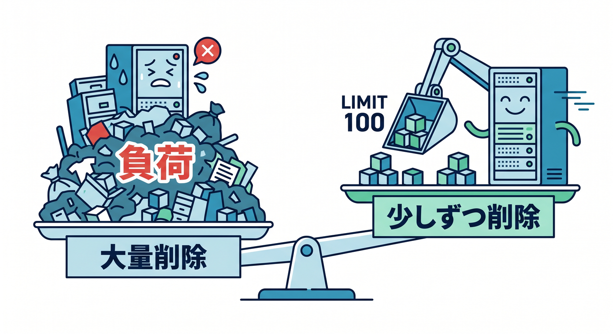
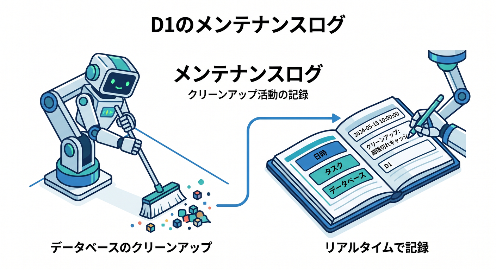
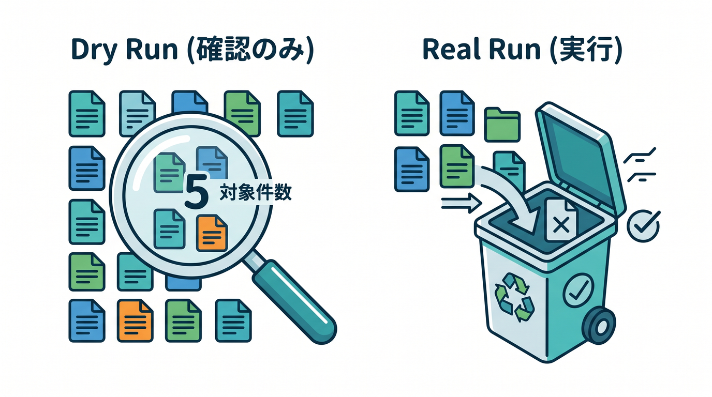
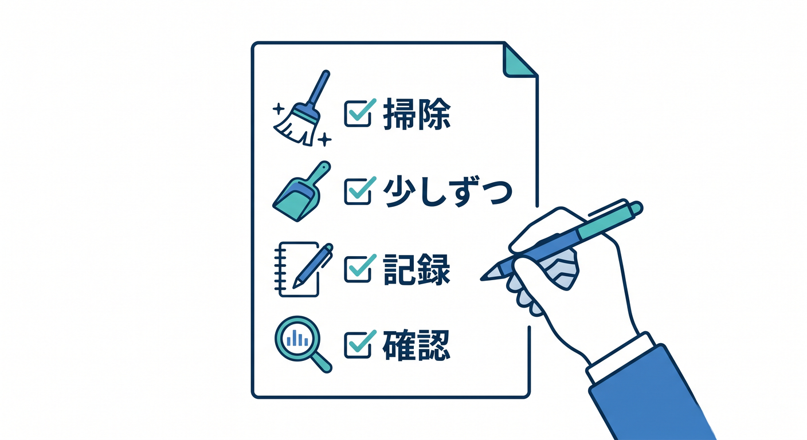

# 第06章：Cronで定期メンテナンスを作ろう 🧹

Cron Triggersの代表的な使い道は、定期メンテナンスです。  
古いデータを掃除したり、集計を更新したりできます。

---

## 1. 何を掃除する？ 🧺



アプリには、時間が経つと不要になるデータがあります。

- 期限切れセッション
- 古い一時トークン
- 失敗したアップロードの残骸
- R2の一時ファイル
- 古いログ
- 未完了の古いAIジョブ

放っておくと、管理が難しくなります。

---

## 2. 削除は少しずつ 🧯



一度に大量削除すると、時間や負荷の問題が出ます。  
まずは少しずつ処理します。

```sql
DELETE FROM temp_tokens
WHERE expires_at < ?
LIMIT 100;
```

本番では、対象件数や削除件数をログに残します。

---

## 3. D1でメンテナンスログを残す 📋



いつ何をしたかを残します。

```ts
await env.DB.prepare(
  "INSERT INTO maintenance_logs (task, created_at) VALUES (?, ?)"
)
  .bind("cleanup_temp_tokens", new Date().toISOString())
  .run();
```

裏で動く処理ほど、あとで追えることが大切です。

---

## 4. Dry runの考え方 🧪



いきなり削除せず、まず対象件数だけ数える方法もあります。

```text
dry run → 何件消す予定か確認
real run → 実際に削除
```

削除系のCronでは、とても大切な考え方です。

---

## 5. 章末チェック ✅



- Cronは定期メンテナンスに向くと分かる
- 古い一時データを掃除する場面が分かる
- 一度に大量削除しない理由が分かる
- メンテナンスログを残すと分かる
- dry runの考え方が分かる

この章で覚える一言はこれです。  
**Cronの削除処理は、少しずつ・ログ付き・慎重に進めます 🧹**
