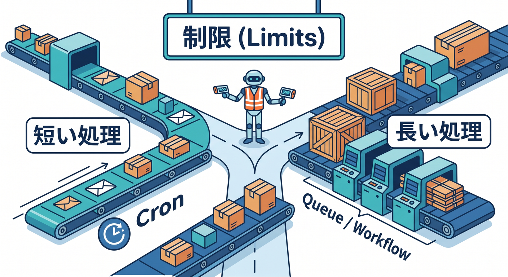
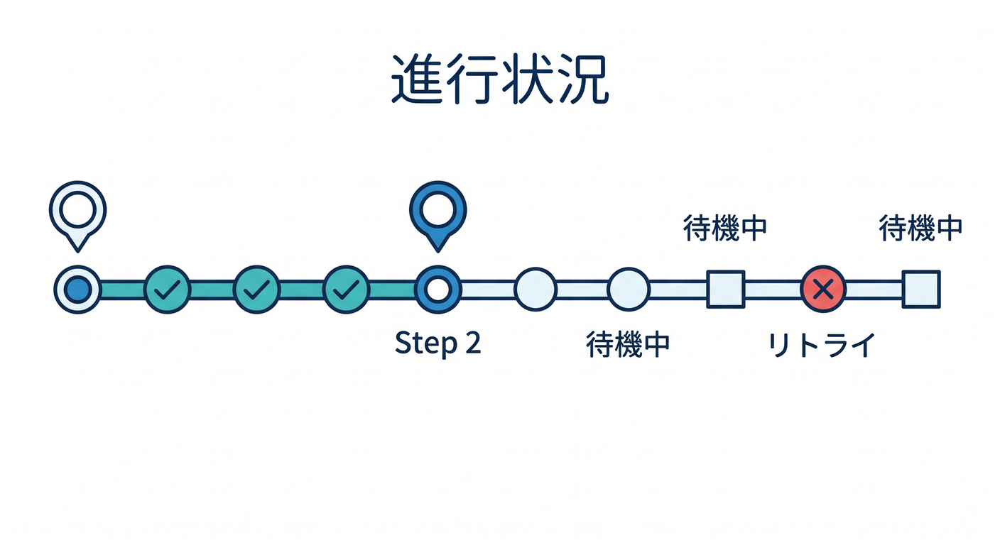
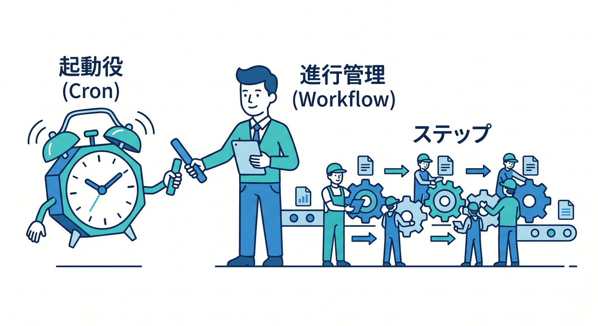
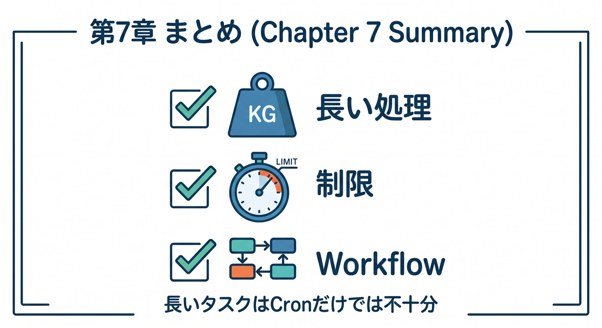

# 第07章：Cronだけでは長い処理に弱い理由 🐢

Cron Triggersは便利ですが、何でもCronだけで済ませるのは危険です。  
特に長い処理や多段処理では、別の設計が必要になります。

---

## 1. 長い処理の例 🧱


次のような処理は、Cronだけで全部やると重くなりがちです。

- R2にある大量画像を処理する
- D1の大量データを集計する
- AIで全記事の要約を作る
- Vectorize用の埋め込みを作る
- 外部APIを何百回も呼ぶ

途中で失敗したときに、どこまで終わったかも問題になります。

---

## 2. Workersのlimitsを意識する ⏱️



Workersには実行時間やCPU時間などのlimitsがあります。  
公式ドキュメントでも、Cron TriggersやWorkersのlimitsは確認するよう案内されています。

学習中は小さく動かせますが、本番では件数が増えます。

```text
小さい処理 → CronだけでもOK
長い処理 → WorkflowsやQueuesへ分ける
```

---

## 3. 途中経過が必要になる 🧭



長い処理では、進行状況が欲しくなります。

```text
1000件中 300件完了
step 2まで成功
外部API待ち
retry中
```

Cronだけでこの管理を書くと、コードが複雑になりやすいです。

---

## 4. Workflowsの出番 🔁



Workflowsは、処理をstepへ分けて進められます。  
失敗時のretryや、待機、状態保持も扱いやすくなります。

```text
Cron → Workflowを開始
Workflow → 長い処理をstepで進める
```

Cronは起動役、Workflowsは進行管理役です。

---

## 5. 章末チェック ✅



- Cronだけでは長い処理が難しいと分かる
- Workersのlimitsを確認する必要があると分かる
- 長い処理には途中経過が必要だと分かる
- Workflowsが進行管理に向くと分かる
- CronとWorkflowsを分けて考えられる

この章で覚える一言はこれです。  
**Cronは開始の合図、長い処理の進行管理はWorkflowsに任せます 🐢**
