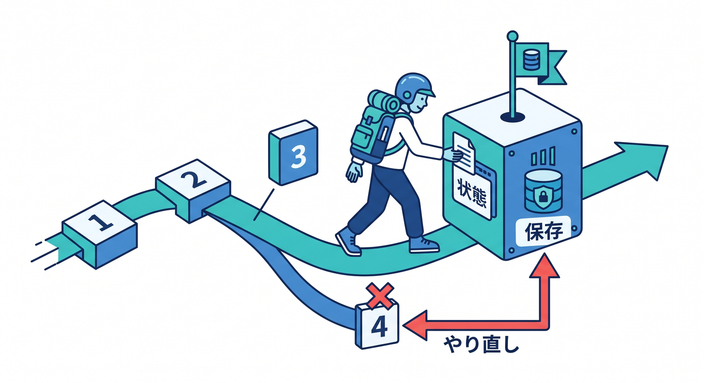
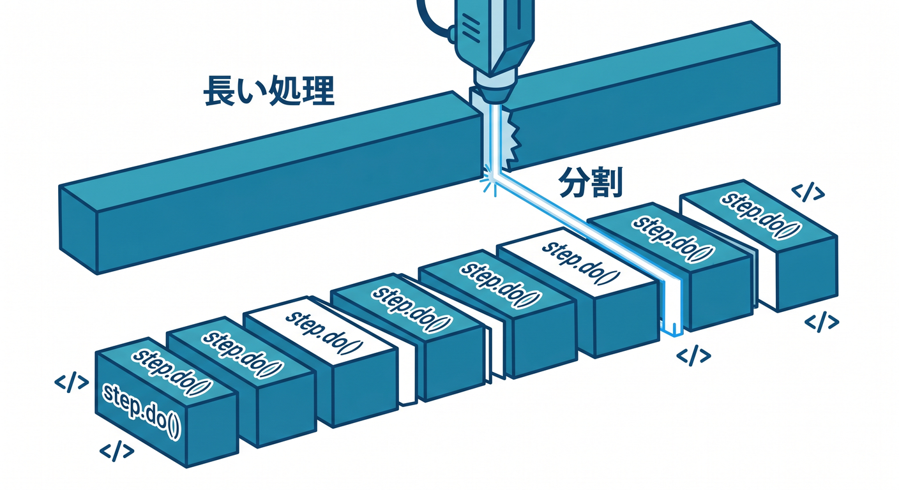
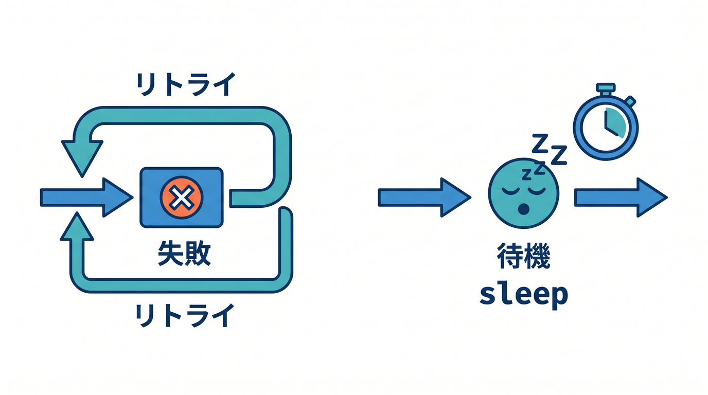
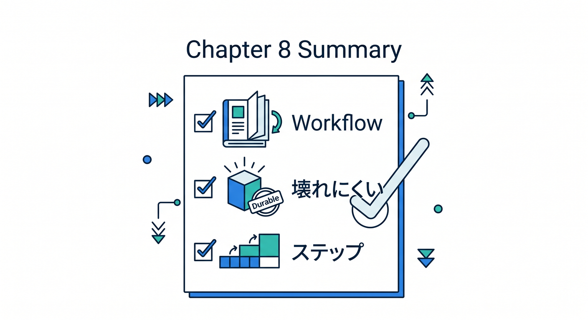

# 第08章：Workflowsの基本を知ろう 🔁

Cloudflare Workflowsは、長い処理をstepに分けて進めるための仕組みです。  
公式ドキュメントでは、durable multi-step applicationsを作るサービスとして案内されています。

---

## 1. Workflowは手順書 📋


Workflowは、処理の手順書のようなものです。

```text
step 1: データを読む
step 2: AIで要約する
step 3: R2へ保存する
step 4: 通知する
```

1つの長い関数に詰め込むより、何をしているか分かりやすくなります。

---

## 2. durableとは 🧱



durableは「途中の状態が残る」というイメージです。  
stepが完了すると、その結果を保持しながら次へ進めます。

処理中に一時的な失敗が起きても、最初から全部やり直すのではなく、step単位で考えられます。

---

## 3. step.do()で区切る 🧩



Workflowsでは、`step.do()` で処理を区切ります。

```ts
await step.do("load data", async () => {
  return { count: 10 };
});
```

step名は、ログで見ても分かる名前にします。

---

## 4. retryやsleepも扱える 🔁



Workflowsでは、失敗時のretryや、途中で待つ処理も扱えます。

```text
外部APIが一時失敗 → retry
1時間後に再確認 → sleep
```

Cronや普通のfetch handlerだけでは書きにくい処理を整理できます。

---

## 5. 章末チェック ✅



- Workflowsは長い多段処理に向くと分かる
- durableの雰囲気が分かる
- `step.do()` で処理を区切ると分かる
- retryやsleepを扱えると分かる
- step名を分かりやすく付けると分かる

この章で覚える一言はこれです。  
**Workflowsは、長い処理を壊れにくいstepへ分ける仕組みです 🔁**
