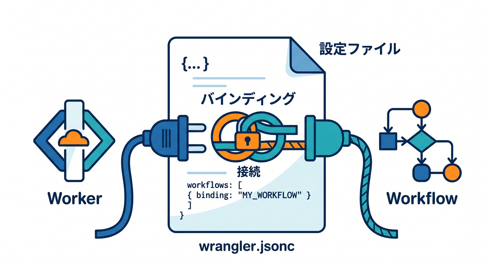
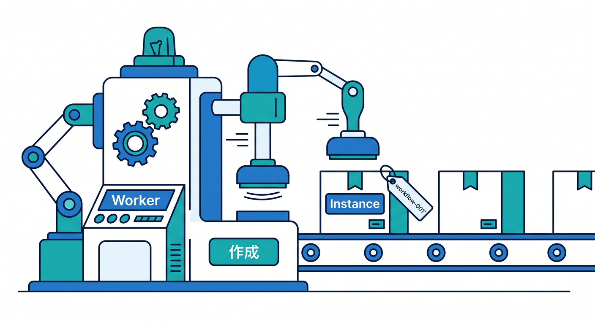
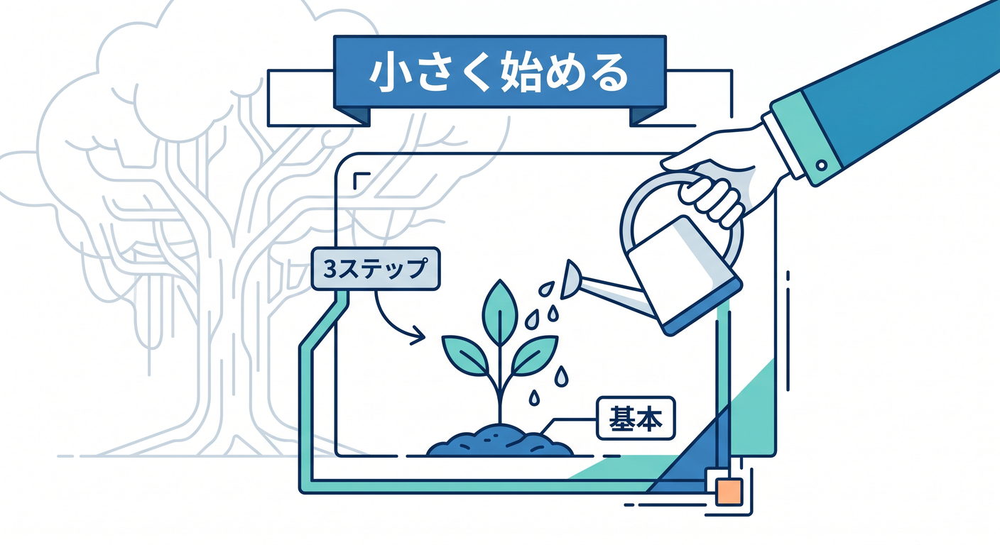
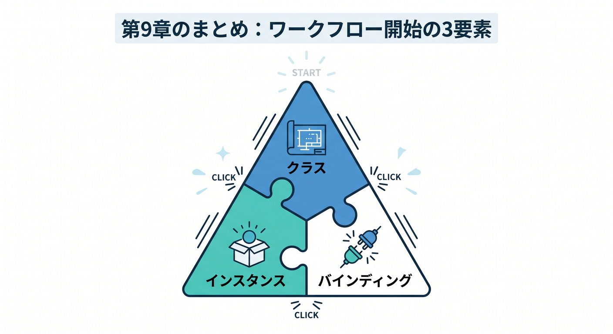

# 第09章：最初のWorkflowを作ろう 🛠️

ここでは、Workflowの最小形を見ます。  
題材は「受付した仕事を、いくつかのstepで処理する」小さな例です。

---

## 1. Workflowクラスを書く 🧩


Workflowsでは、Workflow用のクラスを作ります。

```ts
import { WorkflowEntrypoint } from "cloudflare:workers";
import type { WorkflowEvent, WorkflowStep } from "cloudflare:workers";

type ReportParams = {
  reportId: string;
};

export class DailyReportWorkflow extends WorkflowEntrypoint<Env, ReportParams> {
  async run(event: WorkflowEvent<ReportParams>, step: WorkflowStep) {
    const { reportId } = event.payload;

    await step.do("create report record", async () => {
      console.log("create", reportId);
    });
  }
}
```

最初はconsole.logだけでも、流れを理解できます。

---

## 2. wrangler.jsoncでbindingする ⚙️



WorkerからWorkflowを呼ぶにはbindingが必要です。

```jsonc
{
  "workflows": [
    {
      "name": "daily-report-workflow",
      "binding": "DAILY_REPORT_WORKFLOW",
      "class_name": "DailyReportWorkflow"
    }
  ]
}
```

Workerでは `env.DAILY_REPORT_WORKFLOW` として使います。

---

## 3. Workerからinstanceを作る 🚀



HTTPやCronからWorkflowを開始します。

```ts
const instance = await env.DAILY_REPORT_WORKFLOW.create({
  params: {
    reportId: crypto.randomUUID(),
  },
});

return Response.json({ id: instance.id });
```

`reportId` を使うと、あとでログやD1状態と結びつけやすいです。

---

## 4. 小さく動かす 🌱



最初からAIやR2まで入れず、まずは3step程度で試します。

```text
step 1: 受付ログ
step 2: D1へ保存
step 3: 完了ログ
```

小さく動いてから、外部APIやAI処理を足します。

---

## 5. 章末チェック ✅



- Workflowクラスの雰囲気が分かる
- `run(event, step)` が入口だと分かる
- Wranglerでworkflow bindingを書くと分かる
- WorkerからWorkflow instanceを作れる
- 最初は小さく試すと分かる

この章で覚える一言はこれです。  
**Workflowは、クラス・binding・instance作成の3点セットで始めます 🛠️**
