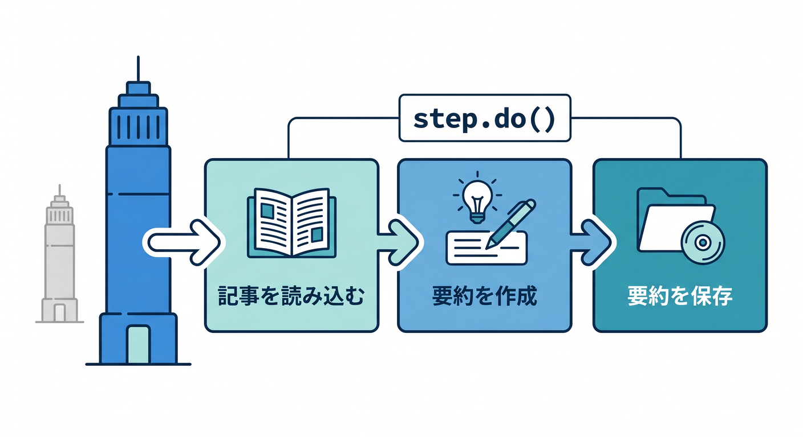
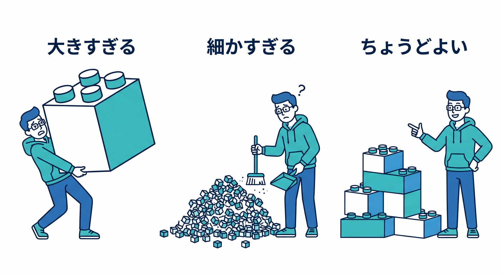
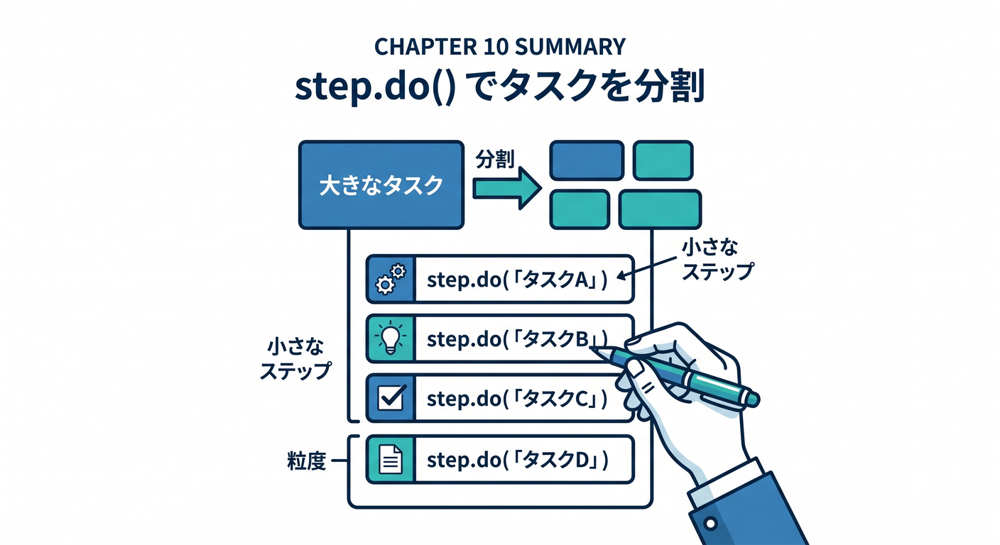

# 第10章：step.do()で処理を分けよう 🧱

Workflowsの中心になるのが `step.do()` です。  
長い処理を意味のある単位に分けることで、読みやすく、失敗にも強くなります。

---

## 1. 1つの長い関数はつらい 😵


全部を1つの関数に書くと、こうなりがちです。

```text
データ取得
入力チェック
AI要約
R2保存
D1更新
通知
エラー処理
```

どこで失敗したのか分かりにくくなります。

---

## 2. stepへ分ける 🧩



Workflowsでは、処理をstepへ分けます。

```ts
const articles = await step.do("load articles", async () => {
  return await loadArticles(this.env);
});

const summary = await step.do("create summary", async () => {
  return await createSummary(articles, this.env);
});

await step.do("save summary", async () => {
  await saveSummary(summary, this.env);
});
```

名前を見るだけで、何をしているか分かります。

---

## 3. step名はログになるつもりで 🏷️


step名は適当に付けないほうがよいです。

```text
悪い例: step1
よい例: fetch recent orders
よい例: generate daily summary
よい例: save report to r2
```

あとで障害対応するとき、名前が助けになります。

---

## 4. stepの粒度 🧭



細かすぎても、大きすぎても読みにくくなります。

```text
大きすぎる: 全部まとめて processAll
細かすぎる: 変数を1つ作るだけ
ちょうどよい: 外部API呼び出し、保存、通知などの意味単位
```

失敗したときにやり直したい単位で分けるのが目安です。

---

## 5. 章末チェック ✅



- `step.do()` がWorkflowの基本だと分かる
- 長い処理をstepへ分けられる
- step名を分かりやすく付けられる
- 失敗時にやり直したい単位で分けると分かる
- 外部APIや保存処理をstep化できる

この章で覚える一言はこれです。  
**step.do()は、長い処理を“意味のある作業単位”へ分ける道具です 🧱**
