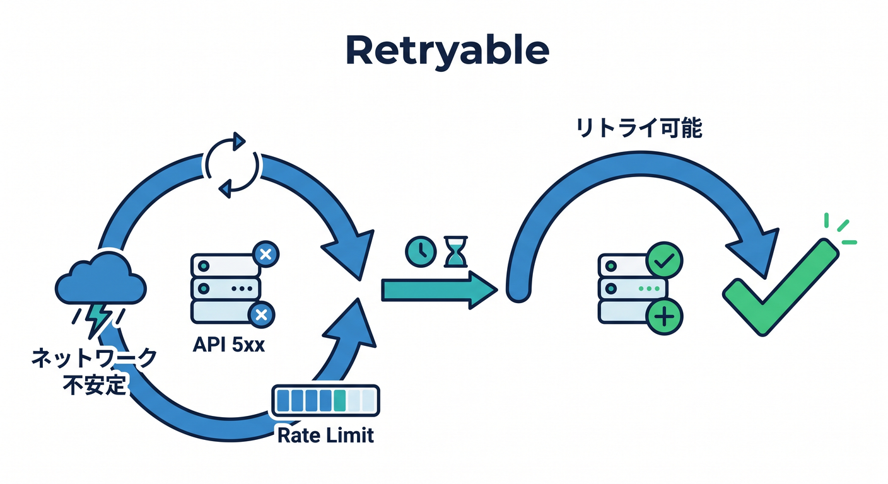
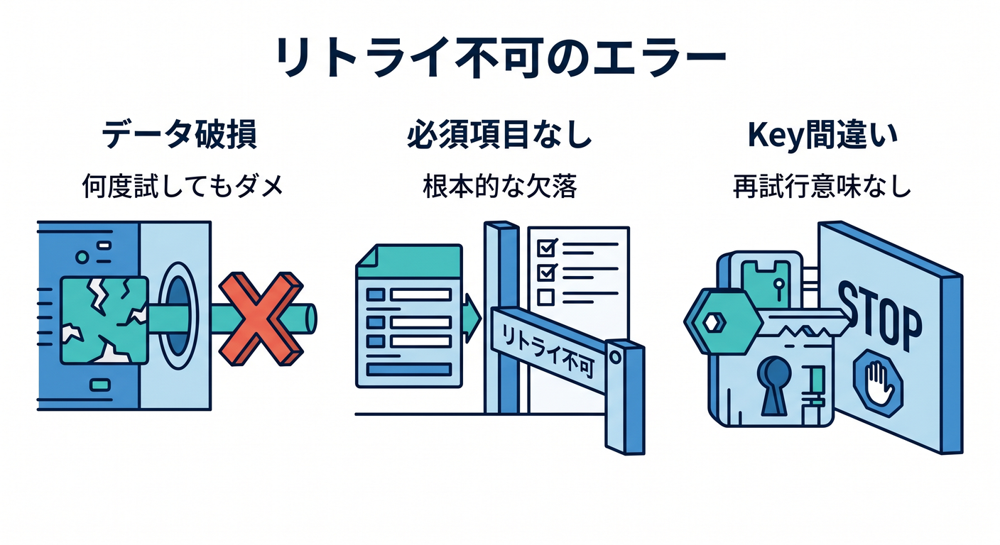
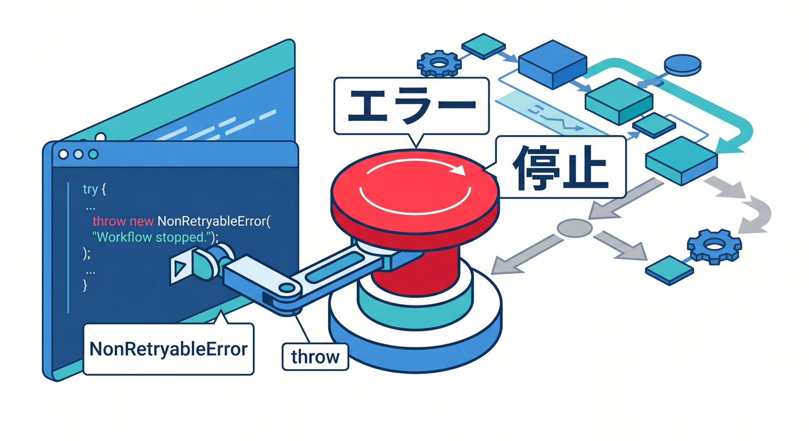
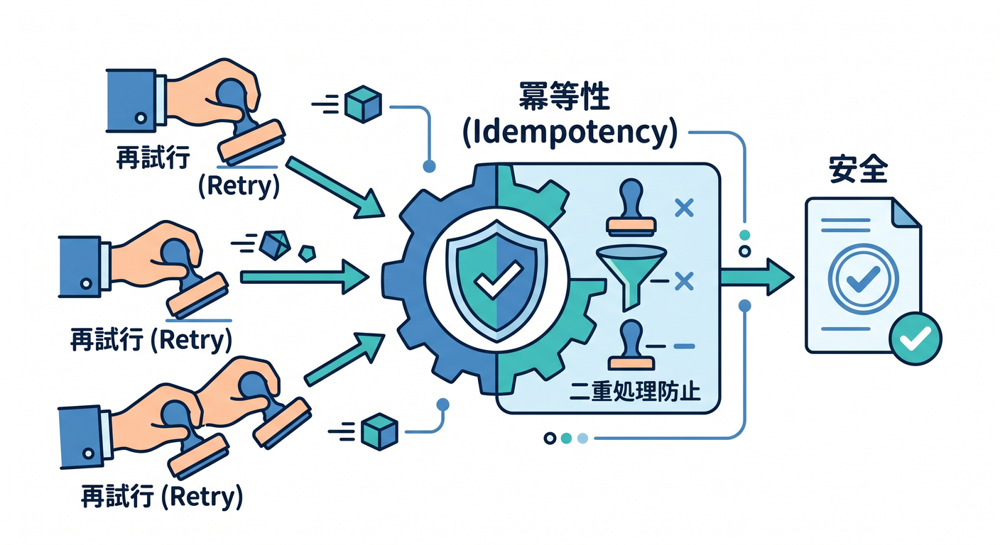
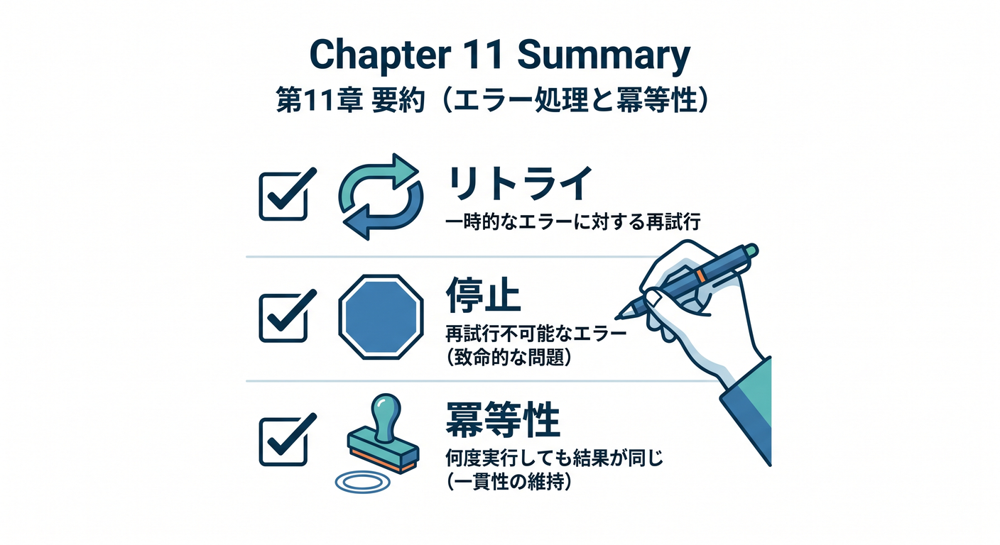

# 第11章：RetryとNonRetryableErrorを学ぼう 🔁

長い処理では、失敗が必ず起きます。  
Workflowsでは、retryする失敗と、retryしても意味がない失敗を分けて考えます。

---

## 1. retryしたい失敗 🔁



一時的な失敗は、retryで成功することがあります。

- 外部APIが一時的に5xxを返した
- ネットワークが不安定だった
- AI APIが一時的に混雑していた
- rate limitで少し待てばよい

こうした失敗は、時間を置いて再試行する価値があります。

---

## 2. retryしても直らない失敗 🛑



一方で、retryしても直らない失敗もあります。

- 入力データが壊れている
- 必須項目がない
- 権限がない
- R2 keyが明らかに間違っている
- 対象ユーザーが削除済み

こうしたものを何度retryしても、成功しにくいです。

---

## 3. NonRetryableError 🧯



公式ドキュメントでは、retryしたくない失敗に `NonRetryableError` を使う方法が案内されています。

```ts
import { NonRetryableError } from "cloudflare:workflows";

await step.do("validate input", async () => {
  if (!event.payload.reportId) {
    throw new NonRetryableError("reportId is required");
  }
});
```

入力不正のような失敗は、早めに止めます。

---

## 4. retry前提の設計 🧠



retryがある処理では、同じstepがもう一度動く可能性を考えます。

```text
D1へ二重insertしない
R2へ同じkeyで安全に上書きする
通知を二重送信しない
jobIdで処理済みを確認する
```

Queuesと同じく、冪等性が大切です。

---

## 5. 章末チェック ✅



- retryしたい失敗を説明できる
- retryしても直らない失敗を説明できる
- `NonRetryableError` の使いどころが分かる
- 同じstepが再実行される可能性を考えられる
- 冪等性が必要だと分かる

この章で覚える一言はこれです。  
**Workflowsでは、“もう一度やるべき失敗”と“止めるべき失敗”を分けます 🔁**
