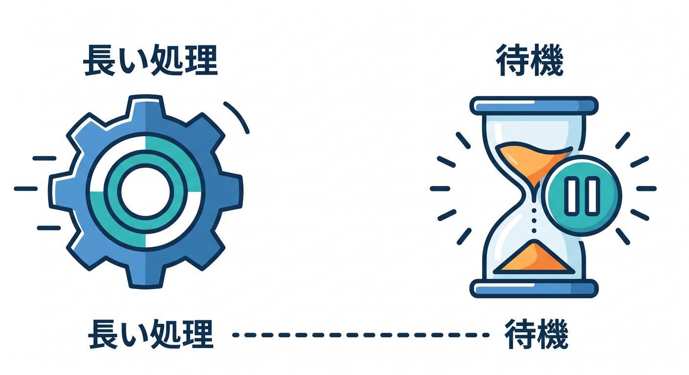
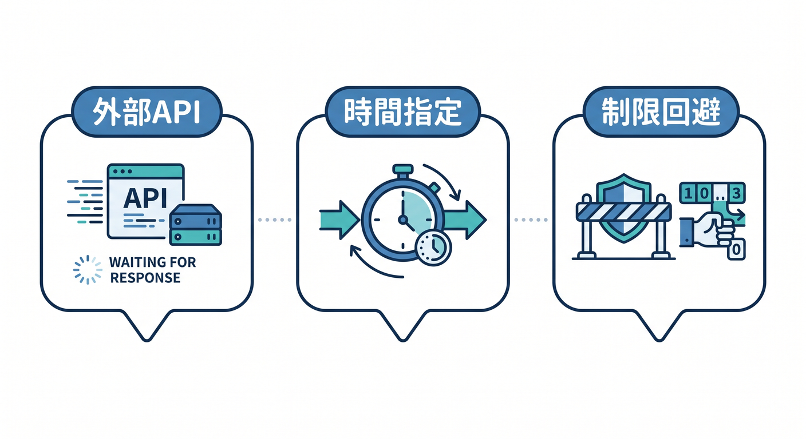
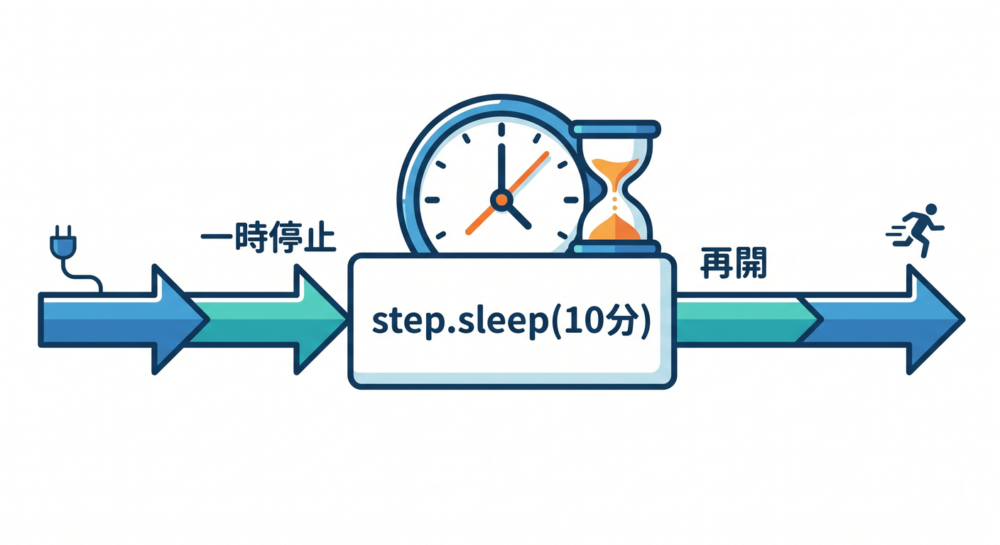
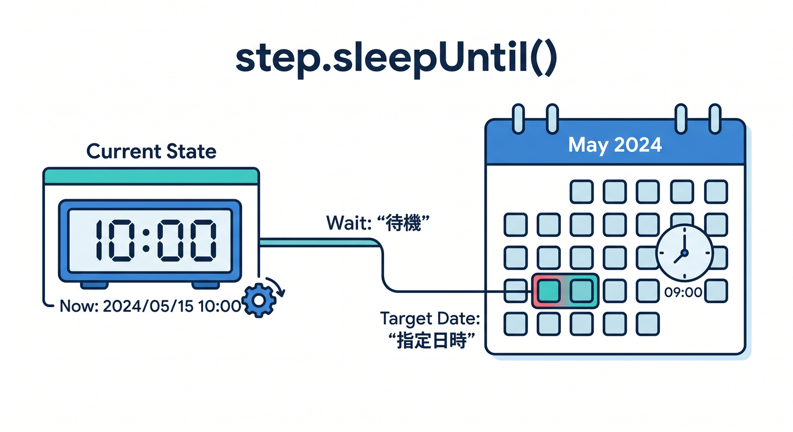
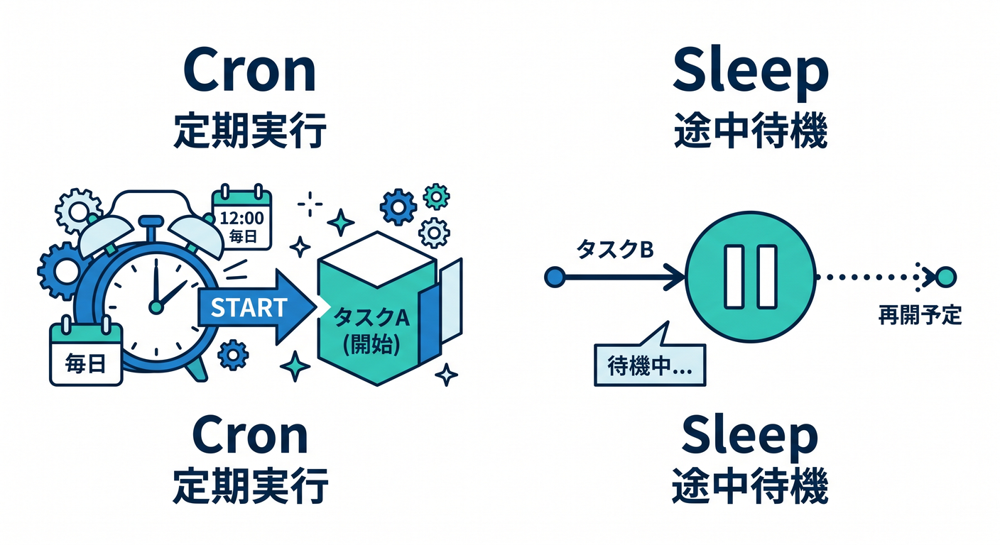

# 第12章：sleep()で待つ処理を作ろう 😴



長い処理では、途中で待ちたい場面があります。  
Workflowsでは `step.sleep()` や `step.sleepUntil()` を使って、待ってから続きを進められます。

---

## 1. 待ちたい場面 ⏳



たとえば、こんな場面です。

- 外部APIの処理完了を待つ
- 10分後に状態を再確認する
- 明日の朝に続きの処理をする
- ユーザー承認を一定時間待つ
- rate limitを避けて少し待つ

普通のWorkerで長時間待ち続けるのは向いていません。

---

## 2. step.sleep()のイメージ 💤



一定時間待ちます。

```ts
await step.sleep("wait before recheck", "10 minutes");
```

待っている間、ずっとCPUを使い続けるイメージではありません。  
Workflowとして、あとで続きを進める発想です。

---

## 3. step.sleepUntil()のイメージ 📅



特定の時刻まで待つこともできます。

```ts
const tomorrow = new Date(Date.now() + 24 * 60 * 60 * 1000);
await step.sleepUntil("wait until tomorrow", tomorrow);
```

日次処理や承認待ちのような場面で使えます。

---

## 4. Cronとの違い 🧭



Cronは「決まった時間に開始する」仕組みです。  
sleepは「Workflowの途中で待つ」仕組みです。

```text
Cron → 毎朝始める
sleep → stepの途中で待って続ける
```

似ていますが、役割が違います。

---

## 5. 章末チェック ✅


- 待ちたい処理の例が分かる
- `step.sleep()` の役割が分かる
- `step.sleepUntil()` の役割が分かる
- Cronとsleepの違いが分かる
- 長時間待つ処理をWorkflowで考えられる

この章で覚える一言はこれです。  
**sleep()は、Workflowの途中で“いったん待ってから続きへ進む”ための機能です 😴**
