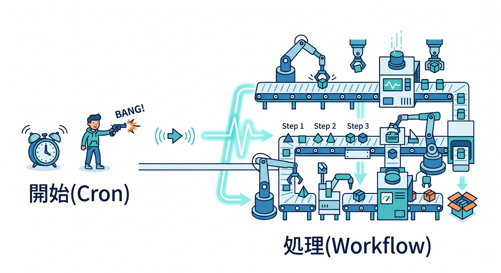
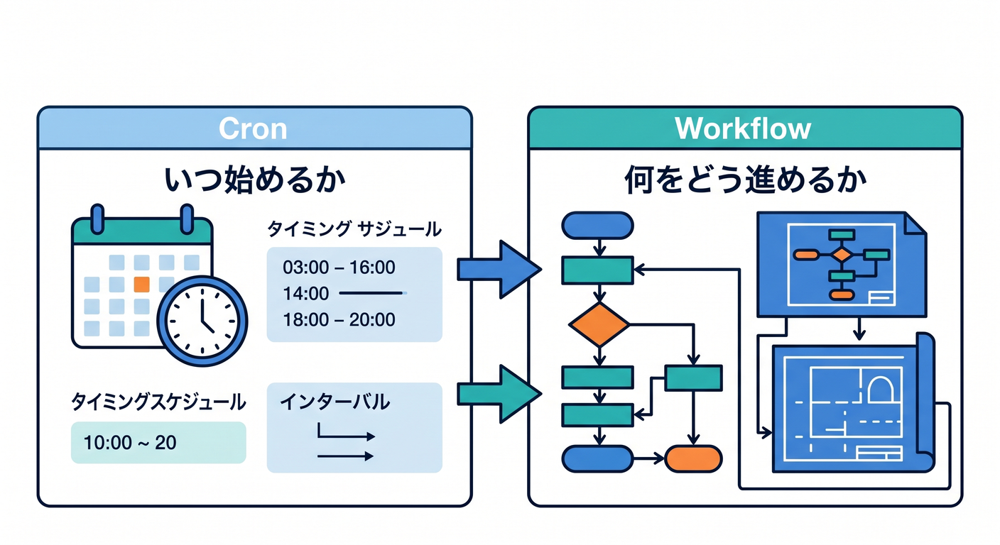
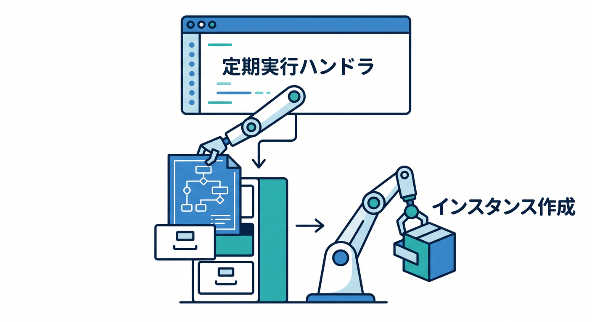
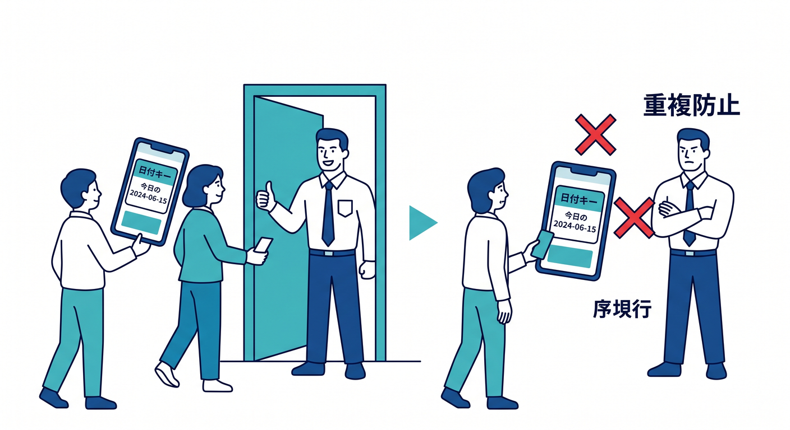
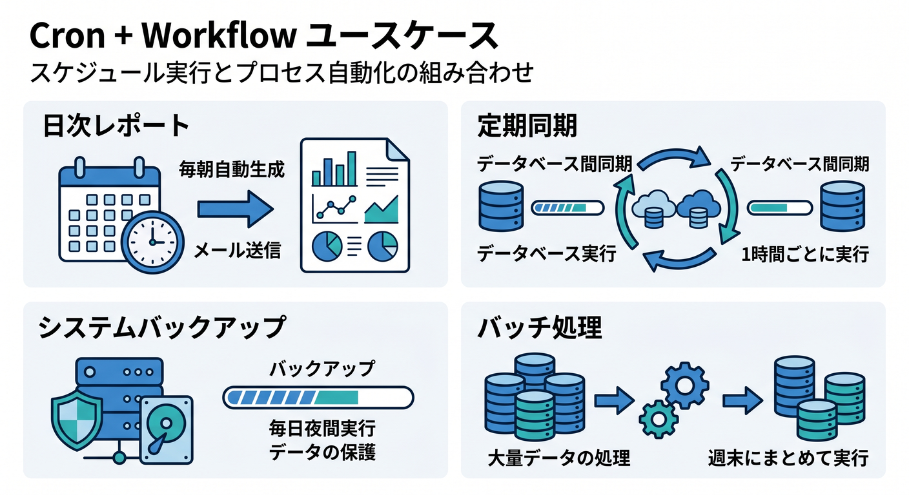

# 第13章：CronからWorkflowを起動しよう 🌉



Cron TriggersとWorkflowsは、組み合わせるとかなり便利です。  
Cronで決まった時間に起動し、長い処理はWorkflowへ渡します。

---

## 1. 分担をもう一度 🧭



役割はこうです。

```text
Cron Trigger
  ↓ いつ始めるか
Workflow
  ↓ 何をどの順番で進めるか
```

Cronの中に長い処理を詰め込まず、Workflowを開始するだけにします。

---

## 2. scheduled()からcreateする 🚀



scheduled handlerからWorkflow instanceを作ります。

```ts
export default {
  async scheduled(controller, env, ctx): Promise<void> {
    const reportId = crypto.randomUUID();

    ctx.waitUntil(
      env.DAILY_REPORT_WORKFLOW.create({
        params: {
          reportId,
          scheduledTime: controller.scheduledTime,
        },
      })
    );
  },
} satisfies ExportedHandler<Env>;
```

`scheduledTime` を渡すと、どの実行分か追いやすくなります。

---

## 3. 重複起動に注意 🔐



Cronは定期実行なので、同じ日の処理が重複しないようにします。

```text
daily-report:2026-04-24
```

このようなkeyをD1に保存し、同じ日付なら二重作成しない設計にします。

---

## 4. 使いどころ 🌅



Cron + Workflowは、次のような処理に向いています。

- 日次AIレポート
- 月次集計
- R2未処理ファイル巡回
- D1の集計更新
- 外部APIからの定期同期

「定期的に始めたい長い処理」に合います。

---

## 5. 章末チェック ✅


- CronからWorkflowを起動できると分かる
- scheduled handlerでは開始だけに寄せると分かる
- `scheduledTime` を渡すと追跡しやすい
- 重複起動を防ぐ必要がある
- 日次レポートや定期同期に使える

この章で覚える一言はこれです。  
**Cronで始めて、Workflowで最後まで進めます 🌉**
