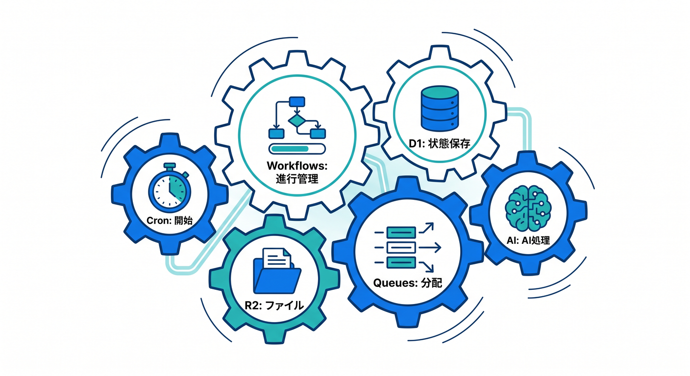
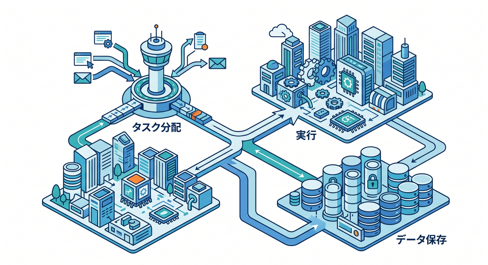
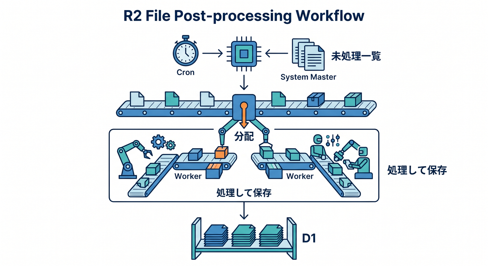
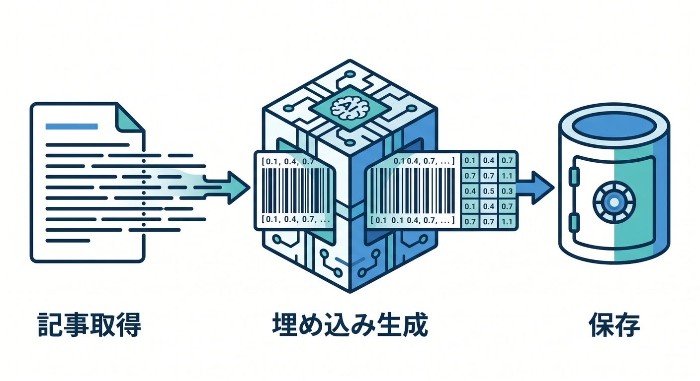
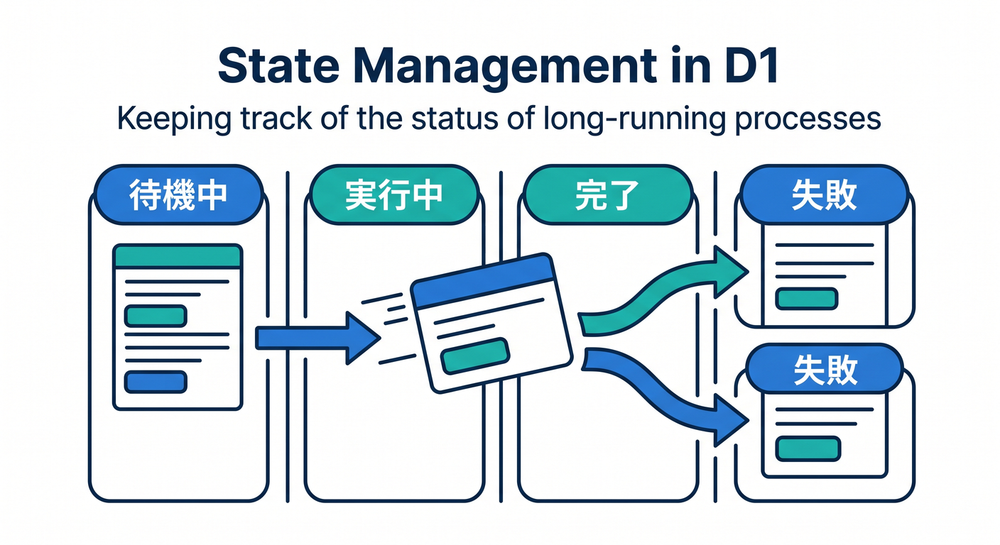
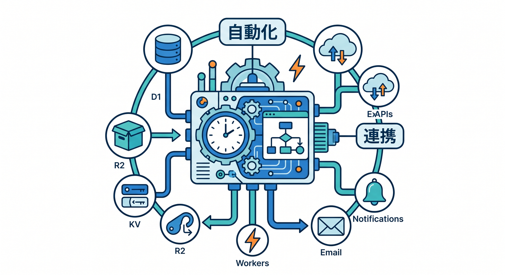

# 第14章：Queues・D1・R2・AIと組み合わせよう 🧩

CronとWorkflowsは、単体でも便利です。  
でも実務では、D1、R2、Queues、AI系サービスと組み合わせることが多いです。



---

## 1. 役割分担の地図 🗺️

ざっくり分けるとこうです。



```text
Cron → 定期的に開始する
Workflows → 長い処理の進行管理
Queues → 大量の小さな仕事を分配
D1 → 状態や検索用データを保存
R2 → ファイル本体を保存
AI Gateway / Workers AI → AI処理
```

全部を1つに詰め込まないのがコツです。

---

## 2. R2ファイル後処理 🖼️

R2にある未処理ファイルを毎朝確認する例です。



```text
Cron
  ↓
Workflow: 未処理一覧をD1から読む
  ↓
Queue: ファイルごとの処理jobを配る
  ↓
Consumer: R2を読み、結果をD1へ保存
```

大量ファイルをWorkflowだけで全部処理しない設計もできます。

---

## 3. AI埋め込み生成 🤖

AI検索用の埋め込み生成も、定期処理と相性があります。



```text
Cron
  ↓
Workflow
  ↓
D1から未処理記事を取得
  ↓
Workers AIでembedding生成
  ↓
Vectorizeへ保存
```

外部AI APIを使うなら、AI Gatewayで観測や制御を考えます。

---

## 4. 状態をD1へ保存する 📋

長い処理は状態が重要です。



```text
queued
running
completed
failed
```

React管理画面から処理状態を見られるようにすると、運用しやすくなります。

---

## 5. 章末チェック ✅

- Cron、Workflows、Queuesの違いが分かる
- D1は状態保存に使えると分かる
- R2ファイル後処理の構成を説明できる
- AI埋め込み生成の構成を説明できる
- 役割分担して設計できる

この章で覚える一言はこれです。  
**CronとWorkflowsは、D1・R2・Queues・AIと組み合わせて運用できる自動化になります 🧩**


