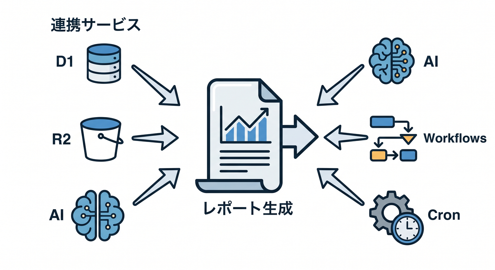
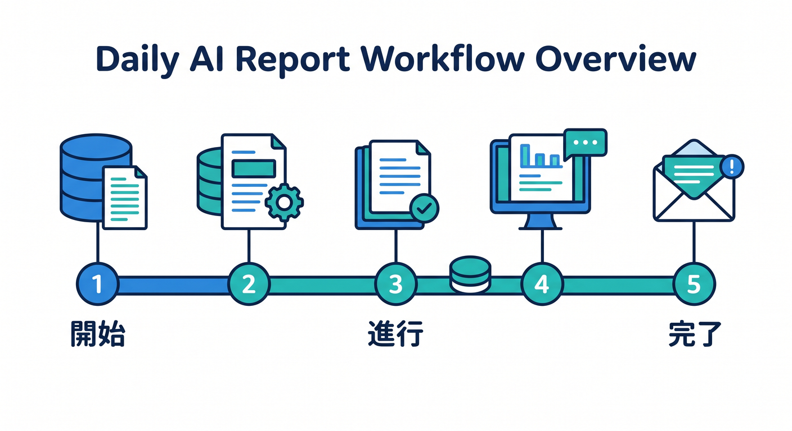
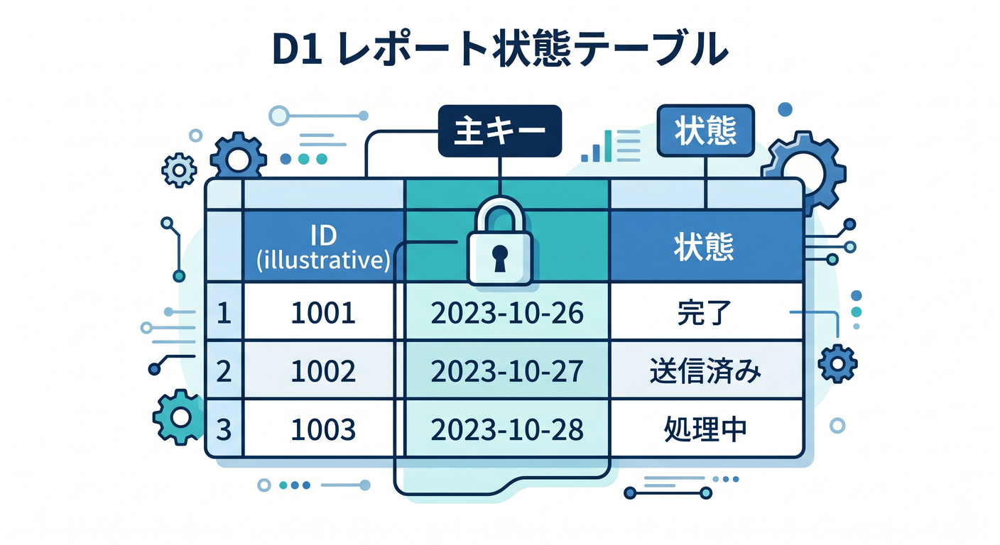
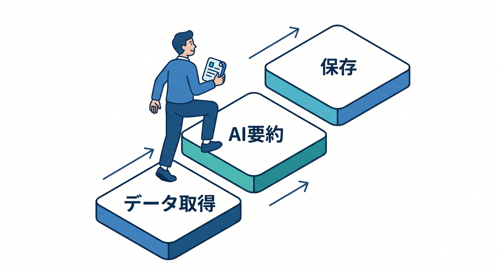
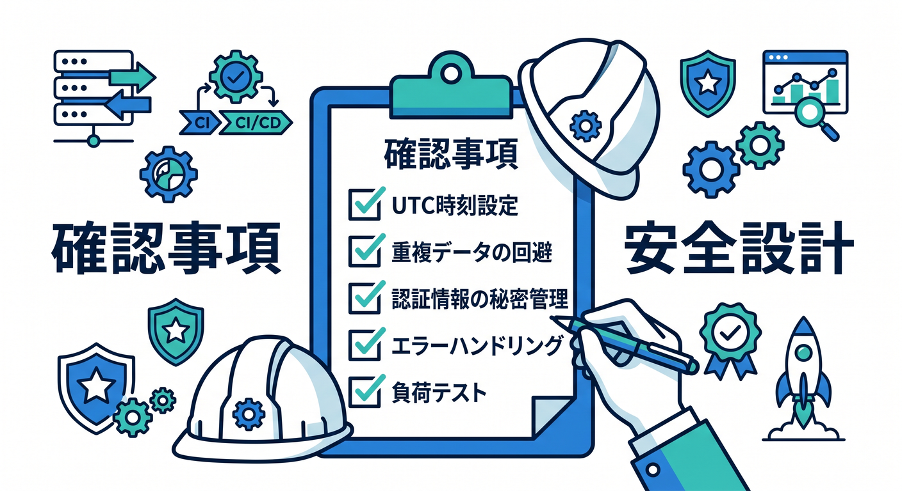
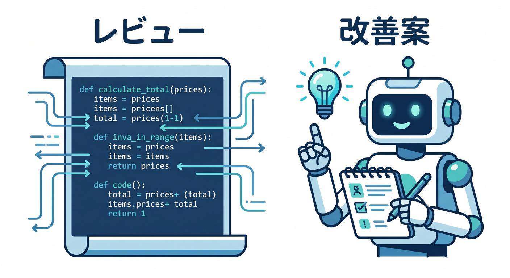
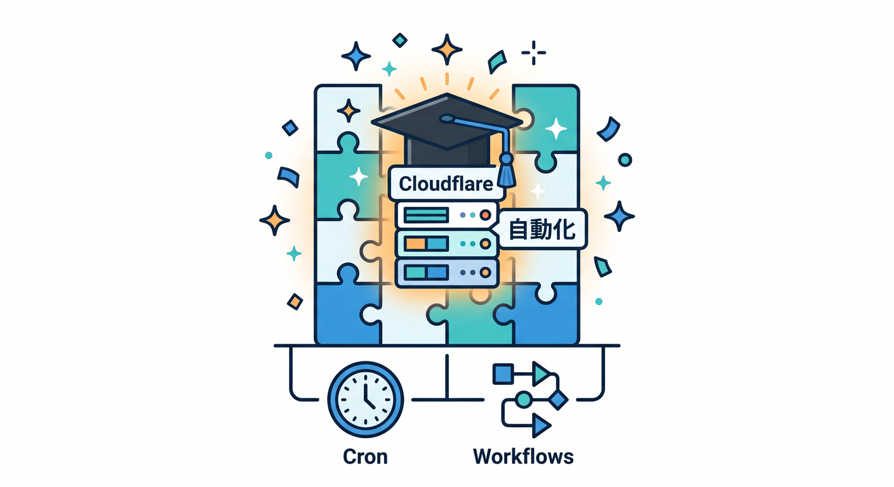

# 第15章：日次AIレポート自動生成を完成させよう 📊

最後は、ここまで学んだ内容を1つの題材にまとめます。  
Cron + Workflows + D1 + R2 + AIで、日次AIレポート自動生成を作るイメージです。



---

## 1. 完成イメージ 🧭

全体像はこうです。



```text
Cron Trigger
  ↓ 毎朝起動
Workflow
  ├─ step 1: D1から対象データ取得
  ├─ step 2: AIで要約
  ├─ step 3: R2へMarkdown保存
  ├─ step 4: D1へ状態保存
  └─ step 5: 通知
```

Cronは開始役、Workflowは進行管理役です。

---

## 2. D1で処理状態を持つ 🗄️

レポートの状態をD1へ保存します。

```sql
CREATE TABLE daily_reports (
  report_date TEXT PRIMARY KEY,
  status TEXT NOT NULL,
  r2_key TEXT,
  created_at TEXT NOT NULL,
  updated_at TEXT NOT NULL
);
```

`report_date` をPRIMARY KEYにすると、同じ日の二重作成を防ぎやすくなります。



---

## 3. Workflowでstep化する 🔁

処理を意味ごとに分けます。



```text
load source data
generate ai summary
save report to r2
mark report completed
send notification
```

どこで失敗したかが追いやすくなります。

---

## 4. 本番前チェック 🔐

公開前には、次を確認します。

- Cron時刻はUTCで正しいか
- 同じ日の重複起動を防いでいるか
- AI APIキーはSecretsにあるか
- R2 keyに個人情報を入れていないか
- retryしても二重通知にならないか
- Workflow、Workers、外部APIのlimitsとpricingを確認したか
- ログに本文や個人情報を出しすぎていないか

自動化は便利ですが、静かに失敗しない設計が大切です。



---

## 5. Copilotレビュー例 🤖

実装後、Copilotにこう聞いてレビューできます。

```text
Cloudflare Cron Triggers + Workflowsで日次AIレポート生成を作りました。
UTC時刻、重複起動、retry、NonRetryableError、D1状態管理、R2保存、Secrets、ログの観点でレビューしてください。
```

AIの指摘は参考にしつつ、公式ドキュメントと実際のログで確認します。



---

## 6. 章末チェック ✅

- Cron + Workflowsの全体構成を説明できる
- D1で処理状態を管理できる
- R2へ生成レポートを保存する設計が分かる
- retryや重複起動に注意できる
- 運用できる自動化の基本を説明できる

この章で覚える一言はこれです。  
**Cron + Workflowsを使うと、毎日動く長い処理をCloudflare上で運用しやすくできます 📊**


