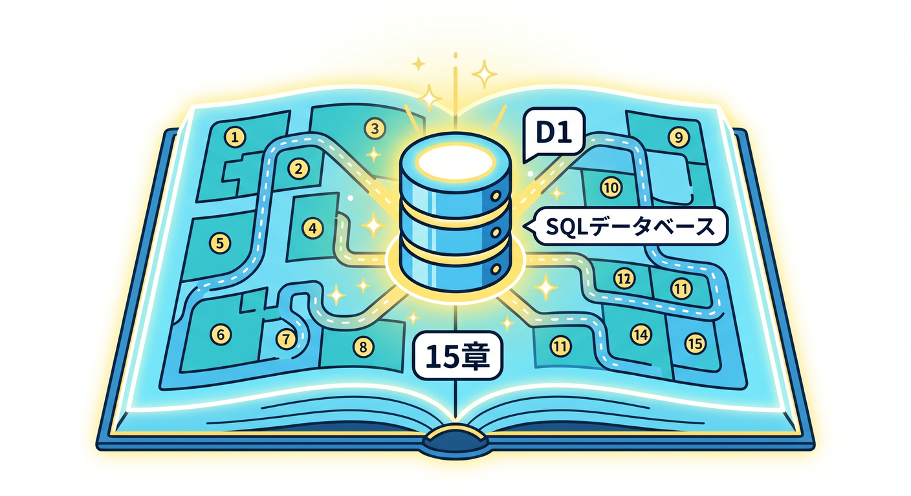
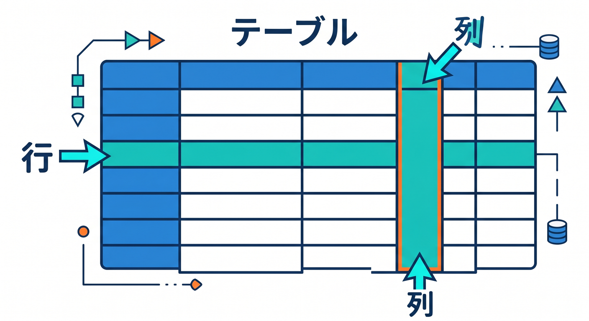
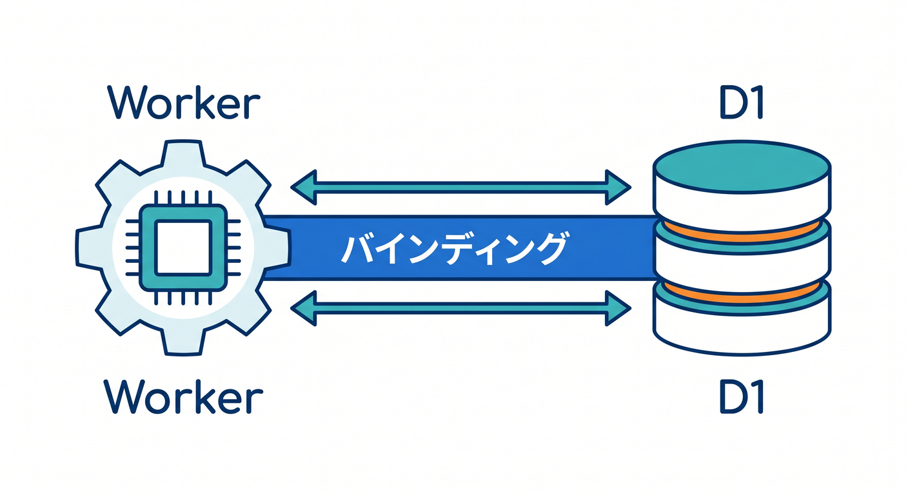
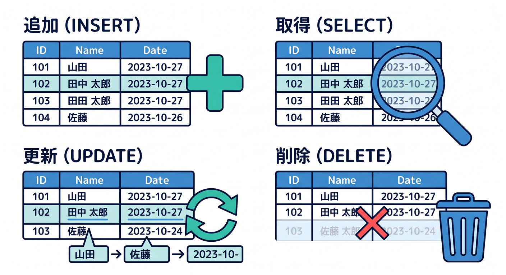
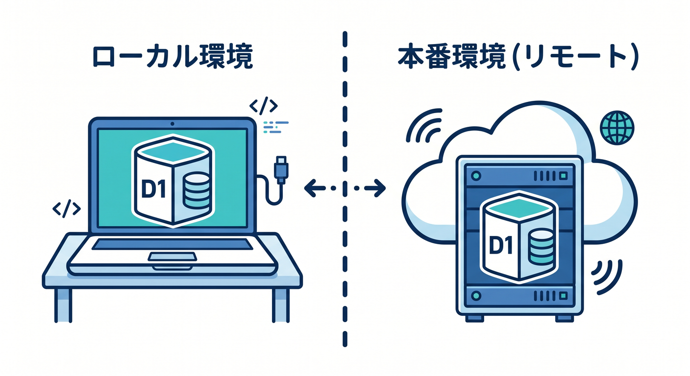
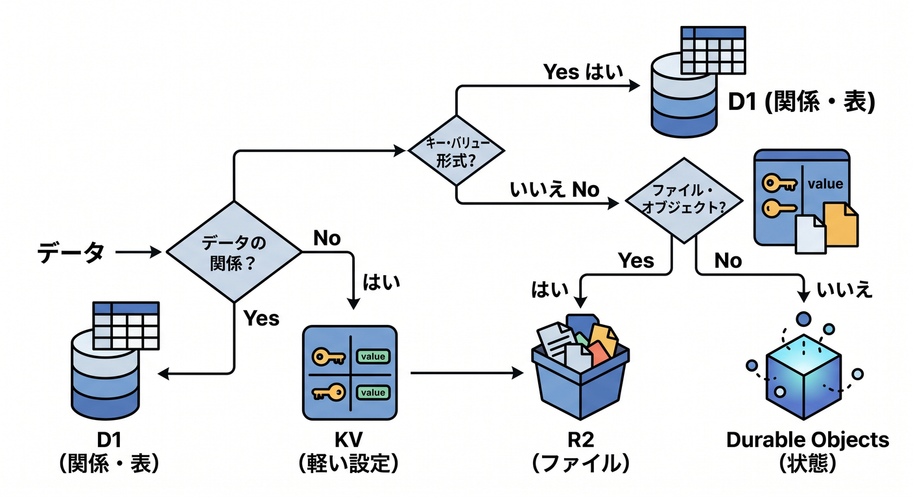

# Cloudflare D1 SQLデータベース入門 15章アウトライン 🧾☁️✨

確認日: 2026-04-24  
主な確認先: Cloudflare D1 Overview / Get started / Workers Binding API / SQL statements / Migrations / Local development / Import and export / Time Travel 公式ドキュメント

## 第1章　D1はCloudflare上のSQLデータベース 🧾

D1は、Cloudflareのmanaged serverless databaseです。  
SQLiteのSQL semanticsを使って、表形式のデータを扱えます 😊  
KVが軽いkey-valueなら、D1は行と列を持つテーブルの世界です。  
メモ、タスク、ユーザー、投稿、履歴のようなデータに向いています。  
Cloudflare Workersからbinding経由でアクセスできます。  
最初は難しいSQLではなく、`CREATE TABLE`、`INSERT`、`SELECT` から始めます。  
この章では、D1を“Cloudflareアプリの表データ置き場”として理解します。  
この章のゴールは、KV/R2との違いを含めてD1の役割を説明できることです 🧭

## 第2章　SQLの超基礎：表・行・列を理解しよう 📊

SQLは表形式のデータを扱うための言葉です。  
テーブルは表、行は1件のデータ、列は項目です 🧩  
たとえば `todos` テーブルには、`id`、`title`、`done`、`created_at` などの列を作れます。  
Excelやスプレッドシートのイメージから入ると分かりやすいです。

D1はSQLite系なので、最初はSQLiteの基本的な型や文だけに絞ります。  
主キー、NOT NULL、DEFAULTなどもやさしく整理します。  
SQLを暗記するより、表に何を入れるかを考えることを重視します。  
この章のゴールは、テーブル設計の最初の感覚を持つことです ✅

## 第3章　D1データベースを作り、WorkerにBindingしよう 🌉

D1を使うには、まずdatabaseを作成します。  
Wranglerでは `npx wrangler d1 create <database_name>` のような流れで作ります 🛠️  
作成後、`wrangler.jsonc` の `d1_databases` にbindingを追加します。  
binding名はWorkerコードで `env.DB` のように参照する名前です。  
TypeScriptでは `Env` 型に `DB: D1Database` を書きます。

Reactから直接D1へ触るのではなく、Workers APIを通すのが基本です 🔐  
localとremoteの違いも、ここで軽く触れます。  
この章のゴールは、WorkerからD1へつながる橋を作れることです ✅

## 第4章　最初のテーブルを作ろう：CREATE TABLE 🧱

D1にデータを入れる前に、テーブルを作ります。  
`CREATE TABLE IF NOT EXISTS todos (...)` のようなSQLを書きます。  
この章では、todoアプリを題材に、最小のテーブル設計を体験します 📝  
`id`、`title`、`done`、`created_at` のような列を作ります。  
`TEXT`、`INTEGER`、`DEFAULT`、`PRIMARY KEY` を初心者向けに説明します。  
`wrangler d1 execute --file=schema.sql` でSQLファイルを実行する流れにも触れます。  
テーブル作成は、アプリのデータの形を決める作業です。  
この章のゴールは、D1に最初のテーブルを作れることです 🧾

## 第5章　データを追加しよう：INSERT ✍️

テーブルができたら、`INSERT` でデータを追加します。  
`INSERT INTO todos (id, title) VALUES (?, ?)` のような形を学びます。  
Workerからはprepared statementとして `env.DB.prepare(...).bind(...).run()` を使います 🧑‍💻  
値をSQL文字列へ直接連結しない理由も説明します。  
ユーザー入力を扱うため、SQL injectionを避ける感覚を最初に入れます 🔐  
追加後はJSONで結果を返し、React画面から保存できる流れを考えます。  
エラー時の扱いも軽く整理します。  
この章のゴールは、D1へ安全に1件追加できることです ✅

## 第6章　一覧を取得しよう：SELECT 📋

保存したデータは `SELECT` で取り出します。  
`SELECT id, title, done FROM todos ORDER BY created_at DESC` のような基本を学びます。  
Workerでは `all()` を使って複数行を取得します 👀  
1件だけ取得するときは `first()` の使い方も見ます。  
`WHERE` で条件を絞る入口にも触れます。  
結果をJSONで返し、Reactで一覧表示するイメージを作ります。  
KVと違い、条件で一覧取得できるのがD1の強みです。  
この章のゴールは、D1から一覧を取り出してAPIで返せることです 🚀

## 第7章　更新しよう：UPDATE 🔁

既存データを変えるには `UPDATE` を使います。  
todoの完了状態を変える、タイトルを編集する、という例で学びます ✅  
`WHERE id = ?` を忘れると大量更新になる危険があります。  
SQL初学者にとって、`UPDATE` と `DELETE` の `WHERE` はとても大事です ⚠️  
Workerでは `prepare().bind().run()` で安全に更新します。  
更新対象が存在しない場合のレスポンスも考えます。  
Reactからチェックボックスで完了状態を切り替える例も扱います。  
この章のゴールは、安全に1件だけ更新できることです 🧯

## 第8章　削除しよう：DELETE 🧹

不要なデータは `DELETE` で消します。  
`DELETE FROM todos WHERE id = ?` のように、必ず条件を付ける練習をします。  
`WHERE` なしDELETEの危険を、初心者向けに強く説明します 🚨  
本番前にはバックアップやTime Travelの存在も知っておきます。  
削除APIは、確認UIや権限チェックとも相性が大事です。  
削除後は204やJSONレスポンスなど、APIの返し方も考えます。  
必要なら物理削除ではなく `deleted_at` を使う発想にも触れます。  
この章のゴールは、D1で削除を安全に扱う感覚を持つことです ✅

## 第9章　Migrationsでテーブル変更を管理しよう 🧭

アプリは作りながらテーブル構造が変わります。  
その変更を管理するのがmigrationsです。  
WranglerにはD1 migrations関連コマンドが用意されています 🛠️  
`CREATE TABLE`、`ALTER TABLE`、index追加などをファイルとして残します。  
手作業で本番DBだけ変えると、あとで何をしたか分からなくなります。  
local、staging、productionへ順番に適用する考え方を学びます。  
Copilotにmigration内容を説明させる使い方も紹介します 🤖  
この章のゴールは、DB構造変更をファイルで管理する発想を持つことです ✅

## 第10章　Local developmentとremote D1を分けよう 🧪

D1はlocal developmentとremote databaseを分けて扱えます。  
開発中に本番データを壊さないため、この区別は重要です 🔐  
`wrangler dev`、`wrangler d1 execute`、`--remote` の考え方を整理します。

ローカルでschemaを試し、remoteへ適用する流れを学びます。  
stagingとproductionのDBを分ける設計も扱います。  
テストデータと本番データを混ぜないことが大切です。  
Cloudflare公式のlocal developmentベストプラクティスを踏まえます。  
この章のゴールは、local/remoteのD1を混同しないことです ✅

## 第11章　Indexと検索の基本を知ろう 🔎

データが増えると、検索速度を考える必要があります。  
indexは、特定の列で探しやすくするための仕組みです。  
`CREATE INDEX idx_todos_created_at ON todos(created_at)` のようなSQLを見ます 📚  
最初から大量にindexを作るのではなく、よく検索する列に絞ります。  
`WHERE user_id = ?`、`ORDER BY created_at` のような用途で考えます。  
D1のbest practicesでもindexesの話が案内されています。  
初心者向けに、indexは本の索引のようなものとして説明します。  
この章のゴールは、indexの役割をざっくり理解することです 🧠

## 第12章　Import / Exportでデータを出し入れしよう 📦

D1では、既存SQLite由来のSQLファイルをimportしたり、D1からexportしたりできます。  
公式ドキュメントでは `wrangler d1 export` や `d1 execute --file` の流れが案内されています。  
ローカル開発、バックアップ、移行、検証に役立ちます 🧳  
`.sql` ファイルにはschemaやdataが入ります。  
exportしたデータをlocalで試し、必要に応じてimportする流れを学びます。  
巨大ファイルや本番データの扱いには注意します。  
個人情報を含むdumpをGitに入れないことも大事です 🔐  
この章のゴールは、D1データをファイルとして扱う基本を知ることです ✅

## 第13章　Time Travelとバックアップの考え方 ⏳

D1にはTime Travelというpoint-in-time recoveryの仕組みがあります。  
公式では、production backendのD1で過去の時点へrestoreできると案内されています。  
Workers Paid planでは最大30日、Free planでは最大7日といった制限があります。  
`wrangler d1 time-travel info` やrestoreの考え方を学びます 🕰️  
restoreは破壊的操作なので、教材では慎重に扱います。  
失敗したmigrationやWHEREなしUPDATE/DELETEの事故から戻る考え方を知ります。  
通常の設計では、事故を防ぐことが第一です。  
この章のゴールは、D1の復旧手段を知りつつ慎重に扱えることです 🧯

## 第14章　React + Workers API + D1で小さなTodoを作ろう ⚛️

ここまでのSQLを使って、React画面とWorkers APIをつなげます。  
Todoの追加、一覧、完了切替、削除を1つの流れで作ります 📝  
Reactは画面、WorkerはAPI、D1は保存先として役割を分けます。  
APIは `GET /todos`、`POST /todos`、`PATCH /todos/:id`、`DELETE /todos/:id` のように設計します。  
入力チェック、SQL injection対策、エラー処理も入れます。  
本格的な認証は発展扱いにし、まずCRUDの理解を優先します。  
CopilotにAPI設計とSQLをレビューさせます 🤖  
この章のゴールは、D1で“本格感のある小さなアプリ”を作ることです 🎉

## 第15章　D1の使いどころと次の学習地図 🏁

最後に、D1をいつ使うか、いつ別の保存先を選ぶかを整理します。  
表形式、検索、一覧、履歴、関係のあるデータはD1が候補です。  
軽い設定ならKV、画像やPDFならR2、状態や順番ならDurable Objects、後処理ならQueuesです 🗺️  
D1はSQLが使えるのでアプリらしいデータ管理に向いています。  
ただし、巨大な既存Postgres/MySQLをそのまま使いたいならHyperdriveも候補です。  
運用ではmigrations、local/remote、import/export、Time Travelを意識します。  
次章以降のR2やDurable Objectsへつながる保存先地図も再確認します。

この章のゴールは、D1を自分のアプリで選ぶ理由を説明できることです ✅

## 参照URL 🔗

- Cloudflare D1 Overview: https://developers.cloudflare.com/d1/
- D1 Get started: https://developers.cloudflare.com/d1/get-started/
- D1 Workers Binding API: https://developers.cloudflare.com/d1/worker-api/
- D1 SQL statements: https://developers.cloudflare.com/d1/sql-api/sql-statements/
- Wrangler D1 commands: https://developers.cloudflare.com/workers/wrangler/commands/d1/
- D1 Best practices: https://developers.cloudflare.com/d1/best-practices/
- D1 Local development: https://developers.cloudflare.com/d1/best-practices/local-development/
- D1 Import and export data: https://developers.cloudflare.com/d1/best-practices/import-export-data/
- D1 Time Travel and backups: https://developers.cloudflare.com/d1/reference/time-travel/
- Workers storage options: https://developers.cloudflare.com/workers/platform/storage-options/
