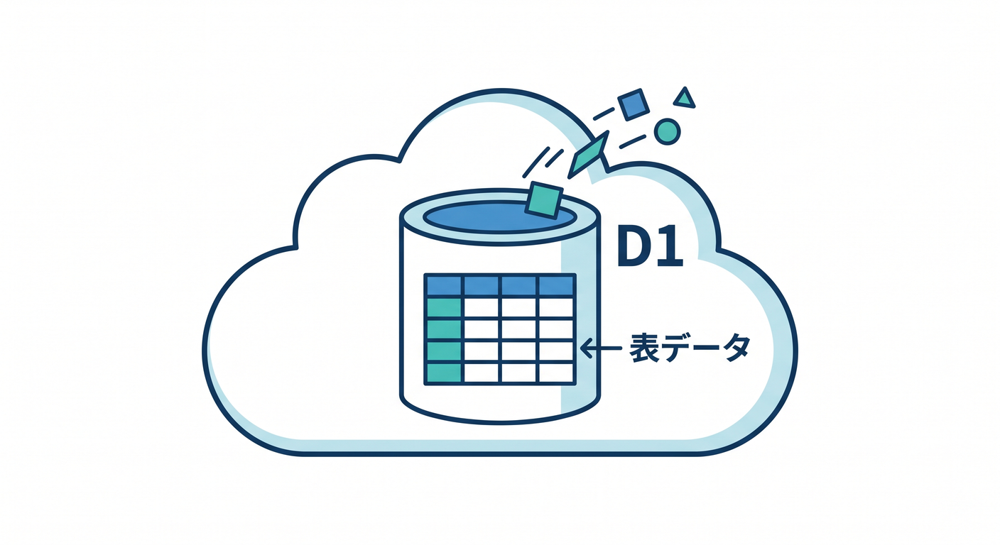
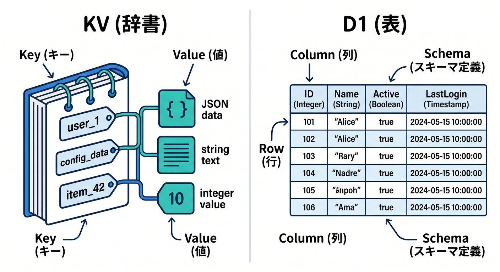
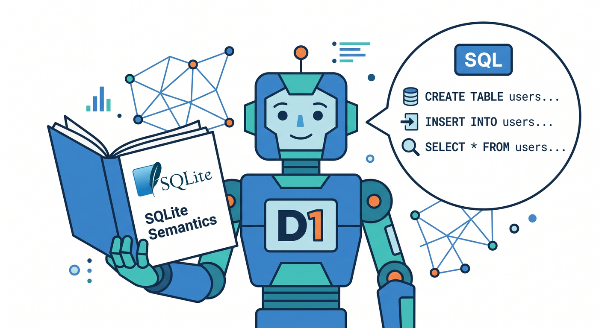
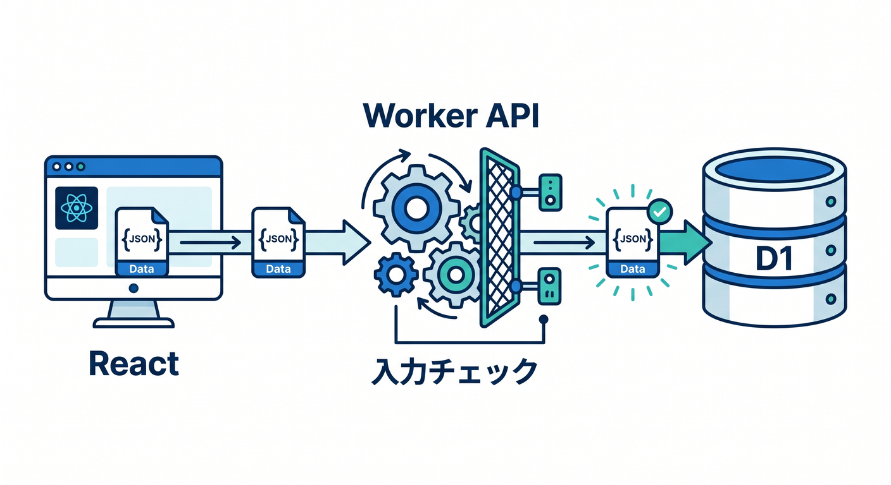
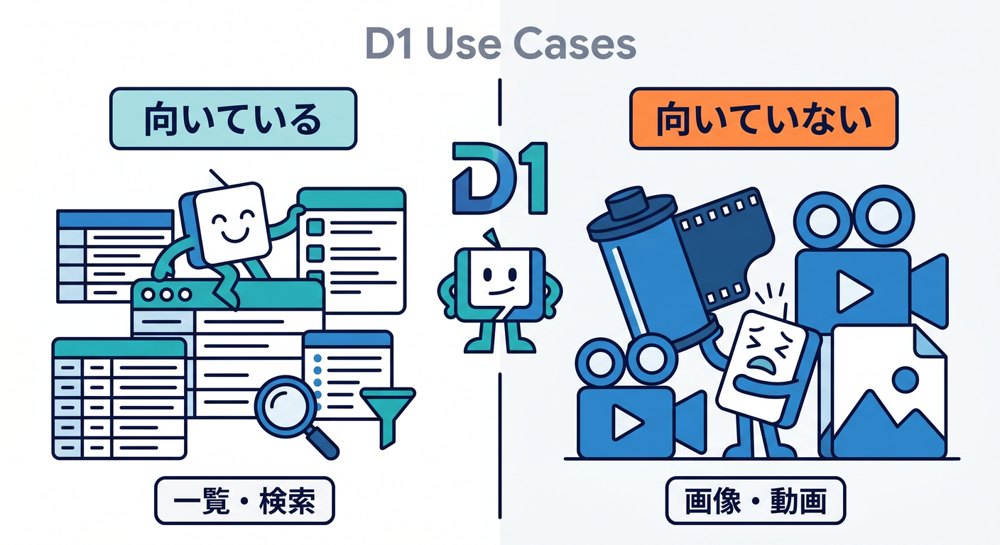

# 第01章：D1はCloudflare上のSQLデータベース 🧾☁️

D1は、Cloudflareで表形式のデータを扱うためのserverless SQL databaseです。  
SQLが初めてだと少し難しく見えますが、最初は「表にデータを入れて、必要な行を取り出す」と考えれば大丈夫です 😊



---

## 1. D1は表データの置き場 📊

D1は、行と列を持つデータを扱うのに向いています。

例です。

- Todo
- メモ
- ユーザー
- 投稿
- 注文
- AI要約履歴

KVがキーで値を取り出す辞書なら、D1は表を作ってデータを整理する場所です。



---

## 2. SQLiteのSQL semanticsを使う 🧠

Cloudflare公式では、D1はSQLiteのSQL semanticsを持つmanaged serverless databaseとして案内されています。  
つまり、SQLite系のSQLでテーブル作成やデータ操作ができます。



最初に覚えるSQLは多くありません。

- `CREATE TABLE`
- `INSERT`
- `SELECT`
- `UPDATE`
- `DELETE`

この5つだけでも、かなりアプリらしいデータ操作ができます。

---

## 3. Workersからbindingで使う 🌉

D1はCloudflare Workersからbinding経由で使います。

```text
React画面
  ↓ fetch
Workers API
  ↓ env.DB
D1
```

Reactから直接D1へ触るのではなく、Worker APIを通します。  
これにより、入力チェックや認証、ログ、Rate Limitingも入れやすくなります。



---

## 4. D1が向いているもの・向かないもの ⚖️

向いているものです。

- 一覧表示したいデータ
- 条件で検索したいデータ
- 更新や削除が必要なアプリデータ
- 履歴データ

向かないものです。

- 画像やPDFの本体
- 軽い設定値だけ
- リアルタイムチャットの状態
- 後で処理するジョブ

画像ならR2、軽い設定ならKV、状態ならDurable Objects、後処理ならQueuesも候補です。



---

## 5. 章末チェック ✅

- D1は表形式データの保存先だと分かる
- SQLite系のSQLを使うと分かる
- Workersからbindingで使うと分かる
- KV/R2/DO/Queuesとの大まかな違いが分かる
- CRUDの入口としてD1を見られる

この章で覚える一言はこれです。  
**D1は、Cloudflareアプリに表データとSQLの本格感を足す保存先です 🧾**
